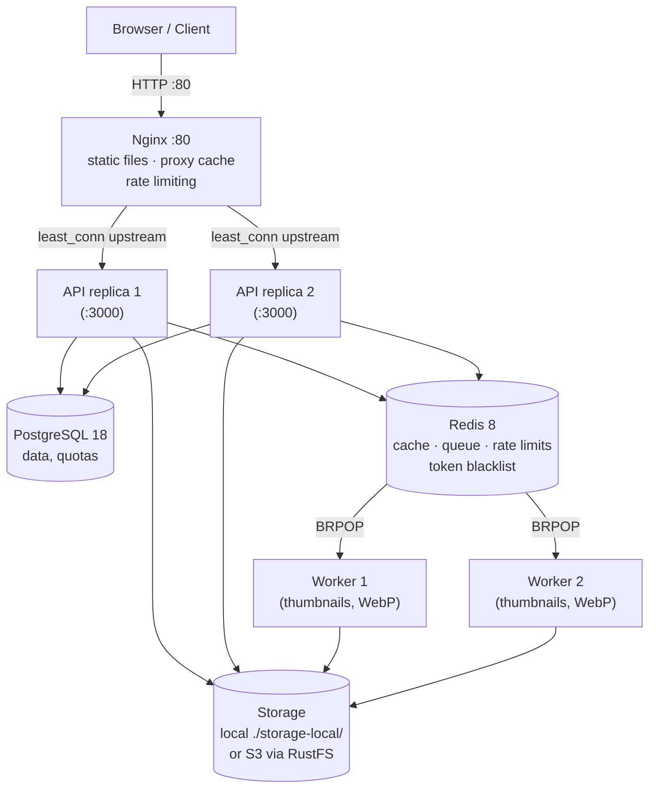

# PicHost

Self-hosted image hosting service — multi-user, JWT auth, OAuth login, local/S3 storage, thumbnails, CDN-ready, Prometheus metrics.

**v1.0.0** — First-run setup wizard + native packages & software repos (deb/rpm/exe, apt/rpm/Homebrew/winget)

## Stack

| Layer | Technology |
|-------|-----------|
| Backend | Rust 1.96+ (Axum 0.8, Tokio, sqlx) |
| Frontend | React 19, Vite 8, TypeScript 7, Tailwind CSS 4, i18next |
| Database | PostgreSQL 18 (standard) / SQLite (lite mode, optional) |
| Cache / Queue | Redis 8 (standard) / SQLite tables (lite mode) |
| Proxy / CDN | Nginx 1.27 (reverse proxy, cache, rate limiting) |
| Deployment | Docker Compose (API×2, Worker×2, stateless) |

## Quick Start (Docker)

```bash
# 1. Clone and enter the repo
git clone https://github.com/JeillZhang/pichost.git && cd pichost

# 2. Create your .env file
cp .env.example .env
# Edit: the JWT secret MUST be changed from the default
# Minimal required:
#   PICHOST_AUTH_JWT_SECRET=<at-least-32-random-chars>

# 3. Build frontend assets (required for Nginx)
cd web-ui && npm install && npm run build && cd ..

# 4. Start the full stack
docker compose up --build -d

# 5. Register the first user (auto-admin)
curl -s -X POST http://localhost/api/v1/auth/register \
  -H "Content-Type: application/json" \
  -d '{"username":"admin","password":"admin123456"}'

# 6. Open the app
open http://localhost
```

The stack runs on **port 80** via Nginx, proxying to 2 API replicas, with 2 background workers.

## Quick Start (Native packages)

Install from the official software repositories (built on every `v*` release, plus a Windows installer):

```bash
# Debian / Ubuntu — add the apt repo, then install
bash <(curl -sL https://jeillzhang.github.io/pichost-repo/setup-repo.sh) && sudo apt install pichost

# Fedora / RHEL — same setup script (auto-detects dnf)
bash <(curl -sL https://jeillzhang.github.io/pichost-repo/setup-repo.sh) && sudo dnf install pichost

# macOS — Homebrew tap, then start the service
brew tap jeillzhang/tap && brew install pichost && brew services start pichost

# Windows — winget (NSIS installer registers a Windows service)
winget install PicHost.PicHost
```

Native packages use the FHS layout (`/usr/bin` + `/usr/share/pichost` + `/var/lib/pichost` + `/etc/pichost`) — see [Deployment](#deployment) for the difference from the single-directory `install.sh` layout.

On first start (no users yet) with an interactive terminal, `pichost-api`
runs a setup wizard: it configures the JWT secret, public URL and UI
language (written to `.env`), then offers to create the first admin
account. Non-TTY environments (systemd/Docker) skip the wizard with a
warning — register the first user via the web UI instead. Re-run anytime
with `pichost-api --setup`.

## Installation & Running

After building the workspace (`cargo build --workspace` + `cd web-ui && npm run build`) or downloading a release artifact, PicHost can be installed/run in these ways:

| Option | Artifact | Platform | Reference |
|--------|----------|----------|-----------|
| Docker Compose | `docker-compose.yml` (dev) / `docker-compose.prod.yml` (prod) | Linux / macOS | [Deployment → Docker](#docker-recommended) |
| Bare binaries | `pichost-api` + `pichost-worker` + `web-ui/dist` | Linux / macOS / Windows | [Run the binaries directly](#run-the-binaries-directly) |
| Release tarball | `pichost-<ver>-<arch>.tar.gz` (linux) / `pichost-<ver>-darwin-universal.tar.gz` (macOS) | Linux / macOS | [systemd (bare metal)](#systemd-bare-metal) |
| deb package | `pichost-<ver>-<arch>.deb` | Debian / Ubuntu | [Quick Start (Native packages)](#quick-start-native-packages) |
| rpm package | `pichost-<ver>-<arch>.rpm` | Fedora / RHEL | [Quick Start (Native packages)](#quick-start-native-packages) |
| Homebrew tap | `jeillzhang/tap/pichost` | macOS | [Quick Start (Native packages)](#quick-start-native-packages) |
| winget / NSIS | `PicHost.PicHost` | Windows | [Quick Start (Native packages)](#quick-start-native-packages) |

### Run the binaries directly

The API serves the frontend itself via `PICHOST_STATIC_DIR`, so **no Nginx is required**:

```bash
# Standard mode — needs PostgreSQL + Redis, plus a separate pichost-worker
PICHOST_AUTH_JWT_SECRET=<32+ random chars> \
PICHOST_SERVER_PUBLIC_URL=https://your.domain \
PICHOST_STATIC_DIR=./web-ui/dist \
./pichost-api

# Lite mode — zero external dependencies (SQLite + embedded worker)
PICHOST_DATABASE_MODE=sqlite \
PICHOST_DATABASE_URL=sqlite:///opt/pichost/pichost.db \
PICHOST_AUTH_JWT_SECRET=<32+ random chars> \
PICHOST_STATIC_DIR=./web-ui/dist \
./pichost-api
```

- **CLI**: `pichost-api [--setup|--install-service|--uninstall-service|--service]` — `--setup` force-runs the first-run wizard; the last three are Windows-only (register / unregister / run as a Windows service).
- **First start**: with no users and an interactive terminal the setup wizard configures JWT secret / public URL / language and creates the first admin; non-TTY environments (systemd/Docker) skip it with a warning — register via the web UI.
- **Standard mode** also needs `PICHOST_REDIS_URL` and a running `pichost-worker` binary (consumes the Redis queue to generate thumbnails / WebP / watermarks).

### Release tarball (manual install)

```bash
# Download pichost-<ver>-<arch>.tar.gz from the GitHub release, then:
tar xzf pichost-1.0.0-x86_64.tar.gz && cd pichost-1.0.0-x86_64
sudo ./scripts/install.sh [--yes] [--mode postgres|sqlite] [/opt/pichost] [/etc/pichost]
```

The tarball bundles both binaries, `web-ui/dist`, both migration dirs, the nginx config, `.env.example` and the systemd units — or run `./pichost-api` straight from the extracted directory (see above).

## Architecture



Standard-mode topology (Docker / bare metal). In **lite mode** (`PICHOST_DATABASE_MODE=sqlite`) the single API process replaces all of PostgreSQL / Redis / the external workers: SQLite holds data + state tables, and the worker runs embedded in-process with zero external dependencies.

## Local Development

### Prerequisites

- Rust 1.96+ (`rustup`), Node.js 22+, PostgreSQL 18, Redis 8 (lite mode needs only Rust + Node.js — no PG/Redis)
- Or: use Docker for PG + Redis (`docker compose up postgres redis`)

### Setup & Run

```bash
# Backend — edit .env first with PICHOST_AUTH_JWT_SECRET (min 32 chars)
cp .env.example .env
cargo build --workspace
PICHOST_AUTH_JWT_SECRET=your-secret cargo run -p pichost-api

# Frontend — proxies /api and /u to localhost:3000
cd web-ui && npm install && npm run dev  # → http://localhost:5173
```

### Test & Lint

```bash
cargo test --workspace                      # 433 pass without infra (DB tests #[ignore]-gated)
cargo test --workspace -- --include-ignored  # 705 pass, 0 fail with Docker PG+Redis+MinIO (see AGENTS.md Testing)
cargo clippy --workspace -- -D warnings      # zero warnings required
cargo llvm-cov --workspace -- --include-ignored  # 91.56% line coverage (needs Docker PG+Redis+MinIO)
cd web-ui && npm run build                   # tsc -b && vite build
```

The full 705-test suite runs automatically on every PR to `main` via `.github/workflows/smoke-test.yml` (PG+Redis+MinIO service containers + clippy gate). See `docs/superpowers/specs/2026-08-02-pichost-smoke-test-design.md` for the smoke test design guide.

Run a single test: `cargo test -p pichost-api test_image_list`

## Configuration

All config via env vars with `PICHOST_` prefix (figment: defaults → env overrides).

| Variable | Required | Default | Purpose |
|----------|----------|---------|---------|
| `PICHOST_DATABASE_MODE` | — | `postgres` | `postgres` (standard: PG+Redis+external worker) or `sqlite` (lite mode: single process, embedded worker, no Redis) |
| `PICHOST_DATABASE_URL` | Yes | — | Connection string — PostgreSQL (`postgresql://...`) in standard mode, SQLite (`sqlite:///path/pichost.db`) in lite mode |
| `PICHOST_REDIS_URL` | Standard mode | — | Redis connection string (not used in sqlite lite mode) |
| `PICHOST_AUTH__JWT_SECRET` | **Yes** | — | HS256 signing key (min 32 chars) |
| `PICHOST_SERVER_PUBLIC_URL` | Production | `http://localhost` | For OAuth callbacks and share links |
| `PICHOST_AUTH_OAUTH_GITHUB_CLIENT_ID` | OAuth | — | GitHub OAuth App client ID |
| `PICHOST_AUTH_OAUTH_GITHUB_CLIENT_SECRET` | OAuth | — | GitHub OAuth App secret |
| `PICHOST_AUTH_OAUTH_GOOGLE_CLIENT_ID` | OAuth | — | Google OAuth client ID |
| `PICHOST_AUTH_OAUTH_GOOGLE_CLIENT_SECRET` | OAuth | — | Google OAuth client secret |
| `PICHOST_STORAGE__LOCAL_BASE_PATH` | Local storage | `./storage-local` | File storage directory |
| `PICHOST_STORAGE_RUSTFS_ENDPOINT` | RustFS | — | S3-compatible endpoint URL (MinIO, etc.) |
| `PICHOST_STORAGE_RUSTFS_BUCKET` | RustFS | — | Bucket name |
| `PICHOST_STORAGE_RUSTFS_REGION` | RustFS | `us-east-1` | Region |
| `PICHOST_STORAGE_RUSTFS_ACCESS_KEY` | RustFS | — | Access key |
| `PICHOST_STORAGE_RUSTFS_SECRET_KEY` | RustFS | — | Secret key |
| `PICHOST_STORAGE_MAX_USER_CONFIGS` | — | `5` | Max Git storage configs per user |
| `PICHOST_AUTH_TOKEN_ENCRYPTION_KEY` | Git storage | — | AES-256-GCM key for Git token encryption |
| `PICHOST_I18N_LANGUAGE` | — | `en` | Default UI language (`en` / `zh-CN`) |
| `PICHOST_I18N_LOCALES_DIR` | — | — | Optional external locale override directory (per-language subdirs, merge-override) |
| `PICHOST_STATIC_DIR` | — | `./dist` | Static frontend assets dir served by the API (`web-ui/dist`); unset/missing dir = not mounted |
| `PICHOST_ENV_FILE` | — | — | Wizard `.env` write target override (probe order: `PICHOST_ENV_FILE` → `/etc/pichost/.env` → CWD `.env`) |
| `DATABASE_URL` | Docker only | — | sqlx CLI helper (not consumed by app) |

**Important**: `DATABASE_URL` and `PICHOST_DATABASE_URL` are separate vars. Only `PICHOST_DATABASE_URL` is consumed at runtime. Both are set in docker-compose for convenience.

## API Endpoints

All API error responses use `{"error": <localized message>, "code": <error key>}`. Messages are localized via `Accept-Language` negotiation, falling back to the deployment's `PICHOST_I18N_LANGUAGE`.

### Auth
| Method | Path | Auth | Notes |
|--------|------|------|-------|
| POST | `/api/v1/auth/register` | No | Invite code required (first user auto-admin) |
| POST | `/api/v1/auth/login` | No | Returns access + refresh tokens |
| POST | `/api/v1/auth/refresh` | Refresh token | |
| POST | `/api/v1/auth/logout` | JWT | Blacklists token in Redis |
| GET | `/api/v1/auth/oauth/github` | No | Redirect to GitHub OAuth |
| GET | `/api/v1/auth/oauth/google` | No | Redirect to Google OAuth |
| GET | `/api/v1/auth/oauth/{provider}/callback` | No | Returns JWT |

### Images
| Method | Path | Auth | Notes |
|--------|------|------|-------|
| POST | `/api/v1/images` | JWT | Multipart upload, auto-thumbnails |
| POST | `/api/v1/images/upload-url` | JWT | Upload from URL (SSRF-protected download) |
| GET | `/api/v1/images` | JWT | Paginated: `?page=&per_page=&sort=&order=&search=&storage_config_id=&category_id=` |
| GET | `/api/v1/images/:id` | JWT | |
| PATCH | `/api/v1/images/:id` | JWT | Rename: `{ original_name }` |
| DELETE | `/api/v1/images/:id` | JWT | |
| POST | `/api/v1/images/:id/move` | JWT | Move image to category: `{ category_id }` |
| POST | `/api/v1/images/batch-delete` | JWT | `{ ids: UUID[] }`, max 100 |
| POST | `/api/v1/images/batch-move` | JWT | Batch move to category: `{ image_ids: [...], category_id }`, max 100 |
| GET | `/u/{public_key}` | No | Public image, cached 1 year |
| GET | `/u/thumb/{id}` | No | Thumbnail variant |
| GET | `/u/webp/{id}` | No | WebP variant |

### User & Admin
| Method | Path | Auth | Notes |
|--------|------|------|-------|
| GET | `/api/v1/users/me/stats` | JWT | Storage usage + quota |
| GET/POST | `/api/v1/categories` | JWT | Category CRUD: GET tree, POST create `{ name, parent_id? }` |
| GET/PATCH/DELETE | `/api/v1/categories/:id` | JWT | Single category: GET, PATCH rename, DELETE cascades |
| GET/POST | `/api/v1/users/me/storage-configs` | JWT | Git storage config management, GET all / POST create |
| GET/PATCH/DELETE | `/api/v1/users/me/storage-configs/:id` | JWT | Single config: GET details, PATCH update, DELETE |
| POST | `/api/v1/users/oauth/link` | JWT | Link OAuth after invite-code registration |
| GET | `/api/v1/admin/stats` | JWT+Admin | System-wide stats |
| GET/POST | `/api/v1/admin/invites` | JWT+Admin | Invite code management |
| GET | `/api/v1/admin/users` | JWT+Admin | Paginated, includes quotas |
| PATCH | `/api/v1/admin/users/:id` | JWT+Admin | Edit user + set `storage_quota` |
| DELETE | `/api/v1/admin/users/:id` | JWT+Admin | Cascades (images, oauth links) |

### Admin Config
| Method | Path | Auth | Notes |
|--------|------|------|-------|
| GET | `/api/v1/admin/config` | JWT+Admin | Current config, sensitive fields masked |
| PUT | `/api/v1/admin/config` | JWT+Admin | Write config.toml (auto-backup), returns updated config |
| POST | `/api/v1/admin/config/test` | JWT+Admin | Test DB/Redis connections |
| POST | `/api/v1/admin/config/backup` | JWT+Admin | Create timestamped backup |
| GET | `/api/v1/admin/config/backups` | JWT+Admin | List backup files, newest first |
| POST | `/api/v1/admin/config/restore` | JWT+Admin | Restore config.toml from a backup |

### Observability
| Method | Path | Auth | Notes |
|--------|------|------|-------|
| GET | `/metrics` | No | Prometheus text format |
| GET | `/health` | No | Nginx health check (also `/api/health` JSON) |

## Features

- [x] User registration — Argon2id password hashing, invite-code gating
- [x] JWT auth — HS256, access (15 min) + refresh (30 days), Redis blacklist
- [x] OAuth login — GitHub & Google OAuth2 (link after invite registration)
- [x] Image upload — drag-and-drop, magic byte validation, per-user SHA256 dedup
- [x] **Storage quota** — per-user limit (default 1 GB, admin adjustable, NULL = unlimited)
- [x] Thumbnails & WebP — async via Redis queue, 2 worker replicas
- [x] Gallery — pagination, search (ILIKE), sort (created_at / file_size / name)
- [x] **Multi-file upload** — concurrent queue (max 3), per-file progress cards
- [x] **Batch management** — delete up to 100 images at once
- [x] Public sharing — `/u/{public_key}` with full-format links (URL/MD/HTML/BBCode)
- [x] **Clipboard paste** — Ctrl+V image upload from clipboard
- [x] **URL upload** — paste image URL, server downloads + SSRF protection
- [x] Admin panel — user management, invite codes, system stats, quota control
- [x] **Rate limiting** — 4 strategies (auth, upload, general, public), Redis-backed
- [x] Nginx — reverse proxy, proxy_cache, gzip, upstream least_conn
- [x] **Horizontal scaling** — API×2, Worker×2 in docker-compose
- [x] **Prometheus /metrics** — counters (uploads, registrations), gauges (users, images)
- [x] RustFS storage backend — S3-compatible object storage (optional)
- [x] **Git storage backend** — GitHub/GitCode via REST API, AES-256-GCM token encryption, CRUD management UI
- [x] **Multi-backend upload** — select storage target per upload, parallel dual-backend write
- [x] **Gallery categories** — 2-level hierarchy, sidebar tree, batch move, category filtering
- [x] **Server-side watermark** — configurable text overlay (font/color/position/tile), applied in Worker pipeline
- [x] **Client-side preprocessing** — browser-side image pipeline (EXIF strip, resize, format convert, compress, rotate) via Web Worker
- [x] **File rename** — inline rename on ImageDetail, `PATCH /api/v1/images/:id`
- [x] **Settings UI optimization** — NavBar user dropdown (Settings/Admin/Logout), accordion settings with hash-based section expand
- [x] **Software packaging** — systemd services, install/uninstall scripts, GitHub Actions release CI (`v*` tags → `.tar.gz`)
- [x] **Native packaging** — deb/rpm (FHS), macOS Homebrew tap, Windows NSIS installer + winget manifest, API static file serving (`PICHOST_STATIC_DIR`)
- [x] **Software repositories** — apt/rpm repos (`pichost-repo`), Homebrew tap, winget, published by release CI
- [x] **System config management** — admin config.toml read/write API, DB/Redis connection tests, backup/restore
- [x] **Internationalization (i18n)** — English/简体中文 UI switching via i18next + LanguageSwitcher (persisted, ~364 UI strings extracted), typed t() keys
- [x] **Localized API errors** — all errors return `{"error": localized message, "code": error key}`, Accept-Language negotiation per request
- [x] **Deployment language config** — `PICHOST_I18N_LANGUAGE` / `PICHOST_I18N_LOCALES_DIR`, admin config hot reload without restart
- [x] **Responsive layout** — mobile-first adaptation: hamburger nav drawer (MobileNav), category filter drawer (Sheet), touch-friendly category ⋯ menu, shared Modal/ConfirmDialog with bottom-sheet on small screens, admin table card-ification, global horizontal-overflow guard, responsive gallery grid (2/3/3/4/5 columns), popover viewport clamping
- [x] **Image detail zoom viewer** — fullscreen lightbox: wheel zoom (cursor-anchored), drag pan, double-click fit↔100%, touch pinch/drag, toolbar zoom controls, keyboard shortcuts
- [x] **SQLite lite mode** — zero-external-dependency single-instance deployment (embedded worker), `PICHOST_DATABASE_MODE=sqlite`
- [x] **First-run setup wizard** — terminal wizard on initial startup (JWT/public URL/language + first admin), `--setup` force flag, non-TTY skip

## Project Structure

```
├── pichost-core/            Domain models, config, StorageBackend trait,
│                            LocalStorage, RustfsStorage, GitStorage,
│                            StorageRouter, AES-256-GCM crypto, i18n module,
│                            db module (per-driver pools + migrations),
│                            state module (5 state traits + SQLite impls)
│   └── src/i18n/locales/    Message catalogs (en, zh-CN), 110 keys
├── pichost-api/             Axum server — routes, middleware, services,
│                            DB pool, Redis, rate limiting, storage config CRUD,
│                            system config service (config.toml + backups)
├── pichost-worker/          Background processing — thumbnails, WebP, watermarks
│   └── fonts/               5 built-in TTF fonts (rusttype + imageproc)
├── web-ui/                  React SPA — Zustand, TanStack Query, i18next, Tailwind CSS 4
│   ├── src/i18n/            i18next init + locale catalogs (en, zh-CN), typed t() keys
│   ├── src/lib/format.ts    Locale-aware formatBytes/formatDate/formatNumber
│   ├── src/hooks/           useImageZoom (zoom viewer zoom/pan state), useUploadQueue, ...
│   └── src/components/      Components (SystemConfig, CategoryTree, MobileNav, ImageViewer (zoom viewer), ...)
│       └── ui/              UI primitives (Modal, Sheet, ConfirmDialog, ...)
│       └── ui/              UI primitives (Button, Input, DropdownMenu)
├── nginx/
│   └── nginx.conf           Reverse proxy + cache + rate limiting
├── migrations/              10 SQL migrations (0001–0010), PostgreSQL
├── migrations-sqlite/       11 SQL migrations (0001–0011, 0011 = lite state tables), SQLite
├── scripts/                 systemd services + install/uninstall + verify-release scripts
├── CHANGELOG.md             Keep a Changelog, linked from every GitHub Release
├── .github/workflows/       Smoke tests (PR → full suite), Release CI (v* tags → build, test, package .tar.gz)
├── Dockerfile.api           Multi-stage Rust build for API
├── Dockerfile.worker        Multi-stage Rust build for Worker
├── docker-compose.yml       Full stack: Nginx, API×2, Worker×2, PostgreSQL, Redis
├── .env.example             Environment variable template
└── docs/
    ├── superpowers/specs/   Design doc (2026-07-11-pichost-design.md)
    └── superpowers/guides/  CDN setup guide, architecture notes
```

## Deployment

### Docker (recommended)

```bash
# Build front-end first (Nginx serves it as static files)
cd web-ui && npm run build && cd ..

# Start full stack
docker compose up --build -d

# Verify
curl http://localhost/health
```

Default compute layout: 2 API replicas (least_conn), 2 worker replicas (independent consumers). Postgres and Redis ports are **not exposed** to the host — internal Docker network only.

### Native packages (deb / rpm / Homebrew / winget)

deb and rpm packages follow the **FHS layout**, split across standard system directories:

| Path | Contents |
|------|----------|
| `/usr/bin/pichost-api`, `/usr/bin/pichost-worker` | Binaries |
| `/usr/share/pichost/` | Static frontend assets (`dist/`), shared install scripts |
| `/var/lib/pichost/` | Runtime data: DB + `storage-local/` |
| `/etc/pichost/.env` | Configuration |

`PICHOST_STATIC_DIR` points the API at `/usr/share/pichost/dist`, so no Nginx is required — the API serves the frontend itself. Homebrew uses the same layout under `/usr/local`/`/opt/homebrew`; the winget installer (NSIS) registers a Windows service.

This is intentionally a **fork from `install.sh`'s single-directory layout** (`<INSTALL_DIR>/data/pichost.db` + `storage-local`, default `/opt/pichost`) — both are documented and supported; pick per platform.

### systemd (bare metal)

```bash
# install:  [--yes] [--mode postgres|sqlite] [INSTALL_DIR] [CONFIG_DIR]
#           INSTALL_DIR = software dir (default /opt/pichost); CONFIG_DIR = config dir (default /etc/pichost)
#           default mode is sqlite (interactive prompt recommends SQLite; --yes / non-tty → sqlite)
sudo ./scripts/install.sh [--yes] [--mode sqlite] /opt/pichost /etc/pichost

# uninstall: [--keep-data] [INSTALL_DIR] [CONFIG_DIR]
#            default wipes INSTALL_DIR including data/; --keep-data preserves data/
sudo ./scripts/uninstall.sh /opt/pichost /etc/pichost
```

`install.sh` is interactive: `--yes` for unattended install, `--mode postgres|sqlite` to force a DB mode (**sqlite is the default**). **SQLite mode needs no PostgreSQL/Redis** — `.env` gets a `sqlite://` URL pointing at `sqlite:///opt/pichost/data/pichost.db`, no `pichost-worker.service` is installed, and the worker runs embedded in the API process (zero external dependencies). DB and storage live in a single directory under the install dir: `<INSTALL_DIR>/data/pichost.db` + `<INSTALL_DIR>/data/storage-local` (`PICHOST_STORAGE_LOCAL_BASE_PATH`).

Units: `pichost-api.service` (API) + `pichost-worker.service` (worker, standard mode only), run as user `pichost` with `EnvironmentFile=/etc/pichost/.env`. Release artifacts (`.tar.gz`) are built by GitHub Actions on `v*` tags. Run `bash scripts/verify-release.sh` locally before tagging — it mirrors the release build→package steps, dry-runs `install.sh` (2-arg contract) in a systemd-free container, and asserts the default sqlite mode.

### Production checklist

1. **Change `PICHOST_AUTH_JWT_SECRET`** — never use the default.
2. Set `PICHOST_SERVER_PUBLIC_URL` to your real domain (for OAuth callbacks, share links).
3. **Use a volume or S3 backend for storage** — the default `./storage-local` loses data when containers are destroyed.
4. Configure OAuth credentials (GitHub/Google) if you want OAuth login.
5. **Put a CDN in front of Nginx** — see `docs/superpowers/guides/cdn-setup.md`.
6. Scale `deploy.replicas` in docker-compose.yml as needed.
7. **Back up `/opt/pichost/data/`** (bare-metal installs) — contains `pichost.db` and all uploaded images; `uninstall.sh` wipes it by default (use `--keep-data` to preserve).

### Volume management

```bash
docker compose down       # Stop containers (keep data)
docker compose down -v    # Wipe PostgreSQL + Redis data
```

### Check logs

```bash
docker compose logs api     # API replicas
docker compose logs worker  # Background workers
docker compose logs nginx   # Proxy requests
```

## Troubleshooting

| Symptom | Likely cause | Fix |
|---------|-------------|-----|
| 401 on all requests | Redis down | `docker compose ps redis` — blacklist fails closed |
| 413 on upload | Storage quota exceeded | Admin: increase user quota or set to NULL |
| Nginx returns 502 | API not ready yet | Wait ~5s for migrations to finish |
| Frontend blank at `localhost` | `web-ui/dist` missing | `cd web-ui && npm run build` |
| Docker build fails | Dockerfile.api needs `COPY` context | Run from repo root |
| `npm run build` fails | Node.js < 22 | Check `node -v` (need 22+) |