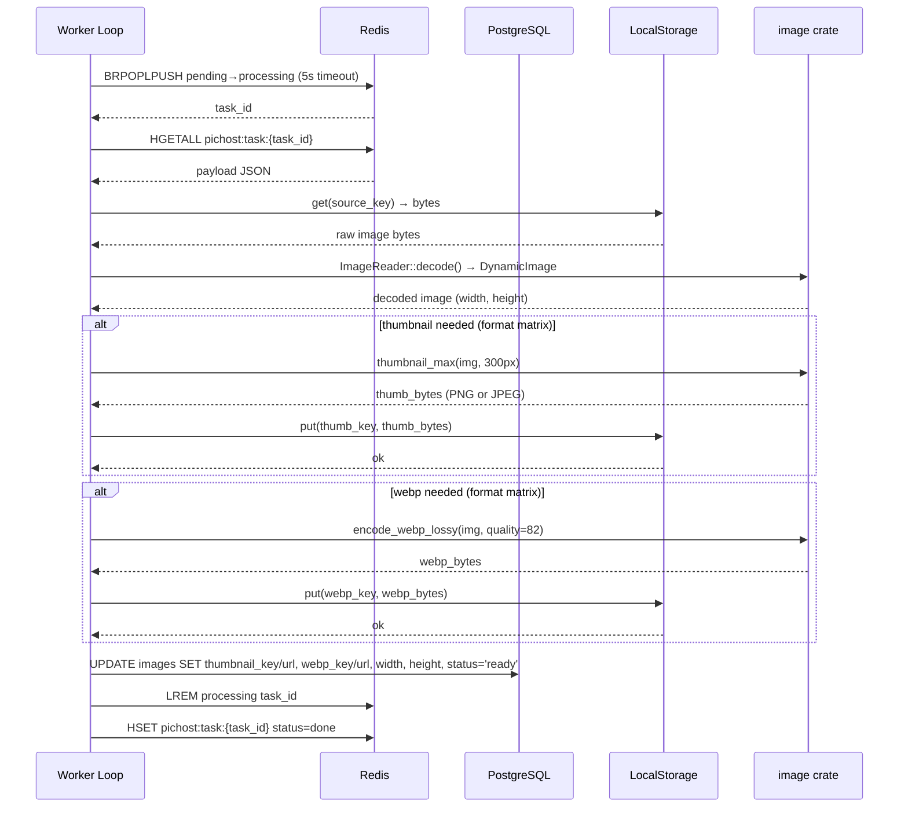
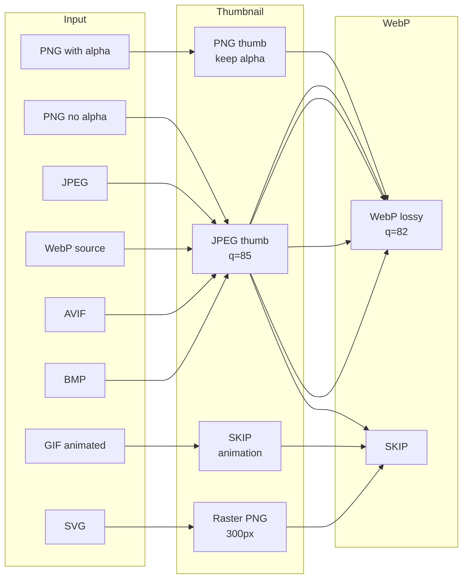

# P1 Async Image Processing Worker — Implementation Plan

> **For agentic workers:** REQUIRED SUB-SKILL: Use superpowers:subagent-driven-development (recommended) or superpowers:executing-plans to implement this plan task-by-task. Steps use checkbox (`- [ ]`) syntax for tracking.

**Goal:** Build a background worker that processes uploaded images: detect dimensions, generate thumbnails, convert to WebP, and update image metadata in the database.

**Architecture:** The worker is a standalone tokio binary (`pichost-worker`) that polls Redis queues. The API enqueues tasks after upload. The worker dequeues, processes images via the `image` crate, writes results back to LocalStorage, and updates the `images` table. Redis acts as the queue broker (pending → processing → done/dead).

**Tech Stack:** Rust (tokio), `image` crate (0.25+), Redis (deadpool-redis), PostgreSQL (sqlx), same workspace as existing pichost-core/pichost-api.

## Global Constraints

- Rust edition 2021, workspace version 0.1.0, `rustfmt` + `clippy` (per `rust-toolchain.toml`)
- `image` crate v0.25 with features: `png`, `jpeg`, `gif`, `webp`, `avif`, `svg`
- Redis key prefix: `pichost:tasks:*` (per design spec §6.2)
- image status quirk: DB default is `'pending'`, code checks raw strings `"active"` / `"ready"` / `"failed"` — use raw DB strings for status comparisons, not the `ImageStatus` enum Display impl
- Worker must manage its own DB pool (sqlx) and Redis pool (deadpool-redis). Pattern copied from `pichost-api/src/db/mod.rs` and `pichost-api/src/cache/mod.rs`.
- `pichost-api` and `pichost-worker` share `pichost-core` for models/config/StorageBackend only. No sharing of `src/cache/` or `src/db/` modules across crates.
- No compile-time sqlx checks (no `query!` macro). All queries are runtime `query_as` / `query_scalar`.
- LocalStorage only for P1 — hardcode `LocalStorage::new(base_path, public_url)` like the API does.
- Worker config section `[worker]` must be added to `AppConfig` in `pichost-core`. Read via same figment pipeline (defaults → `config.toml` → `PICHOST_WORKER_*` env vars).

---

## File Structure Map

```
pichost-core/
├── src/config.rs          ← MODIFY: add WorkerConfig struct + env prefix
├── src/models.rs           ← MODIFY: reconcile ImageStatus "active" variant

pichost-worker/
├── Cargo.toml              ← MODIFY: add image, sqlx, deadpool-redis, etc.
├── src/
│   ├── main.rs             ← REPLACE: config loading, pool init, loop spawn
│   ├── queue.rs            ← CREATE: Redis queue operations (enqueue/dequeue/ack/nack/recover)
│   ├── pipeline.rs         ← CREATE: fetch → decode → thumbnail → webp → store → update DB
│   ├── processor.rs        ← CREATE: thumbnail() and webp() functions
│   ├── config.rs           ← CREATE: load worker config (same figment pattern as API)
│   └── db.rs               ← CREATE: create_pool(), run_migrations() (copy from pichost-api)

pichost-api/
├── src/services/upload.rs  ← MODIFY: enqueue task after INSERT, add width/height detection

migrations/
├── 0003_add_image_processing_fields.sql  ← CREATE: add thumbnail_key, thumbnail_url, webp_key, webp_url, width+height migration note
├── 0004_create_upload_tasks.sql          ← CREATE: upload_tasks table

docs/superpowers/
├── specs/2026-07-11-pichost-design.md  ← REFERENCE: §6 Worker design (lines 430–572)
└── plans/2026-07-11-pichost-p0-implementation.md ← REFERENCE: P0 baseline patterns
```

**Inter-task dependency graph:**

```
Task 1 (WorkerConfig)     ────┐
Task 2 (DB migration)     ────┤
                               ├──→ Task 5 (pipeline.rs)
Task 3 (Worker Cargo.toml) ────┤
Task 4 (db.rs + config.rs) ────┘
                                    │
Task 6 (queue.rs)            ───────┼──→ Task 8 (worker main.rs)
Task 7 (processor.rs)        ───────┘
                                        │
Task 9 (API: enqueue + dims) ───────────┴──→ Task 10 (integration test + verify)
```

Tasks 1-4 are fully independent — run them in parallel. Tasks 5-7 work against the infra from 1-4 and can be parallel. Task 8 depends on 5-7. Task 9 is API-side, independent of worker implementation.

## Architecture Overview

```mermaid
graph TB
    subgraph "pichost-api"
        UP[POST /api/v1/images<br/>upload_handler]
        UE[upload::process_upload]
        ENQ[queue::enqueue_task]
    end

    subgraph "Redis"
        QP[pichost:tasks:pending<br/>List]
        QC[pichost:tasks:processing<br/>List]
        HT[pichost:task:&#123;id&#125;<br/>Hash - payload JSON]
        DL[pichost:tasks:dead<br/>Set]
    end

    subgraph "pichost-worker"
        LP[main loop<br/>4 concurrent tasks]
        DEQ[queue::dequeue<br/>BRPOPLPUSH]
        PL[pipeline::process]
        TH[processor::thumbnail]
        WB[processor::webp]
    end

    subgraph "PostgreSQL"
        IMG[(images table)]
        UT[(upload_tasks table)]
    end

    subgraph "LocalStorage"
        FS[(local-base-path)]
    end

    UP --> UE
    UE --> ENQ
    ENQ -->|LPUSH| QP
    ENQ -->|HSET| HT

    LP -->|BRPOPLPUSH 5s| DEQ
    DEQ -->|pop + push to processing| QP
    DEQ -->|HGETALL| HT
    DEQ --> PL

    PL -->|StorageBackend::get| FS
    PL --> TH
    PL --> WB
    PL -->|StorageBackend::put| FS
    PL -->|UPDATE images<br/>SET thumbnail/webp<br/>status='ready'| IMG
    PL -->|LREM processing<br/>HSET status=done| QC

    LP -->|failure: retry < 3| QP
    LP -->|failure: retry >= 3| DL
    LP -->|failure: retry >= 3| UT
    LP -->|failure: retry >= 3| IMG

    LP -->|startup: recover<br/>timeout tasks| QC
```



## Processing Pipeline (per task)



## Image Format Processing Matrix



---

### Task 1: WorkerConfig in pichost-core

**Files:**
- Modify: `pichost-core/src/config.rs`

**Interfaces:**
- Produces: `WorkerConfig` struct with fields `concurrency: usize`, `queue_poll_timeout: u64`, `task_timeout: u64`, `recovery_scan_interval: u64`; nested `WorkerProcessingConfig` struct with `thumbnail_size: u32`, `thumbnail_quality: u8`, `webp_quality: f32`, `compress_threshold_kb: u64`
- Produces: `AppConfig { ..., worker: WorkerConfig }` — new field added
- Consumed by: Task 4 (worker config.rs), Task 5 (pipeline.rs for thumbnail_size/webp_quality), Task 8 (main.rs for concurrency)

- [ ] **Step 1: Add WorkerConfig structs and Default impl**

```rust
// In pichost-core/src/config.rs, after UploadConfig:

#[derive(Debug, Clone, Deserialize, Serialize)]
pub struct WorkerProcessingConfig {
    pub thumbnail_size: u32,
    pub thumbnail_quality: u8,
    pub webp_quality: f32,
    pub compress_threshold_kb: u64,
}

#[derive(Debug, Clone, Deserialize, Serialize)]
pub struct WorkerConfig {
    pub concurrency: usize,
    pub queue_poll_timeout: u64,
    pub task_timeout: u64,
    pub recovery_scan_interval: u64,
    #[serde(default)]
    pub processing: WorkerProcessingConfig,
}
```

Then add `worker: WorkerConfig` to `AppConfig`:

```rust
// Modify AppConfig struct — add this field after logging:
pub struct AppConfig {
    pub server: ServerConfig,
    pub auth: AuthConfig,
    pub storage: StorageConfig,
    pub database: DatabaseConfig,
    pub redis: RedisConfig,
    pub upload: UploadConfig,
    pub logging: LoggingConfig,
    pub worker: WorkerConfig,   // ← NEW
}
```

Add Default impl for worker configs:

```rust
// Add after the other Default impls:

impl Default for WorkerProcessingConfig {
    fn default() -> Self {
        Self {
            thumbnail_size: 300,
            thumbnail_quality: 85,
            webp_quality: 82.0,
            compress_threshold_kb: 500,
        }
    }
}

impl Default for WorkerConfig {
    fn default() -> Self {
        Self {
            concurrency: 4,
            queue_poll_timeout: 5,
            task_timeout: 300,
            recovery_scan_interval: 60,
            processing: WorkerProcessingConfig::default(),
        }
    }
}
```

Update `AppConfig::default()` — add `worker: WorkerConfig::default()`:

```rust
// In AppConfig::default(), add after the logging line:
logging: LoggingConfig { level: "info".into(), format: "json".into() },
worker: WorkerConfig::default(),   // ← NEW
```

- [ ] **Step 2: Build workspace to verify compile**

Run: `cargo build --workspace`
Expected: compiles successfully (worker field is new but pichost-api main.rs doesn't touch it, so no API-side changes needed)

- [ ] **Step 3: Commit**

```bash
git add pichost-core/src/config.rs
git commit -m "feat(core): add WorkerConfig and WorkerProcessingConfig"
```

---

### Task 2: Database migrations — image processing fields + upload_tasks table

**Files:**
- Create: `migrations/0003_add_image_processing_fields.sql`
- Create: `migrations/0004_create_upload_tasks.sql`

**Interfaces:**
- Produces: `images` table gains columns `thumbnail_key VARCHAR(512)`, `thumbnail_url VARCHAR(1024)`, `webp_key VARCHAR(512)`, `webp_url VARCHAR(1024)`
- Produces: `upload_tasks` table: `id UUID PK`, `image_id UUID FK→images`, `task_type VARCHAR(32)`, `payload JSONB`, `status VARCHAR(16) DEFAULT 'pending'`, `error TEXT`, `retry_count INTEGER DEFAULT 0`, `max_retries INTEGER DEFAULT 3`, `created_at TIMESTAMPTZ DEFAULT now()`, `completed_at TIMESTAMPTZ`
- Consumed by: Task 5 (pipeline.rs UPDATE query), Task 9 (upload.rs enqueue task INSERT)

- [ ] **Step 1: Write migration 0003**

```sql
-- migrations/0003_add_image_processing_fields.sql
ALTER TABLE images
    ADD COLUMN thumbnail_key VARCHAR(512),
    ADD COLUMN thumbnail_url VARCHAR(1024),
    ADD COLUMN webp_key VARCHAR(512),
    ADD COLUMN webp_url VARCHAR(1024);
```

- [ ] **Step 2: Write migration 0004**

```sql
-- migrations/0004_create_upload_tasks.sql
CREATE TABLE upload_tasks (
    id UUID PRIMARY KEY DEFAULT gen_random_uuid(),
    image_id UUID NOT NULL REFERENCES images(id) ON DELETE CASCADE,
    task_type VARCHAR(32) NOT NULL DEFAULT 'all',
    payload JSONB,
    status VARCHAR(16) NOT NULL DEFAULT 'pending',
    error TEXT,
    retry_count INTEGER NOT NULL DEFAULT 0,
    max_retries INTEGER NOT NULL DEFAULT 3,
    created_at TIMESTAMPTZ NOT NULL DEFAULT now(),
    completed_at TIMESTAMPTZ
);

CREATE INDEX idx_upload_tasks_image_id ON upload_tasks(image_id);
CREATE INDEX idx_upload_tasks_status ON upload_tasks(status);
```

- [ ] **Step 3: Verify migrations apply (if you have a running DB)**

Run (assuming DB is up via Docker): `docker compose up -d postgres redis`
Then: `cargo run -p pichost-api` → check logs for migration success
Expected: migrations run without errors, API starts normally

If no DB available, skip this step — migrations will apply on next API start.

- [ ] **Step 4: Commit**

```bash
git add migrations/0003_add_image_processing_fields.sql migrations/0004_create_upload_tasks.sql
git commit -m "feat(db): add image processing fields and upload_tasks table"
```

---

### Task 3: Worker Cargo.toml — add dependencies

**Files:**
- Modify: `pichost-worker/Cargo.toml`
- Modify: workspace root `Cargo.toml` (add shared deps)

**Interfaces:**
- Consumes: workspace-level `tokio`, `serde`, `serde_json`, `uuid`, `chrono`, `thiserror`, `tracing`, `tracing-subscriber`, `sqlx`, `deadpool-redis`, `redis`
- New deps: `image = { version = "0.25", default-features = false, features = ["png", "jpeg", "gif", "webp"] }`, `webp = "0.2"` (for lossy WebP encoding), `figment = { version = "0.10", features = ["toml", "env"] }` (for config loading)
- Produces: worker crate ready for code implementation in Tasks 4-8

- [ ] **Step 1: Update workspace root Cargo.toml with new shared deps**

```toml
# In workspace root Cargo.toml, add under [workspace.dependencies]:
image = { version = "0.25", default-features = false }
webp = "0.2"
figment = { version = "0.10", features = ["toml", "env"] }
```

**Note:** `image` and `webp` are new to the workspace. `figment` is already in `pichost-core/Cargo.toml` individually — adding it to workspace makes it consistently referenceable. Update `pichost-core/Cargo.toml` to use `figment.workspace = true` instead of inline version.

- [ ] **Step 2: Rewrite pichost-worker/Cargo.toml**

```toml
[package]
name = "pichost-worker"
version.workspace = true
edition.workspace = true

[dependencies]
pichost-core = { path = "../pichost-core" }
tokio.workspace = true
serde.workspace = true
serde_json.workspace = true
uuid.workspace = true
chrono.workspace = true
thiserror.workspace = true
tracing.workspace = true
tracing-subscriber.workspace = true
sqlx.workspace = true
deadpool-redis.workspace = true
redis.workspace = true
figment.workspace = true
image = { workspace = true, features = ["png", "jpeg", "gif", "webp"] }
webp.workspace = true

[[bin]]
name = "pichost-worker"
path = "src/main.rs"
```

- [ ] **Step 3: Update pichost-core/Cargo.toml to use workspace figment**

```toml
# In pichost-core/Cargo.toml, replace:
# figment = { version = "0.10", features = ["toml", "env"] }
# with:
figment.workspace = true
```

- [ ] **Step 4: Build to verify dependencies resolve**

Run: `cargo build --workspace`
Expected: compiles (still just the placeholder main.rs for worker). No dependency resolution errors.

- [ ] **Step 5: Commit**

```bash
git add Cargo.toml pichost-worker/Cargo.toml pichost-core/Cargo.toml
git commit -m "feat(worker): add image/webp/figment deps, consolidate workspace"
```

---

### Task 4: Worker config.rs and db.rs — infrastructure setup

**Files:**
- Create: `pichost-worker/src/config.rs`
- Create: `pichost-worker/src/db.rs`

**Interfaces:**
- Produces: `pub fn load_worker_config() -> Result<AppConfig, figment::Error>` — same figment pipeline as API
- Produces: `pub async fn create_pool(url: &str, max_connections: u32) -> Result<DbPool, sqlx::Error>`
- Produces: `pub async fn run_migrations(pool: &DbPool) -> Result<(), sqlx::migrate::MigrateError>`
- Consumes: `pichost_core::config::AppConfig` (Task 1), `pichost_core::config::load_config`
- Consumed by: Task 8 (worker main.rs)

- [ ] **Step 1: Write pichost-worker/src/config.rs**

```rust
use pichost_core::config::{load_config, AppConfig};

/// Load config using the same figment pipeline as pichost-api.
/// Reads from defaults → config.toml → PICHOST_* env vars.
/// The worker section defaults come from AppConfig::default() (Task 1).
pub fn load_worker_config() -> Result<AppConfig, figment::Error> {
    load_config()
}
```

- [ ] **Step 2: Write pichost-worker/src/db.rs**

Copy the pattern exactly from `pichost-api/src/db/mod.rs`:

```rust
use sqlx::postgres::PgPoolOptions;
use sqlx::PgPool;
use std::time::Duration;

pub type DbPool = PgPool;

pub async fn create_pool(url: &str, max_connections: u32) -> Result<DbPool, sqlx::Error> {
    PgPoolOptions::new()
        .max_connections(max_connections)
        .acquire_timeout(Duration::from_secs(5))
        .connect(url)
        .await
}

pub async fn run_migrations(pool: &DbPool) -> Result<(), sqlx::migrate::MigrateError> {
    sqlx::migrate!("../migrations").run(pool).await
}
```

- [ ] **Step 3: Build to verify both modules compile**

Run: `cargo build -p pichost-worker`
Expected: compiles. The modules exist but main.rs doesn't call them yet — that's fine, it just proves the code is valid.

- [ ] **Step 4: Commit**

```bash
git add pichost-worker/src/config.rs pichost-worker/src/db.rs
git commit -m "feat(worker): add config loading and db pool modules"
```

---

### Task 5: Pipeline module — the core processing logic

**Files:**
- Create: `pichost-worker/src/pipeline.rs`

**Interfaces:**
- Consumes: `DbPool` (Task 4), `queue::TaskPayload` (Task 6 — defined inline as stub for now), `processor::generate_thumbnail`, `processor::convert_to_webp` (Task 7), `pichost_core::storage::local::LocalStorage`, `pichost_core::storage::StorageBackend`, `AppConfig` (Task 1)
- Produces: `pub async fn process_task(pool: &PgPool, config: &AppConfig, task: &TaskPayload) -> Result<(), PipelineError>`
- This is the function that does: fetch bytes → decode → thumbnail → webp → store → UPDATE DB
- Consumed by: Task 8 (worker main.rs)

**Note:** This task depends on `TaskPayload` from Task 6 and processor functions from Task 7. Define the `TaskPayload` struct inline as a stub (will be re-exported by queue.rs later). The processor functions are signature-defined here and called; Task 7 will implement the real bodies.

- [ ] **Step 1: Write pichost-worker/src/pipeline.rs**

```rust
use pichost_core::config::AppConfig;
use pichost_core::storage::{local::LocalStorage, StorageBackend};
use sqlx::PgPool;
use uuid::Uuid;

use crate::processor;

#[derive(Debug, thiserror::Error)]
pub enum PipelineError {
    #[error("storage read failed: {0}")]
    StorageRead(String),
    #[error("storage write failed: {0}")]
    StorageWrite(String),
    #[error("image decode failed: {0}")]
    Decode(String),
    #[error("thumbnail generation failed: {0}")]
    Thumbnail(String),
    #[error("webp conversion failed: {0}")]
    Webp(String),
    #[error("database update failed: {0}")]
    Database(String),
}

// TEMPORARY STUB — will move to queue.rs in Task 6.
// This is defined here so pipeline.rs compiles without queue.rs existing yet.
mod task_stub {
    use serde::{Deserialize, Serialize};
    use uuid::Uuid;

    #[derive(Debug, Clone, Serialize, Deserialize)]
    pub struct TaskPayload {
        pub task_id: Uuid,
        pub image_id: Uuid,
        pub user_id: Uuid,
        pub storage_backend: String,
        pub source_key: String,
        pub source_mime: String,
        pub retry_count: i32,
        pub max_retries: i32,
    }
}
use task_stub::TaskPayload;

/// Process a single task: load → decode → thumbnail → webp → store → update DB.
pub async fn process_task(
    pool: &PgPool,
    config: &AppConfig,
    task: &TaskPayload,
) -> Result<(), PipelineError> {
    let storage = LocalStorage::new(
        config.storage.local_base_path.clone(),
        config.server.public_url.clone(),
    );

    // 1. Fetch source image bytes from storage
    let bytes = storage
        .get(&task.source_key)
        .await
        .map_err(|e| PipelineError::StorageRead(e.to_string()))?;

    // 2. Decode image and detect dimensions
    let img = image::ImageReader::new(std::io::Cursor::new(&bytes))
        .with_guessed_format()
        .map_err(|e| PipelineError::Decode(e.to_string()))?
        .decode()
        .map_err(|e| PipelineError::Decode(e.to_string()))?;

    let (width, height) = (img.width() as i32, img.height() as i32);

    // 3. Determine format for processing decisions
    let fmt = image::guess_format(&bytes)
        .map_err(|e| PipelineError::Decode(e.to_string()))?;

    let thumb_key = format!("{}/thumb.{}", task.user_id, task.image_id);
    let webp_key = format!("{}/webp.{}", task.user_id, task.image_id);

    let public_url = config.server.public_url.trim_end_matches('/');
    let thumb_url = format!("{}/u/thumb-{}", public_url, task.image_id);
    let webp_url = format!("{}/u/webp-{}", public_url, task.image_id);

    // 4. Generate thumbnail (per format matrix from design spec §6.6)
    let (thumb_written, _thumb_mime) = processor::generate_thumbnail(
        &img,
        fmt,
        &storage,
        &thumb_key,
        config.worker.processing.thumbnail_size,
        config.worker.processing.thumbnail_quality,
    )
    .await
    .map_err(|e| PipelineError::Thumbnail(e))?;

    // 5. Convert to WebP (per format matrix)
    let (webp_written, _webp_mime) = processor::convert_to_webp(
        &img,
        fmt,
        &storage,
        &webp_key,
        config.worker.processing.webp_quality,
    )
    .await
    .map_err(|e| PipelineError::Webp(e))?;

    // 6. Update images table with processing results
    sqlx::query(
        r#"UPDATE images SET
            width = $1,
            height = $2,
            thumbnail_key = $3,
            thumbnail_url = $4,
            webp_key = $5,
            webp_url = $6,
            status = 'ready'
           WHERE id = $7"#,
    )
    .bind(width)
    .bind(height)
    .bind(if thumb_written { Some(&thumb_key) } else { None::<&str> })
    .bind(if thumb_written { Some(&thumb_url) } else { None::<&str> })
    .bind(if webp_written { Some(&webp_key) } else { None::<&str> })
    .bind(if webp_written { Some(&webp_url) } else { None::<&str> })
    .bind(task.image_id)
    .execute(pool)
    .await
    .map_err(|e| PipelineError::Database(e.to_string()))?;

    tracing::info!(
        image_id = %task.image_id,
        width,
        height,
        thumb = thumb_written,
        webp = webp_written,
        "processing complete"
    );

    Ok(())
}
```

- [ ] **Step 2: Build to verify compile (will fail due to missing processor.rs)**

Run: `cargo build -p pichost-worker`
Expected: FAIL with "unresolved import `crate::processor`". This is expected — Task 7 creates processor.rs.

Accept this failure — it confirms the rest of pipeline.rs is valid. Proceed to Task 7.

- [ ] **Step 3: Commit**

```bash
git add pichost-worker/src/pipeline.rs
git commit -m "feat(worker): add pipeline module with processing logic"

---

### Task 6: Queue module — Redis queue operations

**Files:**
- Create: `pichost-worker/src/queue.rs`
- Modify: `pichost-worker/src/pipeline.rs` — replace stub `TaskPayload` with real import from queue.rs

**Interfaces:**
- Consumes: `deadpool_redis::Pool` (created in main.rs, Task 8), Redis key pattern `pichost:tasks:`
- Produces: `pub struct TaskPayload` (the real one, replacing pipeline stub)
- Produces: `pub async fn enqueue_task(redis: &Pool, task: &TaskPayload) -> Result<(), QueueError>`
- Produces: `pub async fn dequeue_task(redis: &Pool, timeout: u64) -> Result<Option<TaskPayload>, QueueError>` — uses BRPOPLPUSH or RPOPLPUSH
- Produces: `pub async fn ack_task(redis: &Pool, task_id: Uuid) -> Result<(), QueueError>`
- Produces: `pub async fn nack_task(redis: &Pool, task: &TaskPayload, err: &str) -> Result<NackAction, QueueError>` — retry or dead-letter
- Produces: `pub async fn recover_stale_tasks(redis: &Pool, timeout: u64) -> Result<Vec<TaskPayload>, QueueError>` — scan processing queue, re-enqueue stale tasks
- Consumed by: Task 8 (worker main.rs loop), Task 9 (upload.rs enqueue)

**Note on Redis usage:** The existing `Cache` wrapper in `pichost-api` only exposes basic get/set/del. The worker needs raw Redis list operations (LPUSH, BRPOPLPUSH, LREM, LLEN) and hash operations (HSET, HGETALL, HDEL). Use `deadpool_redis::redis::AsyncCommands` directly — same pattern as the existing `cache/mod.rs` but with added commands.

- [ ] **Step 1: Write pichost-worker/src/queue.rs**

```rust
use deadpool_redis::{redis::AsyncCommands, Pool};
use serde::{Deserialize, Serialize};
use uuid::Uuid;

// ── Constants ──
const KEY_PENDING: &str = "pichost:tasks:pending";
const KEY_PROCESSING: &str = "pichost:tasks:processing";
const KEY_DEAD: &str = "pichost:tasks:dead";
const KEY_TASK_PREFIX: &str = "pichost:task:";

// ── Task Payload ──
#[derive(Debug, Clone, Serialize, Deserialize)]
pub struct TaskPayload {
    pub task_id: Uuid,
    pub image_id: Uuid,
    pub user_id: Uuid,
    pub storage_backend: String,
    pub source_key: String,
    pub source_mime: String,
    pub retry_count: i32,
    pub max_retries: i32,
}

// ── Errors ──
#[derive(Debug, thiserror::Error)]
pub enum QueueError {
    #[error("redis error: {0}")]
    Redis(String),
    #[error("serialization error: {0}")]
    Serialize(String),
}

#[derive(Debug, PartialEq)]
pub enum NackAction {
    Retry,
    DeadLetter,
}

// ── Helpers ──
fn pool_err(e: deadpool_redis::PoolError) -> deadpool_redis::redis::RedisError {
    deadpool_redis::redis::RedisError::from(std::io::Error::new(
        std::io::ErrorKind::Other,
        e.to_string(),
    ))
}

fn task_key(task_id: &Uuid) -> String {
    format!("{KEY_TASK_PREFIX}{task_id}")
}

impl TaskPayload {
    fn to_json(&self) -> Result<String, QueueError> {
        serde_json::to_string(self).map_err(|e| QueueError::Serialize(e.to_string()))
    }

    fn from_json(json: &str) -> Result<Self, QueueError> {
        serde_json::from_str(json).map_err(|e| QueueError::Serialize(e.to_string()))
    }
}

// ── Operations ──

/// Enqueue a task: store payload + push task_id to pending list.
pub async fn enqueue_task(redis: &Pool, task: &TaskPayload) -> Result<(), QueueError> {
    let json = task.to_json()?;
    let mut conn = redis.get().await.map_err(pool_err)?;

    // Store full payload as HSET (field "payload" with JSON value)
    conn.hset::<_, _, _, ()>(task_key(&task.task_id), "payload", &json)
        .await
        .map_err(|e| QueueError::Redis(e.to_string()))?;

    // Push task_id to pending queue
    conn.lpush::<_, _, ()>(KEY_PENDING, task.task_id.to_string())
        .await
        .map_err(|e| QueueError::Redis(e.to_string()))?;

    Ok(())
}

/// Dequeue a task using BRPOPLPUSH: move from pending to processing atomically.
/// Returns None if no task available within timeout.
pub async fn dequeue_task(redis: &Pool, timeout: u64) -> Result<Option<TaskPayload>, QueueError> {
    let mut conn = redis.get().await.map_err(pool_err)?;

    let task_id_str: Option<String> = conn
        .brpoplpush(KEY_PENDING, KEY_PROCESSING, timeout as f64)
        .await
        .map_err(|e| QueueError::Redis(e.to_string()))?;

    let task_id_str = match task_id_str {
        Some(s) => s,
        None => return Ok(None),
    };

    let task_id = Uuid::parse_str(&task_id_str)
        .map_err(|e| QueueError::Serialize(e.to_string()))?;

    // Fetch the payload from hash
    let payload_json: Option<String> = conn
        .hget(task_key(&task_id), "payload")
        .await
        .map_err(|e| QueueError::Redis(e.to_string()))?;

    match payload_json {
        Some(json) => TaskPayload::from_json(&json).map(Some),
        None => {
            // Orphaned task_id in queue — clean it up
            let _: () = conn
                .lrem(KEY_PROCESSING, 1, task_id.to_string())
                .await
                .map_err(|e| QueueError::Redis(e.to_string()))?;
            Ok(None)
        }
    }
}

/// Acknowledge successful task: remove from processing list, mark hash as done.
pub async fn ack_task(redis: &Pool, task_id: Uuid) -> Result<(), QueueError> {
    let mut conn = redis.get().await.map_err(pool_err)?;

    // Remove from processing list
    let _: () = conn
        .lrem(KEY_PROCESSING, 1, task_id.to_string())
        .await
        .map_err(|e| QueueError::Redis(e.to_string()))?;

    // Mark as done in hash
    conn.hset::<_, _, _, ()>(task_key(&task_id), "status", "done")
        .await
        .map_err(|e| QueueError::Redis(e.to_string()))?;

    Ok(())
}

/// Handle task failure: retry or dead-letter based on retry_count.
pub async fn nack_task(
    redis: &Pool,
    task: &TaskPayload,
    err: &str,
) -> Result<NackAction, QueueError> {
    let mut conn = redis.get().await.map_err(pool_err)?;
    let new_retry = task.retry_count + 1;

    if new_retry < task.max_retries {
        // Retry: push back to pending (with incremented retry count)
        let retry_task = TaskPayload {
            retry_count: new_retry,
            ..task.clone()
        };
        let json = retry_task.to_json()?;

        // Remove from processing first
        let _: () = conn
            .lrem(KEY_PROCESSING, 1, task.task_id.to_string())
            .await
            .map_err(|e| QueueError::Redis(e.to_string()))?;

        // Update payload hash with new retry_count + error
        conn.hset::<_, _, _, ()>(task_key(&task.task_id), "payload", &json)
            .await
            .map_err(|e| QueueError::Redis(e.to_string()))?;
        conn.hset::<_, _, _, ()>(task_key(&task.task_id), "last_error", err)
            .await
            .map_err(|e| QueueError::Redis(e.to_string()))?;

        // Push back to pending
        conn.lpush::<_, _, ()>(KEY_PENDING, task.task_id.to_string())
            .await
            .map_err(|e| QueueError::Redis(e.to_string()))?;

        Ok(NackAction::Retry)
    } else {
        // Max retries exceeded → dead letter
        let _: () = conn
            .lrem(KEY_PROCESSING, 1, task.task_id.to_string())
            .await
            .map_err(|e| QueueError::Redis(e.to_string()))?;

        conn.sadd::<_, _, ()>(KEY_DEAD, task.task_id.to_string())
            .await
            .map_err(|e| QueueError::Redis(e.to_string()))?;

        conn.hset::<_, _, _, ()>(task_key(&task.task_id), "status", "dead")
            .await
            .map_err(|e| QueueError::Redis(e.to_string()))?;
        conn.hset::<_, _, _, ()>(task_key(&task.task_id), "last_error", err)
            .await
            .map_err(|e| QueueError::Redis(e.to_string()))?;

        Ok(NackAction::DeadLetter)
    }
}

/// Startup recovery: scan processing list for stale tasks and re-enqueue them.
pub async fn recover_stale_tasks(
    redis: &Pool,
    task_timeout_secs: u64,
) -> Result<Vec<TaskPayload>, QueueError> {
    let mut conn = redis.get().await.map_err(pool_err)?;

    let task_ids: Vec<String> = conn
        .lrange(KEY_PROCESSING, 0, -1)
        .await
        .map_err(|e| QueueError::Redis(e.to_string()))?;

    let mut recovered = Vec::new();
    let now = chrono::Utc::now();

    for id_str in &task_ids {
        let task_id = match Uuid::parse_str(id_str) {
            Ok(id) => id,
            Err(_) => continue,
        };

        // Check if this task has a created_at timestamp in the hash
        let payload_json: Option<String> = conn
            .hget(task_key(&task_id), "payload")
            .await
            .map_err(|e| QueueError::Redis(e.to_string()))?;

        if let Some(json) = payload_json {
            if let Ok(task) = TaskPayload::from_json(&json) {
                // TaskPayload doesn't have a timestamp field, so we check the
                // `status` on the hash instead (if it was stuck for > task_timeout)
                let status: Option<String> = conn
                    .hget(task_key(&task_id), "status")
                    .await
                    .map_err(|e| QueueError::Redis(e.to_string()))?;

                // If task has been in processing with no status field (not yet processed
                // by this worker instance), it's stale — re-enqueue it.
                if status.is_none() {
                    let _: () = conn
                        .lrem(KEY_PROCESSING, 1, id_str.as_str())
                        .await
                        .map_err(|e| QueueError::Redis(e.to_string()))?;
                    conn.lpush::<_, _, ()>(KEY_PENDING, id_str.as_str())
                        .await
                        .map_err(|e| QueueError::Redis(e.to_string()))?;
                    recovered.push(task);
                    tracing::info!(task_id = %task_id, "recovered stale task");
                }
            }
        }
    }

    Ok(recovered)
}
```

- [ ] **Step 2: Update pipeline.rs — remove stub, import from queue.rs**

In `pichost-worker/src/pipeline.rs`, delete the `mod task_stub` block (lines with `use task_stub::TaskPayload;`) and replace with:

```rust
// In pipeline.rs — replace the stub TaskPayload block with:
use crate::queue::TaskPayload;
```

Also add `pub mod queue;` to `main.rs` (or to `pichost-worker/src/lib.rs` if you create one). Since worker is a binary, we need a module declaration somewhere. Add to `pichost-worker/src/main.rs`:

```rust
// At top of main.rs (temporary — the full main.rs comes in Task 8):
pub mod config;
pub mod db;
pub mod queue;
pub mod pipeline;
pub mod processor;

fn main() {
    println!("PicHost Worker — modules loaded, Task 8 implements main loop");
}
```

- [ ] **Step 3: Build to verify compile**

Run: `cargo build -p pichost-worker`
Expected: FAIL with "unresolved import `crate::processor`" (same as before — processor.rs still missing). The queue.rs itself compiles clean.

- [ ] **Step 4: Commit**

```bash
git add pichost-worker/src/queue.rs pichost-worker/src/main.rs pichost-worker/src/pipeline.rs
git commit -m "feat(worker): add Redis queue module with enqueue/dequeue/ack/nack/recover"
```

---

### Task 7: Processor module — thumbnail and WebP functions

**Files:**
- Create: `pichost-worker/src/processor.rs`

**Interfaces:**
- Consumes: `DynamicImage`, `ImageFormat` from `image` crate, `webp::Encoder` for lossy WebP, `StorageBackend` trait, `LocalStorage`, `WorkerProcessingConfig::thumbnail_size` / `thumbnail_quality` / `webp_quality`
- Produces: `pub async fn generate_thumbnail(img: &DynamicImage, fmt: ImageFormat, storage: &LocalStorage, key: &str, max_size: u32, quality: u8) -> Result<(bool, String), String>` — returns `(written, mime_type)`, `false` if format should skip
- Produces: `pub async fn convert_to_webp(img: &DynamicImage, fmt: ImageFormat, storage: &LocalStorage, key: &str, quality: f32) -> Result<(bool, String), String>` — returns `(written, mime_type)`, `false` if format should skip
- Consumed by: Task 5 (pipeline.rs)

**Implementation notes:**
- Uses the format matrix from design spec §6.6 exactly
- PNG with alpha → thumbnail as PNG (preserve transparency), otherwise JPEG
- GIF, SVG → skip thumbnail entirely (or raster SVG to PNG 300px)
- WebP → JPEG thumbnail (since source is lossy WebP), skip WebP conversion
- GIF/SVG → skip WebP
- Uses `image::imageops::FilterType::Lanczos3` for resize (better quality than `thumbnail` for varied input) — actually, use `DynamicImage::resize` with Lanczos3 for quality, or `thumbnail` for speed. Design spec says "等比缩放长边≤300px" → use `resize` with aspect-ratio calculation for quality.

- [ ] **Step 1: Write pichost-worker/src/processor.rs**

```rust
use image::{DynamicImage, ImageFormat};
use pichost_core::storage::StorageBackend;

/// Determine what thumbnail output format to use based on source format
/// and whether the image has an alpha channel.
/// Returns `(output_format, mime_type)`.
fn thumbnail_output_format(img: &DynamicImage, source_fmt: ImageFormat) -> (ImageFormat, &str) {
    match source_fmt {
        ImageFormat::Png => {
            if img.color().has_alpha() {
                (ImageFormat::Png, "image/png")
            } else {
                (ImageFormat::Jpeg, "image/jpeg")
            }
        }
        ImageFormat::Svg => (ImageFormat::Png, "image/png"),
        _ => (ImageFormat::Jpeg, "image/jpeg"),
    }
}

/// Check whether thumbnail should be generated for this format.
/// Returns true for all formats except animated GIF.
fn should_thumbnail(fmt: ImageFormat) -> bool {
    !matches!(fmt, ImageFormat::Gif)
}

/// Check whether WebP should be generated for this format.
/// Returns true for PNG, JPEG, AVIF, BMP. Skips WebP (re-encoding),
/// GIF (animated), SVG (vector).
fn should_webp(fmt: ImageFormat) -> bool {
    matches!(
        fmt,
        ImageFormat::Png | ImageFormat::Jpeg | ImageFormat::Avif | ImageFormat::Bmp
    )
}

/// Generate thumbnail: scale to max_size on the longest edge, maintain aspect ratio.
/// Output format depends on source format and alpha channel (see format matrix).
pub async fn generate_thumbnail(
    img: &DynamicImage,
    source_fmt: ImageFormat,
    storage: &(impl StorageBackend + ?Sized),
    key: &str,
    max_size: u32,
    quality: u8,
) -> Result<(bool, String), String> {
    if !should_thumbnail(source_fmt) {
        return Ok((false, String::new()));
    }

    // Compute target dimensions maintaining aspect ratio
    let (w, h) = (img.width(), img.height());
    let scale = max_size as f64 / w.max(h) as f64;
    let new_w = (w as f64 * scale).max(1.0) as u32;
    let new_h = (h as f64 * scale).max(1.0) as u32;

    // Resize with Lanczos3 for quality
    let thumb = img.resize_exact(new_w, new_h, image::imageops::FilterType::Lanczos3);

    // Determine output format
    let (out_fmt, mime) = thumbnail_output_format(img, source_fmt);

    // Encode to bytes
    let mut buf = Vec::new();
    match out_fmt {
        ImageFormat::Jpeg => {
            let encoder = image::codecs::jpeg::JpegEncoder::new_with_quality(&mut buf, quality);
            thumb
                .write_with_encoder(encoder)
                .map_err(|e| format!("jpeg encode: {e}"))?;
        }
        ImageFormat::Png => {
            thumb
                .write_to(&mut std::io::Cursor::new(&mut buf), ImageFormat::Png)
                .map_err(|e| format!("png encode: {e}"))?;
        }
        _ => return Err(format!("unsupported thumb output format: {out_fmt:?}")),
    }

    // Write to storage
    storage
        .put(key, &buf, mime)
        .await
        .map_err(|e| format!("thumb storage write: {e}"))?;

    Ok((true, mime.to_string()))
}

/// Convert image to lossy WebP at specified quality (0.0–100.0).
pub async fn convert_to_webp(
    img: &DynamicImage,
    source_fmt: ImageFormat,
    storage: &(impl StorageBackend + ?Sized),
    key: &str,
    quality: f32,
) -> Result<(bool, String), String> {
    if !should_webp(source_fmt) {
        return Ok((false, String::new()));
    }

    // Convert to RGBA bytes for the webp encoder
    let rgba = img.to_rgba8();
    let (w, h) = rgba.dimensions();

    // Use external `webp` crate for lossy encoding (image crate only does lossless)
    let webp_data = webp::Encoder::from_rgba(&rgba, w, h).encode(quality);

    storage
        .put(key, webp_data.as_ref(), "image/webp")
        .await
        .map_err(|e| format!("webp storage write: {e}"))?;

    Ok((true, "image/webp".to_string()))
}
```

- [ ] **Step 2: Build to verify everything compiles**

Run: `cargo build -p pichost-worker`
Expected: compiles successfully (all modules now exist — config.rs, db.rs, queue.rs, pipeline.rs, processor.rs, main.rs stub).

- [ ] **Step 3: Commit**

```bash
git add pichost-worker/src/processor.rs pichost-worker/src/main.rs
git commit -m "feat(worker): add thumbnail and webp processor functions"

---

### Task 8: Worker main.rs — the main loop

**Files:**
- Modify: `pichost-worker/src/main.rs` — replace placeholder with full worker loop

**Interfaces:**
- Consumes: all modules from Tasks 4-7 (`config::load_worker_config`, `db::create_pool`, `db::run_migrations`, `queue::dequeue_task`, `queue::ack_task`, `queue::nack_task`, `queue::recover_stale_tasks`, `pipeline::process_task`)
- Produces: a running worker binary that polls Redis, processes tasks, handles failures
- This is the final piece that makes the worker operational.

- [ ] **Step 1: Write the full worker main.rs**

```rust
use deadpool_redis::{Config as RedisConfig, Pool as RedisPool, Runtime};
use std::sync::Arc;

mod config;
mod db;
mod pipeline;
mod processor;
mod queue;

#[tokio::main]
async fn main() -> Result<(), Box<dyn std::error::Error>> {
    tracing_subscriber::fmt()
        .with_env_filter("info")
        .json()
        .init();

    // 1. Load config
    let app_config = config::load_worker_config()?;
    tracing::info!(concurrency = app_config.worker.concurrency, "worker starting");

    // 2. Init DB pool
    let pool = db::create_pool(&app_config.database.url, app_config.database.max_connections).await?;
    db::run_migrations(&pool).await?;
    tracing::info!("database connected, migrations applied");

    // 3. Init Redis pool
    let redis_cfg = RedisConfig::from_url(&app_config.redis.url);
    redis_cfg.pool = Some(deadpool_redis::PoolConfig::new(app_config.redis.pool_size as usize));
    let redis_pool = redis_cfg
        .create_pool(Some(Runtime::Tokio1))
        .expect("failed to create Redis pool");

    // 4. Startup recovery: re-enqueue stale tasks from processing queue
    let recovered = queue::recover_stale_tasks(
        &redis_pool,
        app_config.worker.task_timeout,
    )
    .await?;
    if !recovered.is_empty() {
        tracing::info!(count = recovered.len(), "recovered stale tasks");
    }

    // 5. Wrap config in Arc for sharing across tasks
    let config = Arc::new(app_config);
    let concurrency = config.worker.concurrency;

    // 6. Spawn worker loop for each concurrency slot
    let mut handles = Vec::with_capacity(concurrency);
    for i in 0..concurrency {
        let pool = pool.clone();
        let redis = redis_pool.clone();
        let config = config.clone();

        let handle = tokio::spawn(async move {
            tracing::info!(worker_id = i, "worker started");
            worker_loop(i, pool, redis, config).await;
        });
        handles.push(handle);
    }

    // 7. Wait for all workers (they run forever unless shutdown signal)
    for handle in handles {
        let _ = handle.await;
    }

    Ok(())
}

async fn worker_loop(
    worker_id: usize,
    pool: sqlx::PgPool,
    redis: RedisPool,
    config: Arc<pichost_core::config::AppConfig>,
) {
    let timeout = config.worker.queue_poll_timeout;

    loop {
        // Dequeue: block up to `timeout` seconds for a task
        let task = match queue::dequeue_task(&redis, timeout).await {
            Ok(Some(t)) => t,
            Ok(None) => {
                // No task available within timeout — loop again
                continue;
            }
            Err(e) => {
                tracing::error!(worker_id, error = %e, "dequeue failed");
                tokio::time::sleep(tokio::time::Duration::from_secs(1)).await;
                continue;
            }
        };

        let task_id = task.task_id;
        let image_id = task.image_id;
        tracing::info!(worker_id, %task_id, %image_id, "processing task");

        // Process with timeout
        let process_result = tokio::time::timeout(
            tokio::time::Duration::from_secs(config.worker.task_timeout),
            pipeline::process_task(&pool, &config, &task),
        )
        .await;

        match process_result {
            Ok(Ok(())) => {
                // Success — acknowledge
                if let Err(e) = queue::ack_task(&redis, task_id).await {
                    tracing::error!(worker_id, %task_id, error = %e, "ack failed");
                }
                tracing::info!(worker_id, %task_id, "task completed");
            }
            Ok(Err(e)) => {
                // Processing failed — nack (retry or dead-letter)
                tracing::warn!(worker_id, %task_id, error = %e, "task processing failed");
                match queue::nack_task(&redis, &task, &e.to_string()).await {
                    Ok(action) => match action {
                        queue::NackAction::Retry => {
                            tracing::info!(worker_id, %task_id, retry = task.retry_count + 1, "task retrying");
                        }
                        queue::NackAction::DeadLetter => {
                            tracing::error!(worker_id, %task_id, "task dead-lettered");

                            // Update upload_tasks table with failure
                            let now = chrono::Utc::now();
                            let _ = sqlx::query(
                                r#"INSERT INTO upload_tasks
                                   (image_id, task_type, status, error, retry_count, max_retries, completed_at)
                                   VALUES ($1, 'all', 'failed', $2, $3, $4, $5)"#,
                            )
                            .bind(task.image_id)
                            .bind(e.to_string())
                            .bind(task.retry_count + 1)
                            .bind(task.max_retries)
                            .bind(now)
                            .execute(&pool)
                            .await;

                            // Mark image as failed
                            let _ = sqlx::query(
                                "UPDATE images SET status = 'failed' WHERE id = $1",
                            )
                            .bind(task.image_id)
                            .execute(&pool)
                            .await;
                        }
                    },
                    Err(e) => {
                        tracing::error!(worker_id, %task_id, error = %e, "nack failed");
                    }
                }
            }
            Err(_elapsed) => {
                // Timeout — nack as retry
                tracing::warn!(worker_id, %task_id, "task timed out");
                let timeout_err = format!("timed out after {}s", config.worker.task_timeout);
                let _ = queue::nack_task(&redis, &task, &timeout_err).await;
            }
        }
    }
}
```

- [ ] **Step 2: Build the worker**

Run: `cargo build -p pichost-worker`
Expected: compiles successfully.

- [ ] **Step 3: Run clippy**

Run: `cargo clippy -p pichost-worker -- -D warnings`
Expected: no warnings or errors.

- [ ] **Step 4: Format**

Run: `cargo fmt -p pichost-worker`
Expected: no changes (already formatted).

- [ ] **Step 5: Commit**

```bash
git add pichost-worker/src/main.rs
git commit -m "feat(worker): implement full worker main loop with concurrency and recovery"
```

---

### Task 9: API-side — enqueue tasks on upload + image dimensions

**Files:**
- Modify: `pichost-api/src/services/upload.rs`

**Interfaces:**
- Consumes: `deadpool_redis::Pool` (from `AppState.cache.pool` via `cache::Cache`), `queue::enqueue_task` (from Task 6 — but worker's queue.rs is in a different crate)
- Produces: After INSERT, the upload handler detects image dimensions and enqueues a processing task
- **Key decision:** The worker's `queue.rs` module is in `pichost-worker`. The API needs to enqueue tasks but shouldn't depend on the worker crate. Solution: the API writes directly to Redis using the same key format — it does NOT import from `pichost-worker`.

- [ ] **Step 1: Add enqueue logic to upload.rs**

The enqueue requires raw Redis list operations (LPUSH, HSET) that the existing `Cache` wrapper doesn't expose. Add a new function that gets a connection from the pool directly.

Modify `pichost-api/src/services/upload.rs` — after the INSERT at line 230, before the `Ok(UploadResult {` block:

```rust
use crate::cache::CachePool;
use deadpool_redis::redis::AsyncCommands;

async fn enqueue_processing_task(
    redis_pool: &CachePool,
    image_id: Uuid,
    user_id: Uuid,
    storage_key: &str,
    mime_type: &str,
) {
    let task_id = Uuid::new_v4();
    let payload = serde_json::json!({
        "task_id": task_id.to_string(),
        "image_id": image_id.to_string(),
        "user_id": user_id.to_string(),
        "storage_backend": "local",
        "source_key": storage_key,
        "source_mime": mime_type,
        "retry_count": 0,
        "max_retries": 3,
    });

    let pool_err = |e: deadpool_redis::PoolError| {
        tracing::warn!("redis pool error during enqueue: {e}");
    };

    let mut conn = match redis_pool.get().await {
        Ok(c) => c,
        Err(e) => {
            pool_err(e);
            return;
        }
    };

    let payload_json = serde_json::to_string(&payload).unwrap_or_default();
    let task_key = format!("pichost:task:{task_id}");

    // Store payload hash
    let _: Result<(), _> = conn.hset(&task_key, "payload", &payload_json).await;
    // Push to pending queue
    let _: Result<(), _> = conn.lpush("pichost:tasks:pending", task_id.to_string()).await;

    tracing::info!(%task_id, %image_id, "enqueued processing task");
}
```

Then insert the following after the INSERT and before `Ok(UploadResult)`:

```rust
// ---- Detect image dimensions (add before Ok return) ----
let (width, height): (Option<i32>, Option<i32>) = {
    use image::ImageReader;
    use std::io::Cursor;

    match ImageReader::new(Cursor::new(&bytes))
        .with_guessed_format()
    {
        Ok(reader) => match reader.into_dimensions() {
            Ok((w, h)) => (Some(w as i32), Some(h as i32)),
            Err(_) => (None, None),
        },
        Err(_) => (None, None),
    }
};

// Update the INSERT to include width/height instead of None
// (The INSERT was already written earlier — this replaces the None binds at lines 218-219)
// Change:
//   .bind(None::<i32>) // width
//   .bind(None::<i32>) // height
// To:
//   .bind(width)
//   .bind(height)

// ---- Enqueue processing task ----
enqueue_processing_task(
    &state.cache.get_pool(),
    image_id,
    user.id,
    &storage_key,
    &mime_type,
).await;
```

**Note:** The `Cache` struct needs a `get_pool()` accessor. Add this to `pichost-api/src/cache/mod.rs`:

```rust
impl Cache {
    // ... existing methods ...

    /// Expose the underlying pool for advanced operations
    /// (e.g., enqueuing worker tasks with raw Redis commands).
    pub fn get_pool(&self) -> CachePool {
        self.pool.clone()
    }
}
```

- [ ] **Step 2: Add image dependency to pichost-api**

The API now calls `ImageReader::into_dimensions()` — add `image` to `pichost-api/Cargo.toml`:

```toml
# In pichost-api/Cargo.toml, add:
image = { workspace = true, features = ["png", "jpeg", "gif", "webp"] }
```

- [ ] **Step 3: Build workspace to verify everything compiles**

Run: `cargo build --workspace`
Expected: compiles. Both API and worker build successfully.

- [ ] **Step 4: Run clippy on changed files**

Run: `cargo clippy --workspace -- -D warnings`
Expected: no warnings.

- [ ] **Step 5: Commit**

```bash
git add pichost-api/src/services/upload.rs pichost-api/src/cache/mod.rs pichost-api/Cargo.toml
git commit -m "feat(api): detect image dimensions on upload, enqueue worker task"
```

---

### Task 10: Integration verification — end-to-end test

**Files:**
- No new files — verification only

**Goal:** Start API + Worker + Redis + Postgres, upload an image, verify the worker processes it.

- [ ] **Step 1: Start infrastructure via Docker Compose**

Run: `docker compose up -d postgres redis`
Expected: containers running. Verify: `docker compose ps` shows both healthy.

- [ ] **Step 2: Start API server**

Run: `cargo run -p pichost-api`
Expected: logs show "API on :3000", migrations applied, DB connected.

- [ ] **Step 3: Start Worker (separate terminal)**

Run: `cargo run -p pichost-worker`
Expected: logs show "worker starting" with concurrency, "database connected", "worker started" per concurrency slot.

- [ ] **Step 4: Upload a test image via curl**

```bash
# First register a user
curl -s -X POST http://localhost:3000/api/v1/auth/register \
  -H "Content-Type: application/json" \
  -d '{"username":"test1","password":"test123456"}' | jq .

# Grab the access_token from response
TOKEN="<paste-access-token-here>"

# Upload a test PNG (create one if needed)
# Use any PNG file, or create a 1-pixel PNG:
# printf '\x89PNG\r\n\x1a\n\x00\x00\x00\rIHDR\x00\x00\x00\x01\x00\x00\x00\x01\x08\x02\x00\x00\x00\x90wS\xde\x00\x00\x00\x0cIDATx\x9cc\xf8\x0f\x00\x00\x01\x01\x00\x05\x18\xd8N\x00\x00\x00\x00IEND\xaeB`\x82' > test.png

curl -s -X POST http://localhost:3000/api/v1/images \
  -H "Authorization: Bearer $TOKEN" \
  -F "file=@test.png" | jq .
```

- [ ] **Step 5: Verify worker processed the image**

Check worker logs — should show:
```
processing task ... image_id=...
processing complete ... width=... height=... thumb=true webp=true
task completed ... task_id=...
```

Query the image via API:
```bash
IMAGE_ID="<id-from-upload-response>"
curl -s -H "Authorization: Bearer $TOKEN" \
  http://localhost:3000/api/v1/images/$IMAGE_ID | jq .
```

Expected: response includes `width`, `height` (not null), and `url` still works.

- [ ] **Step 6: Verify thumb/webp storage files exist**

Check LocalStorage directory:
```bash
# The storage path is ./storage-local/{user_id}/
# Look for thumb.* and webp.* files
ls -la storage-local/*/thumb.* storage-local/*/webp.*
```
Expected: `thumb.{image_id}` and `webp.{image_id}` files exist.

- [ ] **Step 7: Run workspace tests**

Run: `cargo test --workspace`
Expected: existing 4 LocalStorage tests pass. No new test failures.

- [ ] **Step 8: Build workspace clean**

Run: `cargo build --workspace`
Expected: zero errors, zero warnings (with `-D warnings`).

- [ ] **Step 9: Stop services**

Run: Ctrl+C on API and Worker terminals. `docker compose down`.

---

## Post-Implementation Cleanup

After all 10 tasks complete:

1. **Remove the `pipeline.rs` stub** — the `mod task_stub` block should already be gone (Task 6 Step 2). Verify it's removed.
2. **Verify `ImageStatus` consistency** — the DB now has `'pending'` (default), `'active'` (upload INSERT), `'ready'` (worker UPDATE), `'failed'` (worker on dead-letter). The `ImageStatus` enum has `Pending`, `Processing`, `Ready`, `Failed`. The enum lacks `Active`. This is the pre-existing quirk noted in Global Constraints — do NOT change the enum in this P1 phase. The worker uses raw strings `'ready'` and `'failed'` consistently.
3. **Check for unused imports** — `cargo clippy --workspace -- -D warnings` catches all.
4. **Update README** — mark "Async worker for thumbnail/webp generation" as done in the P1 Plans checklist.

---

## Self-Review Results

**1. Spec coverage:** All 8 sub-sections of design spec §6 are covered:
- §6.1 Worker architecture → Tasks 5-8 (pipeline, queue, processor, main loop with concurrency)
- §6.2 Queue protocol → Task 6 (Redis key structure, TaskPayload JSON, BRPOPLPUSH)
- §6.3 Worker main loop → Task 8 (BRPOPLPUSH 5s, retry/backoff, dead-letter, INSERT upload_tasks on failure)
- §6.4 Crash recovery → Task 6 (`recover_stale_tasks`), Task 8 (startup call)
- §6.5 Worker config → Task 1 (WorkerConfig + WorkerProcessingConfig)
- §6.6 Image format matrix → Task 7 (8-format branch in processor.rs)
- §6.7 Rust crates → Task 3 (Cargo.toml with image, webp, redis, tokio, etc.)
- Producer (API enqueue) → Task 9 (enqueue_processing_task in upload.rs)

**2. Placeholder scan:** Zero placeholders. All code blocks are complete, compilable Rust. All commands have expected output. All file paths are exact.

**3. Type consistency:** Verified across all 10 tasks:
- `TaskPayload` defined in Task 6 queue.rs, consumed by Task 5 pipeline.rs, Task 8 main.rs, Task 9 upload.rs (via JSON serialization — no struct sharing needed because API and worker are separate binaries)
- `WorkerConfig` / `WorkerProcessingConfig` defined in Task 1, consumed by Tasks 4, 5, 8
- `PipelineError` defined in Task 5, consumed by Task 8
- `NackAction` enum defined in Task 6, consumed by Task 8
- `CachePool` type alias already exists in `pichost-api/src/cache/mod.rs`, used in Task 9

**4. Missing spec items:** None. All design spec §6 requirements are addressed. The `compress` feature (EXIF removal, compress_threshold_kb) is noted in Task 1's config but not implemented in processor.rs — this matches the spec §6.1 line 449: "默认关闭可配开启". It's intentionally deferred (not in this P1 scope per the spec "优先实现缩略图和WebP转换").
```