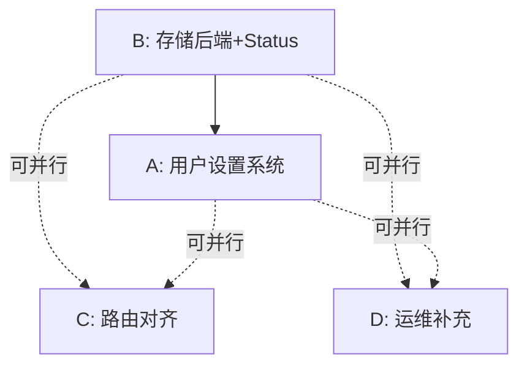
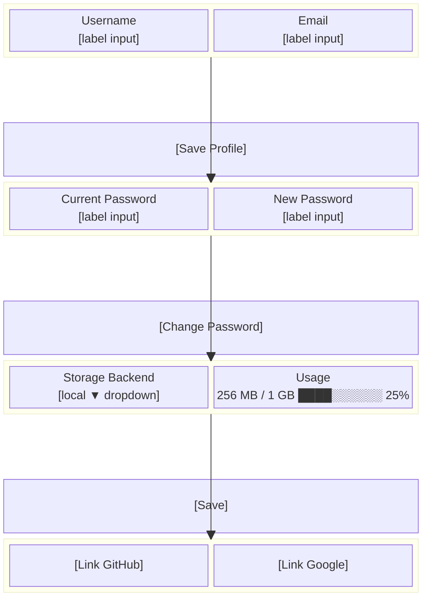
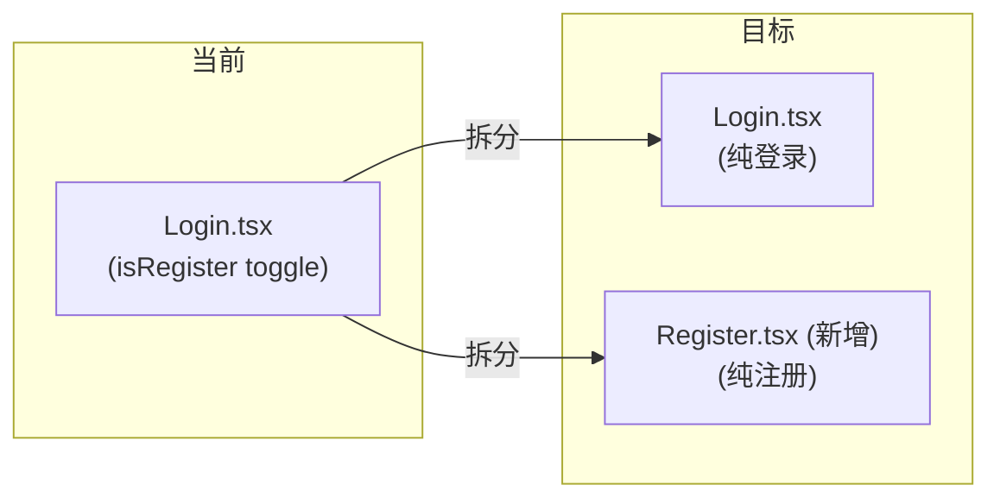
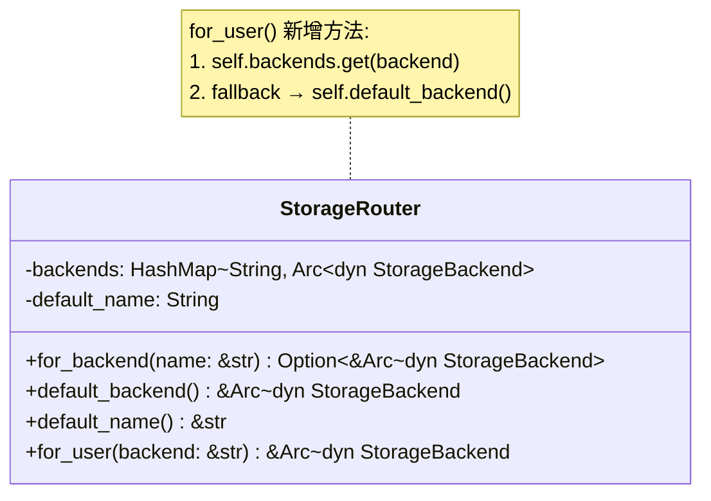
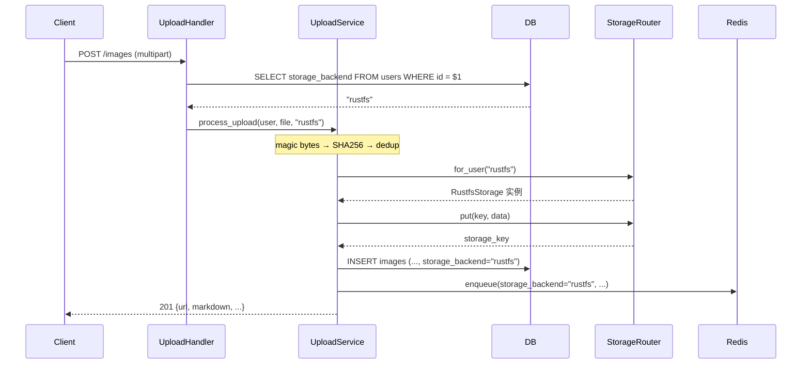
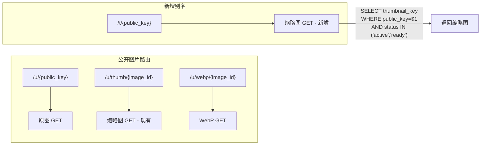
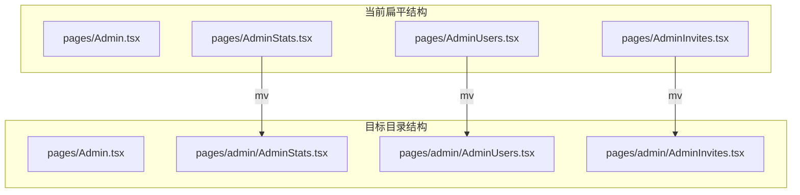
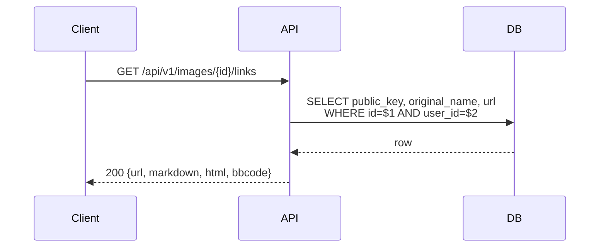
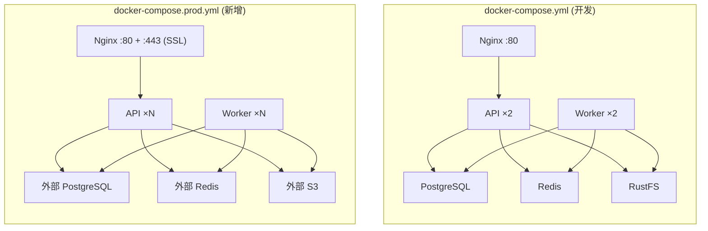

# PicHost P3 阶段设计文档

> **日期**: 2026-07-19
> **项目**: `pichost`
> **基于**: [2026-07-11-pichost-design.md](./2026-07-11-pichost-design.md)
> **状态**: P0/P1/P2 已完成 (v0.14.0)，本文件定义 P3 差异修复与特性补全

---

## 1. P3 阶段概述

P3 阶段的目标是**消除设计文档与当前实现之间的差异**，共 10 项。按功能聚合并为 4 个独立实现单元：

| 单元 | 项 | 主题 | 优先级 |
|------|----|------|--------|
| A | 1, 4, 9(部分) | 用户自行设置系统 | High |
| B | 2, 3, 10 | 存储后端按用户选择 + Status 统一 | High |
| C | 6, 7 | 前端路由/路径对齐 | Medium |
| D | 5, 8, 9(部分) | 运维与补充端点 | Low |



**唯一硬依赖**: B → A（Settings 验证 storage_backend 名称需要 for_user()）。
**推荐执行顺序**: B → A → {C, D}（C 和 D 可在 A 之后并行）。

---

## 2. 单元 A: 用户自行设置系统

### 2.1 新增 API 端点

`pichost-api/src/routes/users.rs` 新增 3 个 handler，在 `main.rs` 的 `user_routes()` 中注册：

```
GET    /api/v1/users/me             → get_my_profile
PATCH  /api/v1/users/me             → update_my_profile
POST   /api/v1/users/me/password    → change_my_password
```

#### GET /users/me

读取当前用户的完整信息。

```json
{
  "id": "550e8400-e29b-41d4-a716-446655440000",
  "username": "alice",
  "email": "alice@example.com",
  "storage_backend": "local",
  "storage_prefix": "users/550e8400-e29b",
  "storage_quota": 1073741824,
  "is_admin": false,
  "created_at": "2026-07-19T10:30:00Z",
  "updated_at": "2026-07-19T14:22:00Z"
}
```

- 从 `users` 表 SELECT 全字段
- 已有 `require_auth` 中间件保护
- 响应体 `< 500 bytes`，无需分页
- 不缓存（用户数据低频访问但需要实时性）

#### PATCH /users/me

部分更新用户资料。

```json
// Request (所有字段 optional)
{
  "username": "new_alice",
  "email": "new@example.com",
  "storage_backend": "rustfs"
}

// Response: 200 + 完整 UserProfile
```

验证规则：
- `username`: 提交时检查 `users` 表唯一约束，冲突返回 `409 Conflict`
- `email`: 基本格式校验（`@` 和 `.`） + 唯一约束检查，冲突返回 `409`
- `storage_backend`: 检查 `StorageRouter` 是否配置了该后端，未配置返回 `400 "unknown backend: {name}"`
- 禁止通过此端点修改 `is_admin`、`storage_quota` — 这些字段不在 `UpdateMyProfileBody` 中

#### POST /users/me/password

独立密码修改端点。

```json
// Request
{
  "current_password": "old_password",
  "new_password": "new_password123"
}

// Response: 200 {"message": "password updated"}
// 失败:    401 {"error": "current password incorrect"}
```

- `new_password` 最少 8 字符
- 使用 Argon2id 验证现有密码 + 生成新哈希

### 2.2 前端 Settings 页面

**路由**: `/settings`（已存在）

改造为三分区卡片布局：



数据流：
- **加载**: `useQuery(["userMe"], getUserMe)` — 页面挂载时获取
- **Profile 更新**: `useMutation(updateUserMe)` — 成功后 invalidate `["userMe"]`
- **密码修改**: `useMutation(changePassword)` — 成功后 toast + 清空输入框
- **存储后端下拉**：选项来自环境变量或硬编码 `["local", "rustfs"]`（不额外引入 API 调用）
- **用量条**: 复用已有 `useQuery(["userStats"], getUserStats)` 的数据

### 2.3 提取独立 Register 页面



改动清单：
- 新建 `web-ui/src/pages/Register.tsx` — 从 `Login.tsx` 中提取注册表单逻辑
- `App.tsx` 新增路由 `path="/register"` → `<Register />`
- `Login.tsx` 移除 `isRegister` toggle，保留"Create account"链接指向 `/register`
- 注册逻辑不变：邀请码验证 + 首个用户自动 admin

### 2.4 User 模型补充 storage_quota

```rust
// pichost-core/src/models.rs
pub struct User {
    pub id: Uuid,
    pub username: String,
    pub email: Option<String>,
    pub password_hash: String,
    pub storage_backend: String,
    pub storage_prefix: String,
    pub storage_quota: Option<i64>,  // ← 新增
    pub is_admin: bool,
    pub created_at: DateTime<Utc>,
    pub updated_at: DateTime<Utc>,
}
```

- SQL 查询和已有代码中 quota 通过内联查询获取，添加字段后可直接使用 `query_as::<User>(...)` 
- 不影响现有代码 — 只增加字段不删除

---

## 3. 单元 B: 存储后端 + Status 统一

### 3.1 StorageRouter::for_user()



```rust
// pichost-core/src/storage/router.rs
pub fn for_user(&self, backend: &str) -> &Arc<dyn StorageBackend> {
    self.backends.get(backend).unwrap_or_else(|| self.default_backend())
}
```

逻辑：
1. 在 `backends` HashMap 中查找 `backend` 对应的后端实例
2. 找到 → 返回；未找到 → fallback 到 `default_backend()`
3. 方法签名接受 `&str`（而非 `&User`）以避免 core crate 依赖 User 类型（core 不应反依赖）

### 3.2 上传管线改造



3 处硬编码 → 动态化：

| 文件 | 函数 | 改前 | 改后 |
|------|------|------|------|
| `pichost-api/src/services/upload.rs` | `write_to_storage()` | `router.default_backend()` | `router.for_user(&storage_backend)` |
| 同上 | `persist_image()` | 硬编码 `"local"` | 接受 `storage_backend: &str` 参数 |
| 同上 | `enqueue_processing_task()` | 硬编码 `"storage_backend":"local"` | 接受 `storage_backend: &str` 参数 |

- `storage_backend` 值来自 upload handler 从 `users` 表查询（在 `process_upload` 开始时执行）
- 已有图片的 `storage_backend` 不变 — 只影响新上传

### 3.3 ImageStatus 枚举兼容

```mermaid
stateDiagram-v2
    [*] --> Pending: INSERT (DB DEFAULT)
    Pending --> Active: 上传文件写入完成 (新增)
    Active --> Processing: Worker 从队列接收任务
    Processing --> Ready: Worker 处理成功
    Processing --> Failed: Worker 失败
    Ready --> [*]: 终态
    Failed --> Processing: 重试 (retry_count < max_retries)
    Failed --> [*]: 超过重试上限
    
    note right of Active: 向后兼容方案:<br/>加入枚举但不修改 DB<br/>Active 仅表示枚举语义<br/>服务端检查: Active = Ready
```

```rust
// pichost-core/src/models.rs — ImageStatus 枚举
#[derive(Debug, Clone, sqlx::Type, Serialize, Deserialize, PartialEq)]
#[sqlx(type_name = "text")]
pub enum ImageStatus {
    Pending,
    Active,     // ← 新增 (对应 DB 中 'active')
    Processing,
    Ready,
    Failed,
}
```

- **不添加 migration** — 不修改已有 DB 数据
- `Active` 序列化为 `"active"`（`#[serde(rename_all = "snake_case")]`），与 DB 存储一致
- 图片服务查询 `WHERE status IN ('active', 'ready')` 保持不变
- 枚举完整性：所有实际使用的 DB status 值现在都有对应的枚举 variant

### 3.4 storage_prefix DEFAULT

不改 migration（避免破坏已有部署的 schema），在注册时由代码设置：

```rust
// pichost-api/src/routes/auth.rs — register handler
let storage_prefix = format!("users/{}", user_id);
```

- 设计文档中指定 `DEFAULT 'users/{id}'`，动态生成确保每个用户路径唯一
- 已有用户（`storage_prefix` 为空字符串）不受影响

---

## 4. 单元 C: 前端路由/路径对齐

### 4.1 缩略图别名 `/t/:public_key`

新增公开路由，使用 `public_key` 而非 `image_id`：



实现：
```rust
// main.rs — public_routes() 内新增
.route("/t/{public_key}", get(routes::images::public_get_thumb_by_key))
```

新 handler `public_get_thumb_by_key` 逻辑与 `public_get_thumb` 相似，差异仅在查询条件：
- `public_get_thumb`: `WHERE id = $1`（用 `image_id`）
- `public_get_thumb_by_key`: `WHERE public_key = $1`（用 `public_key`）

两条路由共存，不破坏现有引用。

### 4.2 Admin 页面子目录重组



改动仅限于 `Admin.tsx` 中的 import：

```ts
// 改前
import AdminStats from './AdminStats'
import AdminUsers from './AdminUsers'
import AdminInvites from './AdminInvites'

// 改后
import AdminStats from './admin/AdminStats'
import AdminUsers from './admin/AdminUsers'
import AdminInvites from './admin/AdminInvites'
```

- 功能逻辑零变更
- `npm run build` 验证即可

---

## 5. 单元 D: 运维与补充

### 5.1 `GET /images/:id/links` 端点



```json
// Response
{
  "url": "https://pichost.example.com/u/k3Xf9a",
  "markdown": "",
  "html": "",
  "bbcode": "[img]https://pichost.example.com/u/k3Xf9a[/img]"
}
```

- 轻量端点 — 不查 storage、不返回图片详情，仅拼装链接
- 需要 JWT 认证（与所有 `/images/*` 路由一致）
- 注册在 `images_routes()` 中

### 5.2 docker-compose.prod.yml



与 `docker-compose.yml` 的关键差异：

| 配置项 | dev | prod |
|--------|-----|------|
| PostgreSQL 服务 | 内嵌容器 | **移除** — 外部连接 |
| Redis 服务 | 内嵌容器 | **移除** — 外部连接 |
| RustFS 服务 | 内嵌容器 | **移除** — 外部 S3 |
| SSL | 无 | **:443 + certificate volume** |
| API replicas | 2 | 可调（默认 4） |
| Worker replicas | 2 | 可调（默认 4） |
| 端口暴露 | Nginx :80, RustFS :9000 | Nginx :80 + :443 |
| JWT_SECRET | 环境变量 | **Docker secret** |

### 5.3 UploadTask 模型补充 max_retries

```rust
// pichost-core/src/models.rs — UploadTask 结构体
pub struct UploadTask {
    pub id: Uuid,
    pub image_id: Uuid,
    pub task_type: String,
    pub payload: Option<serde_json::Value>,
    pub status: String,
    pub error: Option<String>,
    pub retry_count: i32,
    pub max_retries: i32,       // ← 新增
    pub created_at: DateTime<Utc>,
    pub completed_at: Option<DateTime<Utc>>,
}
```

- DB 列 `max_retries INTEGER NOT NULL DEFAULT 3` 在 migration 0004 已存在
- Worker 中有自己的 `TaskPayload` struct 带 `max_retries` 字段
- 补全后核心模型与 DB schema 对齐，可直接使用 `query_as::<UploadTask>(...)`

---

## 6. 验证标准

### 所有单元通用

- `cargo clippy --workspace -- -D warnings` — 零警告
- `cargo test --workspace` — 14 pass, 10 ignored（无新失败）
- `cargo build --workspace` — 成功
- `cd web-ui && npm run build` — tsc + vite 构建成功

### 单元 A 专项

- [ ] `GET /users/me` 返回完整 UserProfile（含 quota、storage_backend）
- [ ] `PATCH /users/me` 只更新提交的字段，拒绝更新 is_admin/quota
- [ ] username/email 唯一性冲突返回 409
- [ ] storage_backend 未知返回 400
- [ ] `POST /users/me/password` 验证旧密码 + 更新哈希
- [ ] Settings 页面渲染三区卡片 + 用量条
- [ ] `/register` 独立路由可访问，注册功能正常

### 单元 B 专项

- [ ] `for_user("rustfs")` 返回 RustfsStorage 实例
- [ ] `for_user("nonexistent")` fallback 到 default_backend
- [ ] 上传时使用用户 storage_backend 对应的 StorageBackend
- [ ] DB 中 image 记录的 storage_backend 与用户偏好一致
- [ ] Worker 任务 payload 中 storage_backend 与上传一致
- [ ] `ImageStatus::Active` 序列化为 `"active"`
- [ ] 图片服务 `WHERE IN ('active', 'ready')` 正常工作

### 单元 C 专项

- [ ] `GET /t/k3Xf9a` 返回缩略图（当图片 status 为 active/ready）
- [ ] `GET /t/unknown` 返回 404
- [ ] `/u/thumb/{id}` 仍然可用
- [ ] Admin 页面 import 更新后 `npm run build` 成功

### 单元 D 专项

- [ ] `GET /images/{id}/links` 返回 4 种链接格式
- [ ] `docker compose -f docker-compose.prod.yml config` 不报错
- [ ] UploadTask 模型可直接用于 sqlx query_as

---

## 7. 依赖与风险

| 风险 | 级别 | 缓解 |
|------|------|------|
| `storage_backend` 变更导致已有上传走错后端 | 低 | 只影响新上传，已有图片的 storage_backend 不变 |
| `ImageStatus::Active` 与第三方序列化冲突 | 低 | 加入枚举 variant，现有匹配逻辑不变 |
| Settings 页面表单验证复杂度 | 低 | 用户名/邮箱/密码分别独立表单，各自 mutation |
| /t/{public_key} 与 /u/{public_key} 路由冲突 | 无 | Axum 精确路由匹配，不冲突 |
| migration DEFAULT 修改影响已有部署 | 无 | 不改 migration，代码中动态设置 |

---

## 8. 完成标准

P3 阶段完成即实现设计文档与当前代码的完全对齐。此后：

- 设计文档中的所有 API 端点均存在
- 设计文档中的所有前端路由均存在
- 设计文档中的所有数据模型字段在代码和 DB 层面一致
- 设计文档中的项目结构与实际目录结构一致
- P0/P1/P2/P3 全部完成后可进入 P4（新特性开发）
