# PicHost P4 — 新特性设计文档

> **状态**: 设计中 / 未实施
> **目标版本**: v0.15.0+
> **日期**: 2026-07-19
> **前置条件**: P3（差距修复阶段）必须完成后才能开始 P4 开发。

## 目录

1. [概述](#1-概述)
2. [P4-A：Git 存储后端 + 多后端上传选择](#2-p4-a-git-存储后端--多后端上传选择)
3. [P4-B：剪贴板粘贴 + URL 上传](#3-p4-b剪贴板粘贴--url-上传)
4. [P4-C：图库分类/目录](#4-p4-c图库分类目录)
5. [P4-D：图片水印（服务端）](#5-p4-d图片水印服务端)
6. [P4-E：图片预处理（客户端）](#6-p4-e图片预处理客户端)
7. [P4-F：原文件名保留 + 重命名](#7-p4-f原文件名保留--重命名)
8. [P4-G：设置入口优化](#8-p4-g设置入口优化)
9. [P4-H：软件打包 + 自动化发布](#9-p4-h软件打包--自动化发布)
10. [实施分期](#10-实施分期)
11. [风险评估](#11-风险评估)

---

## 1. 概述

P4 引入 6 个新特性领域，分为独立阶段。各阶段在 P4-A 完成后可独立开发和部署。

| 阶段 | 主题 | 优先级 | 依赖 |
|------|------|--------|------|
| **P4-A** | Git 存储后端 + 多后端上传选择 + Gallery 过滤 | **最高** | P3 完成 |
| **P4-B** | 剪贴板粘贴 + URL 上传 | 高 | P4-A（共享上传管线） |
| **P4-C** | 图库分类/目录 | 高 | 无 |
| **P4-D** | 服务端水印 | 中 | 无 |
| **P4-E** | 客户端图片预处理 | 中 | 无 |
| **P4-F** | 文件名保留 + 重命名 | **低** | 无 |
| **P4-G** | 设置入口优化 | 中 | 无 |
| **P4-H** | 软件打包 + 自动化发布 | 中 | 无（DevOps） |

**B–H 阶段互相独立**，P4-A 完成后可并行开发。

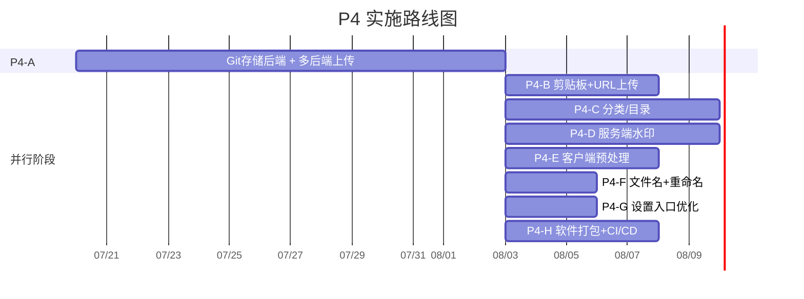

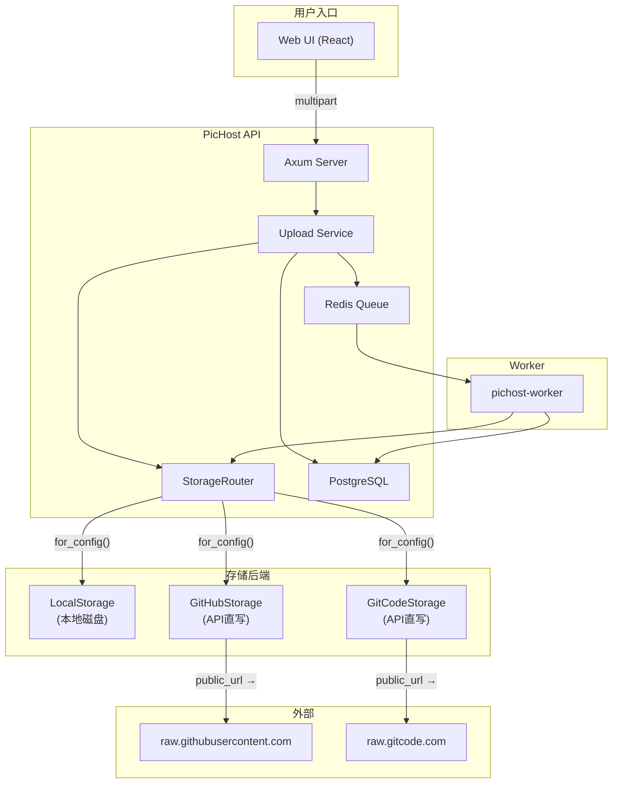

---

## 2. P4-A：Git 存储后端 + 多后端上传选择

### 2.1 范围

- 支持 GitHub 和 GitCode（CSDN 旗下）作为图片存储后端，通过其 Contents REST API 操作
- 用户自带仓库 + Personal Access Token（PAT），管理员零存储负担
- 每用户可配置多个存储后端（上限 5 个）
- 上传时可按次选择目标后端（最多同时 2 个，其中一个必须为 `local`）
- Gallery 支持按存储后端过滤
- Worker（缩略图/WebP）透明写入 Git 后端

### 2.2 架构决策：纯 API 操作 Git

使用 HTTP API 直写（GitHub Contents API / GitCode Contents API），不走 clone-commit-push 流程。

| 方案 | 优点 | 缺点 |
|------|------|------|
| **API 直写** ✅ | 轻量、无需本地 clone、响应快、适合单文件操作 | 受速率限制、GitCode 有 20MB 单文件上限 |
| Clone + commit + push | 无大小限制、支持批量操作 | 需本地 clone 目录、慢、并发复杂 |

**选定**: API 直写 — 契合 PicHost 无状态架构和单文件上传模式。

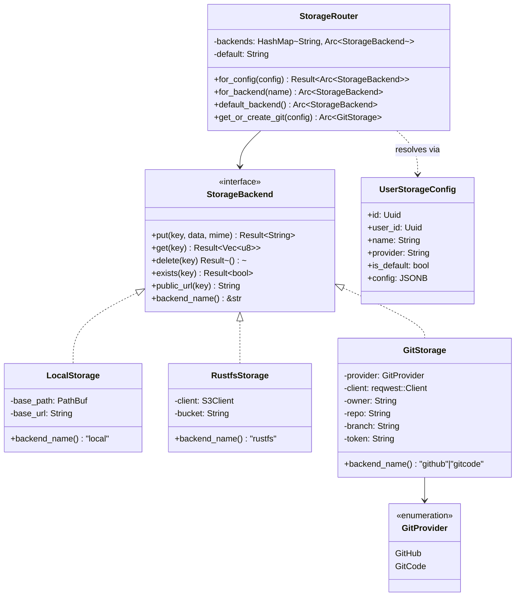

### 2.3 数据库设计

#### 新表：`user_storage_configs`

```sql
-- 迁移 0008
CREATE TABLE user_storage_configs (
    id          UUID PRIMARY KEY DEFAULT gen_random_uuid(),
    user_id     UUID NOT NULL REFERENCES users(id) ON DELETE CASCADE,
    name        VARCHAR(64) NOT NULL,          -- 用户自定义名称，如 "我的GitHub图床"
    provider    VARCHAR(16) NOT NULL,           -- 'github' | 'gitcode' | 'local'
    is_default  BOOLEAN NOT NULL DEFAULT false, -- 是否为默认后端
    config      JSONB NOT NULL,                 -- 后端特定配置，token 已加密
    created_at  TIMESTAMPTZ NOT NULL DEFAULT NOW(),
    updated_at  TIMESTAMPTZ NOT NULL DEFAULT NOW(),

    UNIQUE(user_id, name)
);

-- 确保每用户最多一个默认配置
CREATE UNIQUE INDEX idx_default_per_user
    ON user_storage_configs(user_id) WHERE is_default = true;
```

#### `images` 表新增字段

```sql
-- 迁移 0008（续）
ALTER TABLE images
    ADD COLUMN storage_config_id UUID
    REFERENCES user_storage_configs(id);
```

#### `config` JSONB 结构

**GitHub / GitCode:**
```json
{
    "token_encrypted": "<AES-256-GCM 密文，base64 编码>",
    "repo": "owner/repo",
    "branch": "main",
    "path_prefix": "pichost"
}
```

**local（本地存储）:** `{}`

#### Token 加密密钥

新增环境变量：

| 变量 | 必填 | 说明 |
|------|------|------|
| `PICHOST_AUTH_TOKEN_ENCRYPTION_KEY` | 启用 Git 后端时必填 | AES-256-GCM 密钥，用于加密用户 PAT。须 32 字节（base64 或 hex 编码）。与 `PICHOST_AUTH_JWT_SECRET` 独立。 |

Token 生命周期：
1. 用户提交明文 PAT → `POST /api/v1/users/me/storage-configs`
2. 服务端 AES-256-GCM 加密后 `INSERT`
3. `GitStorage::new()` 创建时解密
4. GET 接口返回 `token_masked`（如 `ghp_****abcd`）
5. 明文 token 仅存于服务端内存，永不写入日志

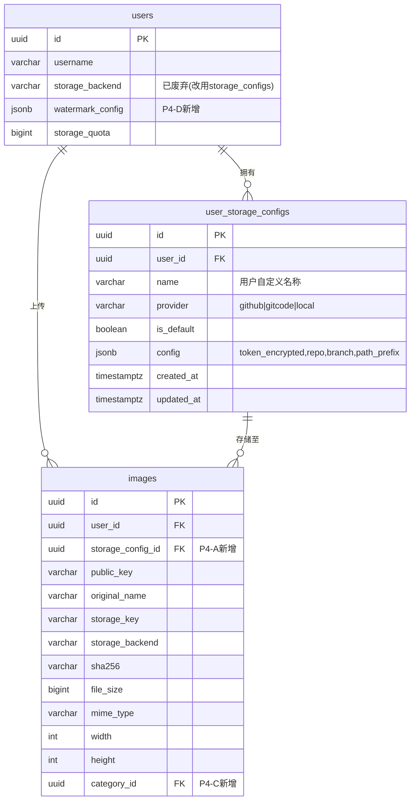

### 2.4 Rust 模型

```rust
// pichost-core/src/models.rs

/// 用户的存储后端配置
pub struct UserStorageConfig {
    pub id: Uuid,
    pub user_id: Uuid,
    pub name: String,           // "我的GitHub图床"
    pub provider: String,       // "github" | "gitcode" | "local"
    pub is_default: bool,
    pub config: serde_json::Value,
    pub created_at: DateTime<Utc>,
    pub updated_at: DateTime<Utc>,
}

/// config JSON 的反序列化结构（Git 后端）
pub struct GitConfigDetail {
    pub token_encrypted: String,
    pub repo: String,
    pub branch: String,
    pub path_prefix: Option<String>,
}
```

### 2.5 GitStorage 实现

**文件**: `pichost-core/src/storage/git.rs`

单一 `GitStorage` 结构体，通过 `GitProvider` 枚举区分 GitHub 和 GitCode。

```rust
pub enum GitProvider { GitHub, GitCode }

pub struct GitStorage {
    provider: GitProvider,
    client: reqwest::Client,
    owner: String,              // 从 "owner/repo" 解析
    repo: String,
    branch: String,
    path_prefix: Option<String>,
    token: String,              // 创建时解密
    raw_base_url: String,       // "raw.githubusercontent.com" 或 "raw.gitcode.com"
    api_base_url: String,       // "https://api.github.com" 或 "https://api.gitcode.com/api/v5"
}
```

#### Trait 方法实现

| 方法 | 实现 |
|------|------|
| `backend_name()` | 返回 `"github"` 或 `"gitcode"` |
| `put(key, data, mime)` | GitHub: `PUT .../contents/{path}`；GitCode: `POST .../contents/{path}`。Base64 编码内容 + commit message + branch。GitCode 文件 ≤20MB 时可用 Contents API，否则回退 `multipart/file_upload`。返回 raw 公开 URL。 |
| `get(key)` | `GET .../raw/{path}?ref={branch}` → 原始 bytes |
| `delete(key)` | `GET .../contents/{path}` 获取 SHA → `DELETE .../contents/{path}` |
| `exists(key)` | `GET .../contents/{path}` → 200 = 存在，404 = 不存在 |
| `public_url(key)` | `https://{raw_base_url}/{owner}/{repo}/{branch}/{full_path}` |

#### 文件路径规范

```
{path_prefix}/{YYYY}/{MM}/{DD}/{public_key}.{ext}
```

示例: `pichost/2026/07/19/a3f8c2.png`

- `path_prefix` 默认 `"pichost"`（用户可自定义）
- 扩展名从 `content_type` 推导（MIME → 扩展名映射表）
- 日期取自服务端起钟
- **数据库中 `storage_key` 存储完整路径**（如 `pichost/2026/07/19/a3f8c2.png`），与本地存储的 `{user_id}/{public_key}` 格式不同 — 各后端自行管理 `storage_key` 格式

#### 速率限制

| 平台 | 限制 | 处理方式 |
|------|------|----------|
| GitHub | 5,000 次/小时（已认证） | 读取 `X-RateLimit-Remaining` 头；接近 0 时返回 `StorageError::WriteFailed` + retry-after |
| GitCode | 400 次/分钟，4,000 次/小时 | 429 时读取 `Retry-After` 头；返回 `StorageError::WriteFailed` |
| 两者 | 429 Too Many Requests | Worker 现有重试机制（3 次）处理瞬时限流 |

#### 文件大小限制

| 平台 | 端点 | 限制 | 超限处理 |
|------|------|------|----------|
| GitHub | Contents API | 100 MB | 无影响 — PicHost 单文件上限 50 MB |
| GitCode | Contents API | 20 MB | ≤20MB 用 Contents API；>20MB 返回 `413 Payload Too Large`，提示用户改用本地或 GitHub 存储。**不做静默 fallback** — 用户显式选择了后端，偷偷换掉会令用户困惑。 |

### 2.6 Router 改动

`StorageRouter` 需支持按上传选择的 `storage_config_id` 路由，替代现有的按用户 `storage_backend` 字段路由。

**新增方法**:
```rust
impl StorageRouter {
    /// 根据配置 ID 解析后端，非根据名称字符串
    pub fn for_config(
        &self,
        config: &UserStorageConfig,
    ) -> Result<Arc<dyn StorageBackend>, StorageError> {
        match config.provider.as_str() {
            "local" => Ok(self.default_backend()),
            "github" | "gitcode" => {
                // 动态创建 GitStorage 或从缓存获取
                self.backends.get(&config.id.to_string())
                    .cloned()
                    .ok_or(StorageError::Config("后端未找到".into()))
            }
            _ => Err(StorageError::Config(format!("未知 provider: {}", config.provider)))
        }
    }
}
```

**注册策略**: Git 后端**不**在 `init_storage_backends()` 启动时预注册，而是在用户上传时按需动态创建，按 `config.id` 缓存在 Router 的 HashMap 中。原因：用户 PAT 可能随时更新，启动时注册会用到过期 token。Router 新增 `get_or_create_git(config)` 方法。

### 2.7 上传管线改动

**文件**: `pichost-api/src/services/upload.rs`

`process_upload()` 修改点：

1. 接收可选 `storage_config_ids: Option<Vec<Uuid>>` 参数
2. 未提供 → 使用用户默认配置（查 `user_storage_configs`），兜底 `local`
3. 已提供 → 校验每个 ID 属于该用户，校验最多 2 个，校验至少 1 个为 `local`
4. 循环：对每个 `storage_config_id`，通过 `router.get_or_create_git(config)` 获取后端，调用 `put()`，生成 URL
5. **每个后端各插入一条 `images` 记录**（各有独立 `id`、`public_key`、`url`，但 `sha256`、`original_name` 相同）
6. 每条 image 记录各入队一个 worker 任务

**多后端写入**意味着上传到 GitHub + local 产生 **2 条 image 记录**，而非 1 条。前端显示 2 个 UploadCard，文件名相同但 URL 不同。

**去重行为**: 现有 SHA256 去重按用户进行。多后端上传场景，去重扩展为 `(user_id, sha256, storage_config_id)`：
- 同一图片上传到 GitHub 两次 → 去重命中（返回已有的 GitHub 记录）
- 同一图片先上传到 GitHub，再上传到 local → **不去重**（`storage_config_id` 不同 → 新建记录）
- 去重查询从 `WHERE user_id=$1 AND sha256=$2` 改为 `WHERE user_id=$1 AND sha256=$2 AND storage_config_id=$3`

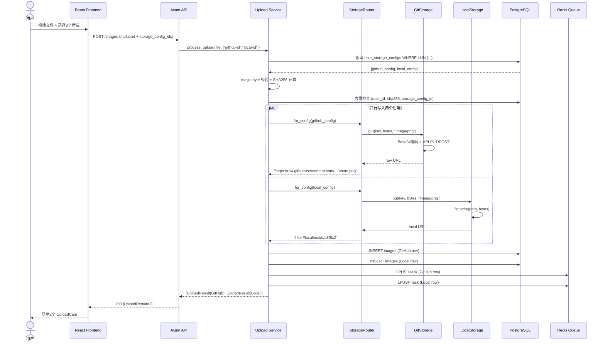

### 2.8 API 端点

#### 存储配置 CRUD

| Method | Path | Auth | 说明 |
|--------|------|------|------|
| `GET` | `/api/v1/users/me/storage-configs` | JWT | 列出所有配置（token 掩码返回） |
| `POST` | `/api/v1/users/me/storage-configs` | JWT | 创建配置。保存前验证 token + 仓库可达性。每用户上限 5 个。 |
| `GET` | `/api/v1/users/me/storage-configs/:id` | JWT | 单个配置详情（token 掩码） |
| `PATCH` | `/api/v1/users/me/storage-configs/:id` | JWT | 更新 name、token、repo、branch、path_prefix。若 token/repo 变更则重新验证。 |
| `DELETE` | `/api/v1/users/me/storage-configs/:id` | JWT | 删除配置。若有图片引用则返回 409。 |
| `POST` | `/api/v1/users/me/storage-configs/:id/default` | JWT | 设为默认（自动取消上一个默认）。 |

#### 上传接口改动

**`POST /api/v1/images`** — 新增可选 FormData 字段：

```
storage_config_ids: "uuid1,uuid2"  （可选，逗号分隔，最多 2 个）
```

- 不传 → 使用默认配置（兜底 local）
- 传 1 个 → 只写该后端
- 传 2 个 → 同时写两个（其中一个必须为 `local`）

响应: `200` + `Vec<UploadResult>`（每个后端一条）。每条 `UploadResult` 包含新的 `storage_config` 字段：

```json
{
    "id": "uuid...",
    "public_key": "a3f8c2",
    "url": "https://raw.githubusercontent.com/owner/repo/main/pichost/2026/07/19/a3f8c2.png",
    "original_name": "photo.jpg",
    "storage_config": {
        "id": "uuid...",
        "name": "我的GitHub图床",
        "provider": "github"
    }
}
```

#### Gallery 过滤

**`GET /api/v1/images`** — 新增可选 query 参数：

```
?storage_config_id=uuid
```

SQL 增加 `AND i.storage_config_id = $N`，注入到 `fetch_user_images()` 和 `count_user_images()` 的 WHERE 子句。

### 2.9 前端设计

#### 设置页 — 存储配置管理

Settings 页面新增 **"存储后端"** Section Card，替代当前单一的 `<select>`：

```text
┌─ 存储后端 ────────────────────────────────────┐
│                                                │
│  ● 本地存储（默认）            [•••] 设为默认  │
│                                                │
│  ○ 我的GitHub图床                         [•••]│
│     github.com/myuser/my-images    [编辑][删除] │
│                                                │
│  ○ 我的GitCode图床                         [•••]│
│     gitcode.com/myuser/images     [编辑][删除] │
│                                                │
│  [+ 添加存储后端]                               │
└────────────────────────────────────────────────┘
```

**添加/编辑弹窗**：
```text
┌─ 添加存储后端 ─────────────────────────────────┐
│                                                │
│  名称: [我的GitHub图床               ]          │
│  类型: [GitHub ▾]                               │
│  Token: [ghp_••••••••••••••••••••••]  [显示]    │
│  仓库: [myuser/my-images            ]           │
│  分支: [main                         ]          │
│  路径: [pichost                       ]（可选） │
│  ☐ 设为默认后端                                  │
│                                                │
│  [测试连接]   ✓ 连接成功                        │
│                                                │
│              [取消]  [保存]                      │
└────────────────────────────────────────────────┘
```

- 保存前**必须先点「测试连接」**，后端验证 token + 仓库存在性
- Token 字段默认隐藏，点击「显示」切换可见
- 选择 GitCode 时，URL 提示文字变为 `gitcode.com/api/v5`

#### 上传页 — 多后端选择

Dashboard 页面 DropZone 上方新增后端选择器：

```text
┌─ 上传图片 ───────────────────────────────────────┐
│                                                   │
│  存储到: [我的GitHub图床 ▾]  [+ 添加第2个后端]    │
│          [本地存储 ▾]  （已选 2/2）               │
│                                                   │
│  ┌──────────────────────────────────┐            │
│  │      拖拽图片到此处               │            │
│  │      或 点击选择文件              │            │
│  └──────────────────────────────────┘            │
│                                                   │
│  或按 Ctrl+V 粘贴  |  输入 URL: [______] [上传]   │
└───────────────────────────────────────────────────┘
```

**交互规则**：
- 默认选中用户的默认后端（1 个）
- 点击 `[+ 添加第2个后端]` 展开第二个下拉，已选项置灰
- 最多 2 个，选满后按钮消失
- 两个选择器的选项互斥
- 剪贴板粘贴和 URL 上传共用同一套后端选择逻辑

#### UploadCard 改动

完成后新增一行显示存储后端名称：

```text
✓ photo.jpg（2.3 MB）
  → 我的GitHub图床
  [打开] [复制URL] [复制MD]
```

双后端上传时，前端收到 2 条 `UploadResult`，渲染 2 个 Card。

#### Gallery 过滤

筛选栏新增后端下拉：

```text
[全部后端 ▾]  [🔍 搜索...]  [排序 ▾]  [全选]
```

下拉列出该用户所有 `storage_configs` + "全部"。选中后附加 `?storage_config_id=uuid` 到 API 请求，同时同步到 URL searchParams（刷新保持筛选状态）。

Gallery 图片卡片右上角显示小型 provider 图标（GitHub/GitCode/local）。

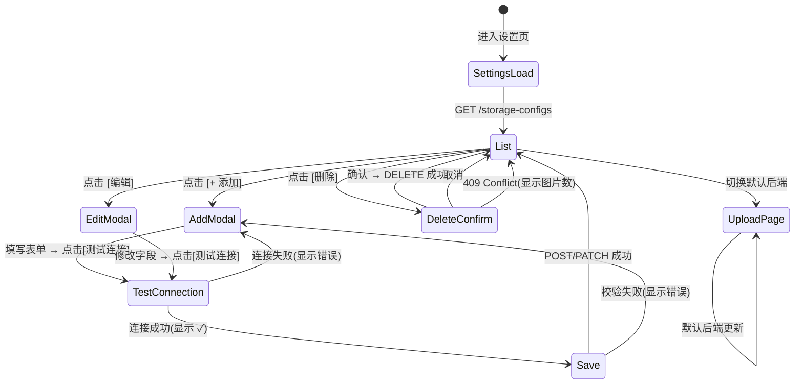

### 2.10 Worker 改动

`TaskPayload` 新增字段：
```rust
pub storage_config_id: Option<Uuid>,
pub storage_backend_name: String,    // "github" | "gitcode" | "local"
```

Worker 在任务处理时通过 `router.for_config(config)` 解析后端。所有变体（缩略图、WebP）写回同一后端。

**管线逻辑无变化** — `StorageBackend` trait 抽象已屏蔽差异。

### 2.11 安全约束

| 规则 | 实现 |
|------|------|
| Token 静态加密存储 | AES-256-GCM，独立密钥（`PICHOST_AUTH_TOKEN_ENCRYPTION_KEY`） |
| Token 永不在 API 响应中返回 | GET/PATCH 返回 `token_masked: "ghp_****abcd"` |
| 创建时验证仓库可达性 | `POST` handler 先调 `GET /repos/{owner}/{repo}` 再 INSERT |
| 删除保护 | 有 `images` 引用则返回 409 Conflict |
| 每用户配置上限 | 5 个（可通过环境变量调整） |
| 多后端上传至少含一个 local | 服务端强制校验，2 个非 local 后端返回 400 |
| Token 永不记录日志 | 中间件从请求体日志中剥离 `token` 字段 |

### 2.12 GitCode 与 GitHub API 兼容性

| 维度 | GitHub | GitCode | 兼容？ |
|------|--------|---------|--------|
| 基础 URL | `https://api.github.com` | `https://api.gitcode.com/api/v5` | 不同（配置区分） |
| 认证头 | `Authorization: Bearer <token>` | `Authorization: Bearer` 或 `PRIVATE-TOKEN` | ✅ 都支持 Bearer |
| 创建文件 | `PUT .../contents/{path}` | `POST .../contents/{path}` | HTTP 方法不同 |
| 获取文件内容 | `GET .../contents/{path}` | `GET .../contents/{path}` | ✅ 一致 |
| 获取原始内容 | `GET .../raw/{path}` | `GET .../raw/{path}` | ✅ 一致 |
| 删除文件 | `DELETE .../contents/{path}` | `DELETE .../contents/{path}` | ✅ 一致 |
| 文件大小上限 | 100 MB（Contents API） | 20 MB（Contents API） | 不同 |
| 速率限制 | 5,000 次/小时 | 400 次/分钟, 4,000 次/小时 | 相近 |
| Raw URL 模式 | `raw.githubusercontent.com/{owner}/{repo}/{branch}/{path}` | `raw.gitcode.com/{owner}/{repo}/{branch}/{path}` | 模式相同 |

**结论**: 单一 `GitStorage` 实现 + `GitProvider` 枚举，仅切换基础 URL、HTTP 方法和 raw URL 模板。核心参数结构完全一致。

---

## 3. P4-B：剪贴板粘贴 + URL 上传

### 3.1 范围

- 在 Dashboard 页面直接粘贴剪贴板中的图片
- 提供图片 URL，由服务端下载后上传
- 均使用 P4-A 的后端选择逻辑

### 3.2 剪贴板粘贴

**触发**: DropZone 容器（或 `window`）上监听 `paste` 事件。

**检测**: 检查 `event.clipboardData.items` 中 `type.startsWith('image/')` 的项。

**流程**:
```
用户 Ctrl+V
  → paste 事件触发
  → clipboardData.items[n].type === 'image/png'
  → item.getAsFile() → File 对象
  → addFiles([file], { source: 'paste', storageConfigIds })
  → useUploadQueue 正常处理
```

**实现**: `useClipboardPaste` hook 或 Dashboard 内联处理。需处理：剪贴板无图片（忽略）、多个剪贴板项（仅取第一张图片）。

### 3.3 URL 上传

**选定方案**: 服务端下载（避免 CORS，更可靠）。

**新增端点**:

```
POST /api/v1/images/upload-url
Body: { "url": "https://example.com/photo.jpg", "storage_config_ids": ["uuid1"] }
Response: 200 { ... UploadResult }
```

**SSRF 防护**:
- DNS 解析检查：拒绝私有/保留 IP（127.0.0.0/8, 10.0.0.0/8, 172.16.0.0/12, 192.168.0.0/16, 169.254.0.0/16, ::1, fc00::/7）
- URL scheme 白名单：仅 `http` 和 `https`
- 超时：30 秒
- 最大响应体：50 MB
- 重定向限制：5 跳
- 下载后 magic byte 校验

**前端**: DropZone 旁的 URL 输入框 + "上传"按钮。提交后调 `uploadImageFromUrl()` → 显示进度 → 结果追加到上传队列。

---

## 4. P4-C：图库分类/目录

### 4.1 范围

- 用户可创建层级分类（最多 2 级）
- 图片可分配到分类
- Gallery 可按分类过滤
- 支持批量移动图片到分类

### 4.2 数据库设计

```sql
-- 迁移 0009
CREATE TABLE categories (
    id          UUID PRIMARY KEY DEFAULT gen_random_uuid(),
    user_id     UUID NOT NULL REFERENCES users(id) ON DELETE CASCADE,
    name        VARCHAR(128) NOT NULL,
    parent_id   UUID REFERENCES categories(id) ON DELETE CASCADE,
    created_at  TIMESTAMPTZ NOT NULL DEFAULT NOW(),

    UNIQUE(user_id, name, parent_id)
);

ALTER TABLE images
    ADD COLUMN category_id UUID REFERENCES categories(id) ON DELETE SET NULL;
```

- `parent_id = NULL` 表示根级分类
- 最大深度在应用层强制（2 级）
- 删除分类级联删除子分类，关联图片的 `category_id` 置为 NULL

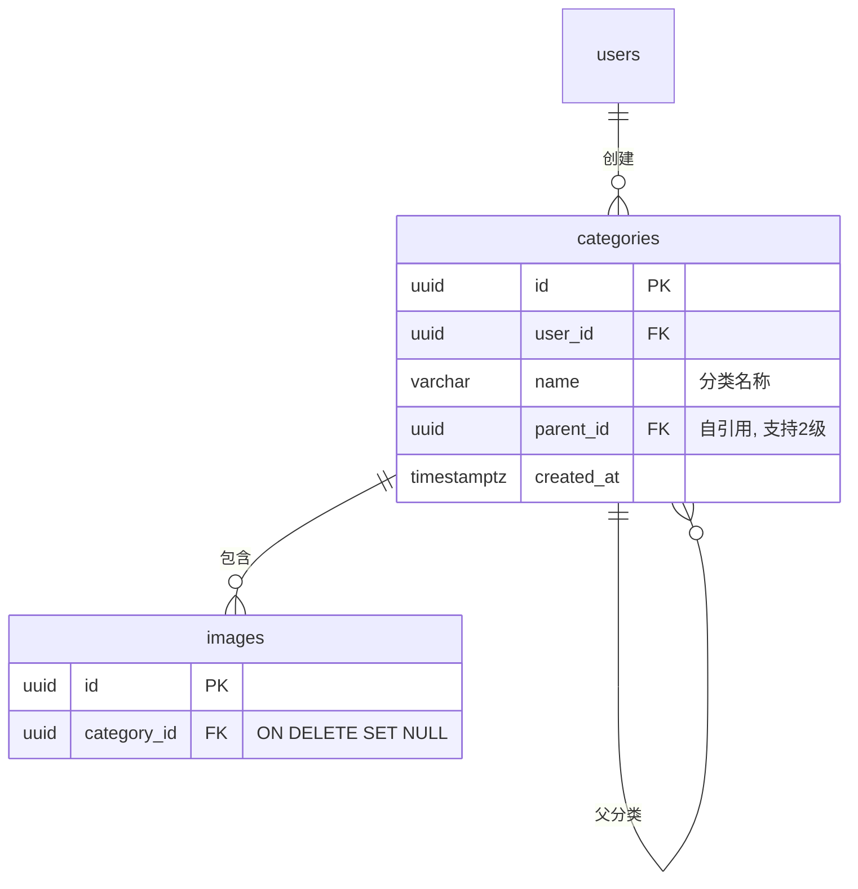

### 4.3 API 端点

| Method | Path | Auth | 说明 |
|--------|------|------|------|
| `GET` | `/api/v1/categories` | JWT | 列出用户分类，返回树结构：`[{ id, name, parent_id, children: [...] }]` |
| `POST` | `/api/v1/categories` | JWT | 创建分类。Body: `{ name, parent_id? }`。校验最大深度 ≤ 2。 |
| `PATCH` | `/api/v1/categories/:id` | JWT | 重命名分类 |
| `DELETE` | `/api/v1/categories/:id` | JWT | 删除分类（级联子分类、解除图片关联） |
| `POST` | `/api/v1/images/:id/move` | JWT | 移动图片到分类。Body: `{ category_id }`。 |
| `POST` | `/api/v1/images/batch-move` | JWT | 批量移动。Body: `{ image_ids: [...], category_id }`。 |

Gallery 过滤：

```
GET /api/v1/images?category_id=uuid
```

SQL 增加 `AND (i.category_id = $N OR ($N IS NULL AND i.category_id IS NULL))` 支持"未分类"筛选。

### 4.4 前端设计

**Gallery 布局改造**: 双栏布局。

```text
┌─ 分类 ────┬── 图片网格 ──────────────────────────┐
│            │                                       │
│ 📁 全部    │  [🔍] [存储 ▾] [排序 ▾] [全选]       │
│ 📁 博客    │                                       │
│   📁 Rust  │  ┌──┐ ┌──┐ ┌──┐ ┌──┐               │
│   📁 前端  │  │  │ │  │ │  │ │  │               │
│ 📁 项目    │  └──┘ └──┘ └──┘ └──┘               │
│            │                                       │
│ [+ 新建]   │                                       │
└────────────┴───────────────────────────────────────┘
```

- 左侧面板：可折叠树，最多 2 级
- 点击分类 → 过滤 Gallery，更新 URL `?category=uuid`
- 右键分类 → 重命名 / 删除 / 新建子分类
- 拖拽图片到侧栏分类 → 移动
- 批量选择 → "移动到分类"下拉按钮 → 分类选择弹窗

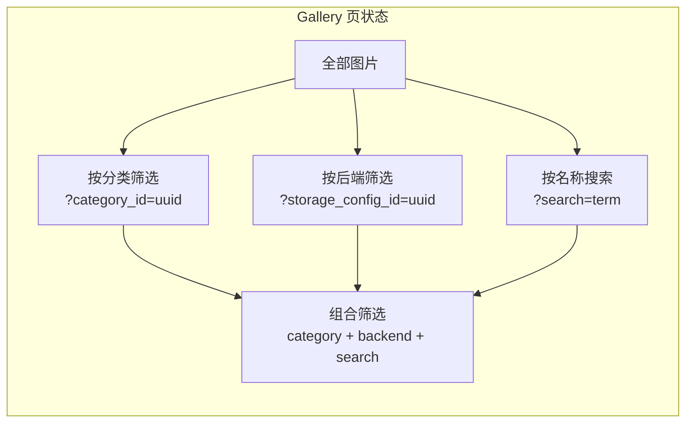

---

## 5. P4-D：图片水印（服务端）

### 5.1 架构决策：服务端 vs 客户端

用户原意是将预处理放在前端，但水印场景特殊：

| | 服务端（Worker）✅ | 客户端（Canvas） |
|---|---|---|
| 可靠性 | 必定执行 | 可绕过（curl 上传、API 直调） |
| 处理开销 | Worker 承担 | 用户浏览器承担 |
| 图片质量 | 高（image crate，精确渲染） | 可变（Canvas 限制） |
| 字体支持 | `imageproc` + `rusttype`（TTF 字体） | 仅浏览器字体 |
| 一致性 | 所有用户结果一致 | 依赖浏览器 |

**选定**: 服务端 Worker 管线中实现。水印是安全/归属功能 — 不可绕过。折中：水印在 Worker 中处理，其他预处理（压缩、缩放、EXIF 移除）放前端。

### 5.2 数据库

```sql
-- 迁移 0010
ALTER TABLE users
    ADD COLUMN watermark_config JSONB;
```

默认 `NULL`（水印关闭）。

### 5.3 水印配置结构

```json
{
    "enabled": true,
    "text": "@username",
    "font": "NotoSansSC-Regular",
    "font_size": 48,
    "color": "rgba(255, 255, 255, 0.5)",
    "rotation": -30.0,
    "scale": 0.15,
    "position": "bottom-right",
    "margin_x": 20,
    "margin_y": 20
}
```

| 字段 | 类型 | 默认值 | 说明 |
|------|------|--------|------|
| `enabled` | bool | `false` | 总开关 |
| `text` | string | `""` | 水印文字 |
| `font` | string | `"NotoSansSC-Regular"` | 字体名称（从内置字体选） |
| `font_size` | u32 | `48` | 基础字号（会按 `scale` 缩放） |
| `color` | string | `"rgba(255,255,255,0.5)"` | 文字颜色含透明度 |
| `rotation` | f64 | `-30.0` | 旋转角度（度） |
| `scale` | f64 | `0.15` | 相对于图片对角线长度的缩放 |
| `position` | enum | `"bottom-right"` | `top-left|top-right|bottom-left|bottom-right|center|tile` |
| `margin_x` | u32 | `20` | 距边缘像素 |
| `margin_y` | u32 | `20` | 距边缘像素 |

### 5.4 实现

**依赖 crate**: `imageproc` + `rusttype`（TTF 字体渲染）。

**内置字体**: 5 种字体随二进制嵌入（`include_bytes!`）：
- `NotoSansSC-Regular.ttf`（中文）
- `NotoSans-Regular.ttf`（拉丁）
- `Arial.ttf`
- `DejaVuSans.ttf`
- `FiraCode-Regular.ttf`

**挂载点**: `pichost-worker/src/pipeline.rs` → `process_image_variants()`。在源图解码**之后**、缩略图/WebP 生成**之前**插入水印步骤，确保所有变体都带水印。

```rust
// processor.rs 新增函数
pub fn apply_watermark(
    img: &DynamicImage,
    config: &WatermarkConfig,
) -> DynamicImage {
    if !config.enabled || config.text.is_empty() {
        return img.clone();
    }
    let font = load_font(&config.font);
    let font_size = calculate_font_size(img, config);
    let (x, y) = calculate_position(img, config, font_size);
    // ... imageproc::drawing::draw_text_mut(...)
}
```

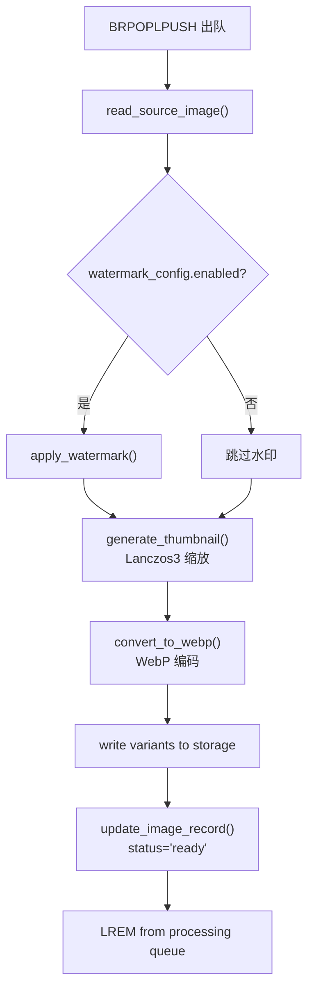

### 5.5 API

水印配置为用户 profile 的一部分。扩展 `PATCH /api/v1/users/me`：

```json
{
    "watermark_config": {
        "enabled": true,
        "text": "@myusername"
    }
}
```

### 5.6 前端

Settings 页面 — 新增 "默认水印" Card：

- 启用/禁用开关
- 文字输入（示例图片实时预览）
- 字体下拉（5 种选项带预览）
- 字号滑块
- 颜色选择器（hex + alpha）
- 旋转滑块（-180 到 180）
- 缩放滑块（0.01 到 1.0）
- 位置：3×3 九宫格选择器 + "平铺"选项
- 边距输入
- **实时预览**：一张示例图片随设置变化更新

---

## 6. P4-E：图片预处理（客户端）

### 6.1 范围

所有预处理在浏览器中**上传前**完成。所有操作均可选，用户按需开启。

| 操作 | 实现 | 说明 |
|------|------|------|
| EXIF 移除 | `exif-js` | 清除 JPEG 中所有 EXIF/元数据 |
| 旋转 | Canvas `rotate()` + `drawImage` | 90°/180°/270° 或自定义角度 |
| 缩放 | Canvas `drawImage` 指定目标尺寸 | 限制最大宽/高，保持宽高比 |
| 格式转换 | Canvas `toBlob(mimeType, quality)` | PNG→JPEG, JPEG→WebP 等 |
| 压缩 | Canvas `toBlob(type, quality)` | JPEG 质量滑块（10-100） |

### 6.2 架构

**Web Worker** — 所有处理在独立线程执行，避免阻塞 UI。

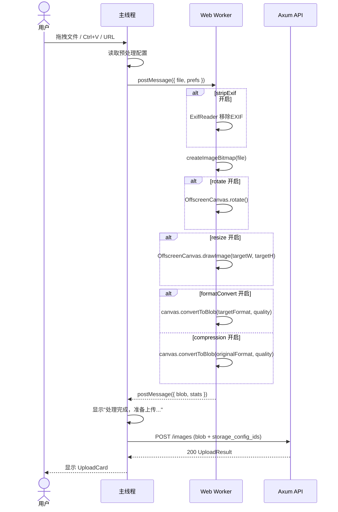

**预处理选项模型**（在 `useUploadQueue` 或独立 setting context 中）：

```typescript
interface PreprocessingPrefs {
  stripExif: boolean;         // 默认 false
  resize: {
    enabled: boolean;         // 默认 false
    maxWidth: number;         // 默认 1920
    maxHeight: number;        // 默认 1920
  };
  formatConvert: {
    enabled: boolean;         // 默认 false
    targetFormat: string;     // "image/jpeg" | "image/png" | "image/webp"
    quality: number;          // 0-100，默认 85
  };
  compression: {
    enabled: boolean;         // 默认 false
    quality: number;          // 0-100，默认 80
    maxSizeKB: number;        // 可选，默认 0（不限制）
  };
  rotate: {
    enabled: boolean;         // 默认 false
    degrees: number;          // 0, 90, 180, 270
  };
}
```

### 6.3 前端集成

**Settings 页** — 新增 "上传预处理" Card：
- 每个操作一行 toggle + 简要说明
- 缩放：宽 + 高输入
- 格式转换：下拉 + 质量滑块
- 压缩：质量滑块
- 旋转：单选按钮（0°/90°/180°/270°）

**Dashboard** — 预处理选项显示为紧凑标签，在 DropZone 下方：
```text
预处理: [EXIF:开] [缩放:1920×1920] [WebP:85] [压缩:80%]
        [配置...]
```
点击 `[配置...]` → 跳转 Settings。

**处理中状态**: 预处理期间，UploadCard 在"上传中..."之前显示"处理中..."。

### 6.4 限制

- Canvas 格式转换是有损的
- 并非所有浏览器支持 Worker 中的 `OffscreenCanvas`（降级方案：主线程 Canvas，分块处理）
- 超大图片（>20MP）可能导致浏览器 OOM — 警告用户
- AVIF 编码需要 Chrome 85+（降级为 WebP/JPEG）

---

## 7. P4-F：原文件名保留 + 重命名

### 7.1 范围

- `original_name` 已存储于数据库（现有行为）
- Gallery 和 ImageDetail 中显示原始文件名
- 允许用户重命名图片
- Git 存储使用 `original_name` 作为文件名（而非随机 hex），使 URL 可读

### 7.2 API

**`PATCH /api/v1/images/:id`**:

```json
{
    "original_name": "new-filename.jpg"
}
```

- 校验：最大 255 字符、不含路径分隔符（`/`、`\`）、不含空字节
- 返回更新后的 `UploadResult`

**URL 影响**: 上传后更改文件名**不会**改变 Git 仓库路径或公开 URL。Git 路径在上传时基于 `public_key` + 扩展名固定。重命名仅影响显示用的 `original_name` 字段。

### 7.3 前端

**ImageDetail 页**:
```text
┌─ 图片详情 ──────────────────────────────────┐
│                                              │
│  photo.jpg  [✎]                             │
│  ↑ 点击变输入框，回车保存                     │
│                                              │
│  ┌──────────────────────────────────┐       │
│  │         图片预览                   │       │
│  └──────────────────────────────────┘       │
└──────────────────────────────────────────────┘
```

**Gallery 卡片**: 图片卡片 overlay 显示 `original_name`（确认现有行为已支持，补充遗漏）。

---

## 8. P4-G：设置入口优化

### 8.1 范围

- 所有页面提供明显的设置入口，方式为：右上角头像/用户名展开下拉菜单
- 下拉菜单含：设置、Admin（管理员可见）、登出
- 设置页面按功能分区，清晰组织各配置项

### 8.2 前端设计

#### 导航栏改造

当前 NavBar 仅显示用户名 + ThemeToggle + Logout。改造为：

```text
┌──────────────────────────────────────────────────────────┐
│ 🖼 PicHost   仪表盘  图库  管理           👤 admin ▼     │
│                                         ┌──────────┐    │
│                                         │ ⚙ 设置   │    │
│                                         │ 🛡 管理   │    │
│                                         │ 🌓 主题   │    │
│                                         │ ──────── │    │
│                                         │ 🚪 登出   │    │
│                                         └──────────┘    │
└──────────────────────────────────────────────────────────┘
```

- 点击头像/用户名 → 展开下拉
- 常规用户：3 项（设置、主题切换、登出）
- 管理员用户：4 项（增加"管理"入口）
- 下拉框外点击 → 关闭
- 使用 `lucide-react` 图标（Settings、Shield、SunMoon、LogOut）

#### 设置页分区

Settings 页面当前为单列卡片布局。P4 各阶段新增配置项较多，需按功能分区展示：

```text
┌─ 设置 ──────────────────────────────────────────────────┐
│                                                          │
│  ┌─ 个人信息 ───────────────────────────────────┐       │
│  │  用户名、邮箱、修改密码                        │       │
│  └──────────────────────────────────────────────┘       │
│                                                          │
│  ┌─ 存储后端 ───────────────────────────────────┐       │
│  │  本地存储 / GitHub / GitCode 配置管理          │       │
│  └──────────────────────────────────────────────┘       │
│                                                          │
│  ┌─ OAuth 关联 ─────────────────────────────────┐       │
│  │  GitHub / Google 账号关联                      │       │
│  └──────────────────────────────────────────────┘       │
│                                                          │
│  ┌─ 默认水印 ───────────────────────────────────┐       │
│  │  水印文字、字体、颜色、位置等                   │       │
│  └──────────────────────────────────────────────┘       │
│                                                          │
│  ┌─ 上传预处理 ─────────────────────────────────┐       │
│  │  EXIF、缩放、格式转换、压缩                     │       │
│  └──────────────────────────────────────────────┘       │
│                                                          │
└──────────────────────────────────────────────────────────┘
```

**卡片顺序**：个人信息 → 存储后端 → OAuth → 默认水印 → 上传预处理。
每个卡片标题含图标，默认折叠（`details/summary` 或 Accordion），当前活跃卡片展开。
URL hash 锚定（如 `#settings?section=storage`），支持直接跳转到指定分区。

#### 移动端适配

窄屏（< 768px）：
- 导航栏头像/用户名改为仅图标（User 图标）
- 下拉菜单全宽展开
- 设置页卡片改为手风琴（Accordion），一次仅展开一个

### 8.3 实现

**改动文件**：
- `NavBar.tsx` — 头像下拉菜单组件
- `Settings.tsx` — 重构为分区手风琴布局
- 各设置子组件独立文件（`SettingsProfile.tsx`、`SettingsStorage.tsx` 等）

**无后端改动** — 纯前端重构。

---

## 9. P4-H：软件打包 + 自动化发布

### 9.1 范围

- 将 PicHost 整体打包为单文件发行包（.tar.gz / .zip）
- 提供安装脚本（`install.sh`）和卸载脚本（`uninstall.sh`）
- 支持 systemd 服务配置，实现开机自启
- GitHub Actions 自动化 CI/CD 发布流水线
- 多架构支持：x86_64、aarch64（ARM64）、i686（x86 32位）

### 9.2 打包结构

```
pichost-{version}-{arch}.tar.gz
├── install.sh                    # 安装脚本
├── uninstall.sh                  # 卸载脚本
├── pichost-api                   # Rust 编译产物（stripped, statically linked）
├── pichost-worker                # Rust 编译产物
├── migrations/                   # SQL 迁移文件
├── web-ui/dist/                  # 前端构建产物
├── nginx/
│   └── nginx.conf                # Nginx 配置模板
├── pichost-api.service           # systemd unit 文件（API）
├── pichost-worker.service        # systemd unit 文件（Worker）
├── .env.example                  # 环境变量模板
└── README.md                     # 安装说明
```

### 9.3 安装脚本 (`install.sh`)

```bash
#!/bin/bash
set -euo pipefail

INSTALL_DIR="${1:-/opt/pichost}"
DATA_DIR="${2:-/var/lib/pichost}"
CONFIG_DIR="${3:-/etc/pichost}"

echo "PicHost v${VERSION} 安装中..."

# 1. 创建目录结构
mkdir -p "$INSTALL_DIR" "$DATA_DIR" "$CONFIG_DIR"

# 2. 拷贝二进制文件
cp pichost-api pichost-worker "$INSTALL_DIR/"
chmod +x "$INSTALL_DIR"/pichost-{api,worker}

# 3. 拷贝前端静态资源 + 迁移文件 + nginx 配置
cp -r web-ui/dist "$INSTALL_DIR/"
cp -r migrations "$INSTALL_DIR/"
cp nginx/nginx.conf "$CONFIG_DIR/"

# 4. 初始化 .env（若不存在）
if [ ! -f "$CONFIG_DIR/.env" ]; then
    cp .env.example "$CONFIG_DIR/.env"
    echo ">> 请编辑 $CONFIG_DIR/.env 完成配置"
fi

# 5. 检测 PostgreSQL + Redis，给出提示
echo ">> 确保已安装 PostgreSQL 18+ 和 Redis 8+"

# 6. 安装 systemd 服务（若 systemd 可用）
if command -v systemctl &>/dev/null; then
    sed -i "s|/opt/pichost|$INSTALL_DIR|g" pichost-api.service
    sed -i "s|/opt/pichost|$INSTALL_DIR|g" pichost-worker.service
    cp pichost-api.service pichost-worker.service /etc/systemd/system/
    systemctl daemon-reload
    echo ">> systemd 服务已安装"
    echo ">> 启动: systemctl start pichost-api pichost-worker"
    echo ">> 开机自启: systemctl enable pichost-api pichost-worker"
else
    echo ">> (非 systemd 环境，请手动管理进程)"
fi

echo "PicHost 安装完成！"
```

### 9.4 卸载脚本 (`uninstall.sh`)

```bash
#!/bin/bash
set -euo pipefail

INSTALL_DIR="${1:-/opt/pichost}"
DATA_DIR="${2:-/var/lib/pichost}"
CONFIG_DIR="${3:-/etc/pichost}"

echo "PicHost 卸载中..."

# 1. 停止并禁用 systemd 服务
if command -v systemctl &>/dev/null; then
    systemctl stop pichost-api pichost-worker 2>/dev/null || true
    systemctl disable pichost-api pichost-worker 2>/dev/null || true
    rm -f /etc/systemd/system/pichost-api.service
    rm -f /etc/systemd/system/pichost-worker.service
    systemctl daemon-reload
fi

# 2. 删除二进制和静态文件
rm -rf "$INSTALL_DIR"

# 3. 提示数据目录（不自动删除，防止误操作）
echo ">> 二进制已删除"
echo ">> 数据目录保留: $DATA_DIR (如需删除请手动执行: rm -rf $DATA_DIR)"
echo ">> 配置目录保留: $CONFIG_DIR (如需删除请手动执行: rm -rf $CONFIG_DIR)"
echo "PicHost 卸载完成。"
```

### 9.5 systemd Service 文件

**pichost-api.service**:
```ini
[Unit]
Description=PicHost API Server
After=network.target postgresql.service redis.service
Wants=postgresql.service redis.service

[Service]
Type=simple
User=pichost
Group=pichost
WorkingDirectory=/opt/pichost
EnvironmentFile=/etc/pichost/.env
ExecStart=/opt/pichost/pichost-api
Restart=on-failure
RestartSec=5
LimitNOFILE=65536

[Install]
WantedBy=multi-user.target
```

**pichost-worker.service**:
```ini
[Unit]
Description=PicHost Background Worker
After=network.target postgresql.service redis.service pichost-api.service
Wants=postgresql.service redis.service

[Service]
Type=simple
User=pichost
Group=pichost
WorkingDirectory=/opt/pichost
EnvironmentFile=/etc/pichost/.env
ExecStart=/opt/pichost/pichost-worker
Restart=on-failure
RestartSec=10
LimitNOFILE=65536

[Install]
WantedBy=multi-user.target
```

### 9.6 GitHub Actions 发布流水线

**触发条件**: 推送 `v*` 标签（如 `v0.15.0`）。

**文件**: `.github/workflows/release.yml`

```yaml
name: Release

on:
  push:
    tags:
      - 'v*'

jobs:
  build:
    name: Build (${{ matrix.target }})
    runs-on: ${{ matrix.os }}
    strategy:
      matrix:
        include:
          - target: x86_64-unknown-linux-gnu
            os: ubuntu-24.04
            arch: amd64
          - target: aarch64-unknown-linux-gnu
            os: ubuntu-24.04-arm
            arch: arm64
          - target: i686-unknown-linux-gnu
            os: ubuntu-24.04
            arch: i686

    steps:
      - uses: actions/checkout@v4

      - name: Install Rust toolchain
        uses: dtolnay/rust-toolchain@stable
        with:
          targets: ${{ matrix.target }}

      - name: Install cross-compilation dependencies
        if: matrix.arch == 'i686'
        run: sudo apt-get install -y gcc-multilib

      - name: Setup Node.js
        uses: actions/setup-node@v4
        with:
          node-version: '22'

      - name: Build frontend
        run: |
          cd web-ui
          npm ci
          npm run build

      - name: Build backend
        run: |
          cargo build --release --target ${{ matrix.target }} -p pichost-api -p pichost-worker

      - name: Strip binaries
        run: |
          strip target/${{ matrix.target }}/release/pichost-api
          strip target/${{ matrix.target }}/release/pichost-worker

      - name: Package
        run: |
          VERSION=${GITHUB_REF#refs/tags/v}
          PKG_NAME="pichost-${VERSION}-${{ matrix.arch }}"
          mkdir -p dist/$PKG_NAME
          cp target/${{ matrix.target }}/release/pichost-api dist/$PKG_NAME/
          cp target/${{ matrix.target }}/release/pichost-worker dist/$PKG_NAME/
          cp -r web-ui/dist dist/$PKG_NAME/
          cp -r migrations dist/$PKG_NAME/
          cp -r nginx dist/$PKG_NAME/
          cp .env.example dist/$PKG_NAME/
          cp scripts/install.sh dist/$PKG_NAME/
          cp scripts/uninstall.sh dist/$PKG_NAME/
          cp scripts/pichost-api.service dist/$PKG_NAME/
          cp scripts/pichost-worker.service dist/$PKG_NAME/
          cp README.md dist/$PKG_NAME/
          cd dist && tar czf "${PKG_NAME}.tar.gz" "$PKG_NAME"

      - name: Upload artifact
        uses: actions/upload-artifact@v4
        with:
          name: pichost-${{ matrix.arch }}
          path: dist/*.tar.gz

  release:
    name: Create Release
    needs: build
    runs-on: ubuntu-24.04
    permissions:
      contents: write

    steps:
      - uses: actions/download-artifact@v4

      - name: Create GitHub Release
        uses: softprops/action-gh-release@v2
        with:
          name: "PicHost ${{ github.ref_name }}"
          body: |
            ## PicHost ${{ github.ref_name }}

            ### 安装

            ```bash
            tar xzf pichost-${{ github.ref_name }}-amd64.tar.gz
            cd pichost-${{ github.ref_name }}-amd64
            sudo bash install.sh
            ```

            ### 多架构支持

            | 架构 | 文件名 |
            |------|--------|
            | x86_64 (amd64) | `pichost-${{ github.ref_name }}-amd64.tar.gz` |
            | ARM64 (aarch64) | `pichost-${{ github.ref_name }}-arm64.tar.gz` |
            | i686 (x86 32-bit) | `pichost-${{ github.ref_name }}-i686.tar.gz` |

            ### 变更

            详见 [CHANGELOG](https://github.com/JeillZhang/pichost/blob/main/CHANGELOG.md)
          files: |
            pichost-amd64/*.tar.gz
            pichost-arm64/*.tar.gz
            pichost-i686/*.tar.gz
          draft: false
          prerelease: false
```

### 9.7 多架构编译要点

| 架构 | Rust Target | 运行环境 | 说明 |
|------|-------------|----------|------|
| **amd64** | `x86_64-unknown-linux-gnu` | 主流 x86 服务器、桌面 | 默认架构 |
| **arm64** | `aarch64-unknown-linux-gnu` | ARM 服务器（AWS Graviton）、树莓派 4/5 | GitHub 提供 ARM runner |
| **i686** | `i686-unknown-linux-gnu` | 老旧 32 位 x86 系统 | 需 `gcc-multilib`，使用 QEMU 或交叉编译 |

**静态链接**: 使用 `RUSTFLAGS="-C target-feature=+crt-static"` 编译，确保不依赖系统动态库。但需注意：完全静态链接需要 musl target（`x86_64-unknown-linux-musl`），glibc target 静态链接受限。若需真正可移植，建议新增 musl target：

```yaml
- target: x86_64-unknown-linux-musl
  os: ubuntu-24.04
  arch: amd64-musl
```

### 9.8 文件组织

```
scripts/
├── install.sh
├── uninstall.sh
├── pichost-api.service
└── pichost-worker.service

.github/workflows/
└── release.yml
```

---

## 10. 实施分期

### 8.1 依赖关系

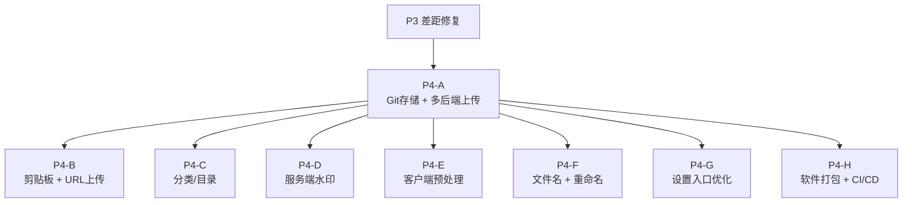

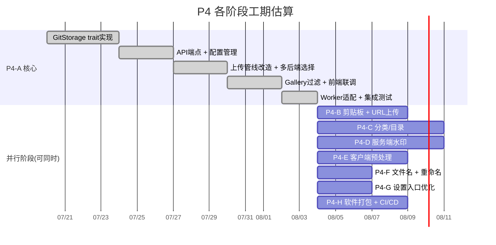

### 8.2 迁移文件

| 迁移编号 | 创建内容 | 所属阶段 |
|----------|----------|----------|
| `0008` | `user_storage_configs` 表、`images` 表 `storage_config_id` 列 | P4-A |
| `0009` | `categories` 表、`images` 表 `category_id` 列 | P4-C |
| `0010` | `users` 表 `watermark_config` 列 | P4-D |

P4-B、P4-E、P4-F 无需数据库迁移。

### 8.3 版本规划

| 阶段 | 版本号 | 类型 |
|------|--------|------|
| P4-A | v0.15.0 | 次版本（重大新特性） |
| P4-B | v0.15.1 | 补丁 |
| P4-C | v0.16.0 | 次版本 |
| P4-D | v0.16.1 | 补丁 |
| P4-E | v0.16.2 | 补丁 |
| P4-F | v0.16.3 | 补丁 |
| P4-G | v0.16.4 | 补丁 |
| P4-H | v0.17.0 | 次版本（CI/CD 基础设施） |

### 8.4 新增环境变量

| 变量 | 阶段 | 必填 |
|------|------|------|
| `PICHOST_AUTH_TOKEN_ENCRYPTION_KEY` | P4-A | 启用 Git 后端时必填 |
| `PICHOST_STORAGE_MAX_USER_CONFIGS` | P4-A | 否（默认: 5） |

---

## 9. 风险评估

| 风险 | 概率 | 影响 | 缓解措施 |
|------|------|------|----------|
| GitCode API 不稳定/breaking changes | 中 | 高 | 通过 `GitProvider` 枚举抽象；可通过配置开关单独禁用 GitCode 而不影响 GitHub |
| 用户 PAT 泄露（日志、错误消息、响应） | 中 | 严重 | AES-256-GCM 静态加密；所有响应 token 掩码；日志中间件剥离 `token` 字段；代码审查清单 |
| GitCode 20MB 限制阻断大文件上传 | 中 | 中 | 超限返回明确错误提示，引导用户改用 local 或 GitHub；不做静默 fallback |
| GitHub/GitCode 速率限制导致上传失败 | 中 | 低 | Worker 重试（3次）覆盖瞬时限流；前端显示明确错误"速率受限，N 秒后重试" |
| URL 上传 SSRF 攻击 | 中 | 高 | IP 黑名单（全部私有网段）、scheme 白名单（仅 http/https）、下载后 magic byte 校验 |
| AES 密钥轮换导致旧 token 无法解密 | 低 | 高 | 支持密钥版本化：存储 `token_encrypted: "v1:base64ciphertext"`，解密时尝试所有已知密钥 |
| 分类层级过深导致复杂 UI | 低 | 低 | API 层面强制最多 2 级；前端 UI 仅支持 2 级 |
| Canvas 预处理在不同浏览器表现不一致 | 中 | 低 | 文档化浏览器要求；不支持时降级为直传原图 |
| ARM 交叉编译 musl 链接失败 | 中 | 中 | 使用 `cross` 工具（Docker 化交叉编译）替代裸 `cargo build`；优先支持 amd64 + arm64 musl |
| GitHub Actions ARM runner 不可用 | 低 | 中 | 使用 QEMU + `cross` 在 amd64 runner 上交叉编译 ARM；`cross` 内置 Docker 镜像覆盖所有 target |
| 安装脚本在非 systemd 系统失效 | 低 | 低 | 脚本检测 systemd 存在性；非 systemd 环境输出手动管理命令提示 |

---

## 附录 A：隐私说明

Git 后端将图片存储在用户自有仓库中。PicHost 除用户提供的 PAT 授权外，无法访问仓库内容。用户可随时在 GitHub/GitCode 上吊销 PAT 以切断 PicHost 的访问。图片数据位置由用户掌控 — 这是隐私友好的设计模式。
