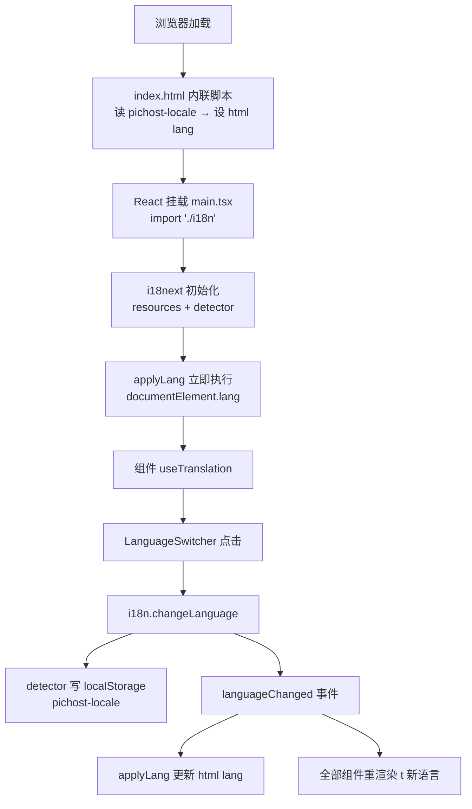

# PicHost 国际化 (i18n) 设计

- **日期**: 2026-08-05
- **状态**: 已批准(待实现)
- **目标版本**: 0.18.0

## 1. 背景与目标

PicHost 目前所有 UI 文案为硬编码英文,后端错误消息为英文与中文混杂(部分路由整文件中文),无法满足中英文用户的自托管部署需求。

**目标**:
1. 前端全部 UI 文本支持 en / zh-CN 双语切换,浏览器自动检测 + 手动切换
2. 后端错误消息按部署语言配置本地化:消息文本由按语言分目录的配置文件承载,i18n 模块按 key 取用;错误响应携带机器可读 `code` 字段供前端行为判断
3. 日期/数字/文件大小格式化统一为 locale 感知的共享模块
4. 语言偏好持久化遵循现有主题偏好模式(localStorage)

## 2. 现状调研结论

### 2.1 前端字符串盘点

| 事实 | 详情 |
|------|------|
| 字符串规模 | ~300–350 条硬编码英文,分散在 ~25 个含用户可见文本的文件 |
| 最密集文件 | StorageConfigSection (~35)、SystemConfig (~32)、ImageDetail (~30)、Settings (~28) |
| 复数手写 | 8 处手写单复数拼接:`"Delete {n} image(s)?"`、`"{n} user(s)"`、`"{n} code(s)"` 等 |
| 格式化工具 | **无共享模块** — 5 处重复 `formatBytes` + 3 处内联 KB + 2 处日期格式化(AdminInvites 硬编码 `'en-US'`,ImageDetail 用浏览器默认 locale) |
| 持久化模板 | `stores/ui.ts` 主题 store:`localStorage['pichost-theme']` + 模块级预读 + index.html 内联 FOUC 脚本 |
| i18n 库 | 无(package.json 无任何 i18n 依赖) |
| html lang | `index.html` 硬编码 `<html lang="en">`,无运行时更新 |
| 语言相关代码 | 零 i18n 基础设施 |
| 前端测试 | vitest + jsdom 已配置(`stores/__tests__/preprocessing.test.ts` 是持久化 store 测试模板) |

### 2.2 后端错误盘点

| 事实 | 详情 |
|------|------|
| 错误信封 | 统一 `{"error": "<string>"}` — 单字段、无 code、无 status;HTTP 状态承载语义 |
| 消息规模 | ~136 处 `"error":` 序列化点,~100–110 条不同消息模板 |
| 集中出口 | 6 个: `AppError::IntoResponse`(pichost-core/error.rs)、`error_response`(auth.rs)、`error_json`(categories.rs)、`err`(upload_url.rs)、`too_many_response`(rate_limit.rs)、`internal_error`(admin.rs) |
| 已中英混杂 | `storage_configs.rs` 整文件中文(12 条),`git.rs` 中文 413 消息(`"文件超过GitCode 20MB限制..."`)直通客户端 |
| 消息不稳定 | 多处插值内部细节:`e.to_string()` sqlx 错误、GitHub/GitCode 响应体、reqwest 错误文本;大小写不一致(`"image not found"` vs `"Image not found"`) |
| 422 缺口 | 无自定义 rejection handler — 畸形 JSON 返回 Axum 明文 422/415,不在 `{"error": ...}` 约定内 |
| 状态码集 | 400/401/403/404/409/413/429/500,一致 |
| 增强 body | 配额超限 413 携带 `quota_bytes`/`used_bytes`/`file_bytes`(唯一带附加字段的错误) |

## 3. 设计决策总览

| # | 决策点 | 结论 |
|---|--------|------|
| 1 | 国际化范围 | 前后端全覆盖:前端 UI 文本 + 后端错误码机制 |
| 2 | 语言集与默认 | en(源)+ zh-CN;浏览器 `navigator.language` 检测,用户可手动切换 |
| 3 | 偏好持久化 | localStorage(`pichost-locale`),仿主题 store 模式 |
| 4 | 格式化工具 | 新建共享 locale 感知模块,替换全部重复实现 |
| 5 | 前端机制 | i18next v26 + react-i18next + i18next-browser-languagedetector,构建时打包资源 |
| 6 | 后端消息 | 配置驱动:按语言分目录的 TOML 文件承载消息,代码经 i18n 模块按 key 取用;en 目录值 = 现有原文,默认(en)响应逐字不变 |
| 7 | 后端语言来源 | 每请求 `Accept-Language` 协商(前端显式发送当前 UI 语言),部署配置 `i18n.language` 作回退,再回退 en |
| 8 | 运行期热更新 | 保留:外部消息文件惰性 mtime 检查(节流)+ 配置写入后显式 `I18n::reload()`,改语言/消息无需重启 |

## 4. 前端 i18n 基础设施

### 4.1 依赖

| 包 | 用途 |
|----|------|
| `i18next` (v26) | 核心引擎:资源管理、复数、插值 |
| `react-i18next` | React 19 绑定:`useTranslation`、类型安全 `t()` |
| `i18next-browser-languagedetector` | navigator + localStorage 检测与缓存 |

三个包均构建时打包,2 个语言 JSON 文件体积小,不做 HTTP backend 按需加载。

### 4.2 目录结构

```
web-ui/src/i18n/
├── index.ts              # i18next 初始化 + lang 副作用注册
├── locales/
│   ├── en.json           # 源语言(现有 ~350 条字符串抽取)
│   └── zh-CN.json        # 中文翻译
└── types/
    └── i18next.d.ts      # CustomTypeOptions 声明合并 → 类型安全 t()
```

### 4.3 初始化配置

```typescript
// i18n/index.ts(示意)
import i18n from 'i18next';
import { initReactI18next } from 'react-i18next';
import LanguageDetector from 'i18next-browser-languagedetector';
import en from './locales/en.json';
import zhCN from './locales/zh-CN.json';

i18n.use(LanguageDetector)
    .use(initReactI18next)
    .init({
        resources: { en: { translation: en }, 'zh-CN': { translation: zhCN } },
        supportedLngs: ['en', 'zh-CN'],
        fallbackLng: 'en',
        nonExplicitSupportedLngs: true,   // 浏览器 'zh' → 'zh-CN'
        detection: {
            order: ['localStorage', 'navigator'],
            caches: ['localStorage'],
            localStorageKey: 'pichost-locale',
        },
        interpolation: { escapeValue: false },  // React 自带 XSS 转义
        ns: ['translation'],
    });

// lang 副作用:首次 + 每次切换同步 <html lang>
const applyLang = (lng: string) => {
    document.documentElement.lang = lng;
};
applyLang(i18n.language);
i18n.on('languageChanged', applyLang);
```

**类型安全**(`i18next.d.ts`):

```typescript
import resources from '../locales/en.json';
declare module 'i18next' {
    interface CustomTypeOptions {
        resources: { translation: typeof resources };
    }
}
```

`t('xxx')` 键自动补全,错误键编译期报错。

### 4.4 FOUC 防闪变

`index.html` 内联脚本(与 `pichost-theme` 脚本并列),React 挂载前生效:

```html
<script>
    // 主题脚本之后
    (function () {
        var stored = localStorage.getItem('pichost-locale');
        var lang;
        if (stored) {
            lang = stored;
        } else {
            lang = (navigator.language || 'en').startsWith('zh') ? 'zh-CN' : 'en';
        }
        document.documentElement.lang = lang;
    })();
</script>
```

### 4.5 接线

`main.tsx` 顶部 `import './i18n'` — react-i18next 使用全局实例,无需显式 Provider;语言切换由全局 `languageChanged` 事件驱动全部组件重渲染。



## 5. 语言切换 UI 与格式化模块

### 5.1 LanguageSwitcher 组件

- 新文件 `web-ui/src/components/LanguageSwitcher.tsx`
- **NavBar**: ThemeToggle 旁 globe 图标下拉(复用 `ui/DropdownMenu` 模式),选项 English / 简体中文,当前语言打勾
- **Login/Register 页**: 页面右上角同款紧凑切换器(未登录用户需要)
- Settings 不重复放置 — 导航栏全局可达,入口唯一
- 切换: `i18n.changeLanguage(lng)`,持久化由 detector 自动完成

### 5.2 共享格式化模块

新文件 `web-ui/src/lib/format.ts`(该目录当前不存在,新建):

```typescript
formatBytes(bytes: number, locale: string): string  // B/KB/MB/GB/TB,Intl.NumberFormat 数字部分
formatDate(ts: number, locale: string): string       // Intl.DateTimeFormat short date + time
formatNumber(n: number, locale: string): string      // Intl.NumberFormat 千位分隔
```

配套 `useFormat()` hook:绑定当前 `i18n.language`,返回三个已绑定函数,随语言切换自动更新。

**替换清单**:

| 现状 | 替换为 |
|------|--------|
| 5 处重复 `formatBytes`(Dashboard/Settings/AdminStats/AdminUsers/EditUserDialog) | `formatBytes(bytes, locale)` |
| 3 处内联 `(bytes/1024).toFixed(1)} KB`(Dashboard/ImageDetail/UploadCard) | `formatBytes` |
| AdminInvites 硬编码 `'en-US'` 日期 | `formatDate`(locale 感知) |
| ImageDetail `toLocaleString()`、AdminStats 两处 `toLocaleString()` | `formatDate` / `formatNumber` |

**顺带修复**: AdminStats `formatBytes` 缺 index clamp 的 TB+ bug;单位保持 B/KB/MB/GB 技术惯例,数字部分 locale 化。

## 6. 后端 i18n 模块与错误码机制

### 6.1 架构总览

后端语言为**每请求协商**(Accept-Language)+ **部署配置回退**;消息文本由**按语言分目录的 TOML 配置文件**承载,代码通过 **key** 取用;支持**运行期热更新**。

```mermaid
flowchart TB
    A[请求进入] --> B[Locale 提取器 FromRequestParts<br/>Accept-Language → 部署配置 → en]
    B --> C[chokepoint: t locale key args]
    C --> D[{"error": 本地化消息, "code": key}]
    E[启动装载 / 配置写入触发 reload<br/>内置默认或外部目录] --> F[I18n 全局单例<br/>RwLock Option Arc]
    F --> G[惰性 mtime 检查 节流<br/>外部消息文件改动自动生效]
    G --> C
```

### 6.2 i18n 模块(pichost-core 新建 `src/i18n.rs`)

- 依赖: pichost-core 新增 `toml` crate(纯解析,无 web 依赖,符合 crate 边界)
- API:

```rust
I18n::load(language, locales_dir) -> I18n   // 内置默认;外部目录时按语言加载 + en 回退
I18n::reload()                               // 配置写入后重新装载(语言/目录/消息)
i18n.t(locale, key)                          // 回退链: locale → en → key 本身
i18n.t(locale, key, args)                    // {} 占位符参数
```

- 全局单例 `RwLock<Option<Arc<I18n>>>`:`reload()` 重建后原子换入 Arc,`t()` 读锁取 Arc 后无锁调用,无写锁竞争
- **热更新**: 外部消息文件惰性 mtime 检查(节流,如 ≥5s 一次),文件改动自动生效;内置默认目录不可变,仅外部目录参与检查
- **Locale 提取器**: axum `FromRequestParts` 实现,解析 `Accept-Language` 首个受支持语言;无头/全部不支持 → 部署配置 `i18n.language`;再回退 en
- 语言枚举 `Language { En, ZhCN }`:`from_str` 解析未知值告警回退 en;新增语言 = 登记枚举 + 新建语言目录

### 6.3 消息配置文件(按语言分目录)

```
locales/
├── en/
│   └── messages.toml        # 英文消息(现有 ~110 条原文)
└── zh-CN/
    └── messages.toml        # 中文消息
```

- 文件内为扁平 key,无语言包裹层:

```toml
# locales/zh-CN/messages.toml
"auth.invalid_credentials" = "用户名或密码错误"
"upload.quota_exceeded" = "存储配额已超出"
```

- **内置默认**: `pichost-core/src/i18n/locales/{en,zh-CN}/messages.toml`(include_str! 编译进二进制)— 开箱即用
- **外部覆盖**: `PICHOST_I18N_LOCALES_DIR` env 指向部署目录(如 `/etc/pichost/locales/`),仅加载**当前语言对应文件** + en 回退文件,避免单文件过长;外部文件参与热更新检查,内置默认不可变
- 新增异常消息 = 对应语言目录文件加 key + 代码 `t("domain.reason")` 取用;**key 即错误信封的 `code` 字段**(细粒度,~110 个)

### 6.4 信封改造

```json
{"error": "用户名或密码错误", "code": "auth_invalid_credentials"}
```

- `error` 消息由 i18n 模块按**请求 locale(协商结果)**生成;en 目录值 = 现有消息原文 → 不带语言头的请求(含现有测试)回退部署配置默认 en,响应与今天**逐字相同**,现有测试零破坏
- 配额 413 增强 body(quota_bytes 等附加字段)保持不变
- code 命名:`{domain}_{reason}` snake_case

### 6.5 改造点

1. **新模块**: `pichost-core/src/i18n.rs` + 内置目录 `locales/{en,zh-CN}/messages.toml`
2. **配置**: `config.rs` 新增 `i18n.language`(env `PICHOST_I18N_LANGUAGE`,默认 `en`)、`i18n.locales_dir`(env `PICHOST_I18N_LOCALES_DIR`,可选);config 服务读写 + SystemConfig UI 增加 Language 字段;**PUT 写入成功后调用 `I18n::reload()` → 语言字段即时生效,该字段不再要求重启**(其余字段维持现有 "Save and Restart Required" 语义)
3. **Locale 提取器**: `axum::extract::FromRequestParts` 实现,解析 Accept-Language,回退部署配置 → en
4. **chokepoint helper 签名**: `error_response(locale, status, key, args)`、`error_json(locale, key, args)`、`err(locale, key, args)`、`too_many_response(locale, retry_after, key)`、`internal_error(locale, key, args)` — 内部 `I18n::global().t(locale, key, args)` 生成消息;~136 调用点改传 key(机械改动)
5. **`AppError::IntoResponse`**: 保持 en 默认(IntoResponse 无状态上下文);storage_configs.rs 改为经 helper 显式本地化(12 处),其中文消息移入 zh 目录
6. **`app.rs` 自定义 `JsonRejection` handler**: 畸形 JSON / 缺 Content-Type 统一 `{"error": t(locale, "validation_error"), "code": "validation_error"}`(422/415),修复现状明文响应

### 6.6 前端

- `api/client.ts` 错误解析升级:`ApiError { status, code, message }`;UI **直接显示后端 message**(已是协商后的语言),不再维护 `errors.*` 翻译键
- ky `beforeRequest` hook 显式设置 `Accept-Language: i18n.language` — 手动切换的 UI 语言优先于浏览器默认
- `code` 仅用于行为判断:`auth_invalid_token` → 登出跳转、`upload_quota_exceeded` → 配额提示等
- 未知 code 无碍 — message 已按请求语言本地化

## 7. 字符串抽取策略

### 7.1 Key 组织(单 `translation` 命名空间)

```
login.* / register.* / dashboard.* / gallery.* / imageDetail.* / settings.*
admin.* / nav.* / categoryTree.* / storageConfig.* / systemConfig.* / watermark.*
preprocessing.* / upload.* / common.*
```

注: 后端错误消息由后端 i18n 模块本地化,前端不维护 errors.* 翻译键(见 §6.6)。

### 7.2 动态字符串规则

| 类型 | 规则 | 示例 |
|------|------|------|
| 插值 | `{{var}}` | `"{{count}} images"` |
| 复数 | `_one` / `_other` 后缀 | `deleteConfirm_one` / `deleteConfirm_other` |
| toasts | 组件内 `toast(t('...'))` | 维持 sonner 分散调用现状 |
| aria/title/placeholder | 一并翻译 | SearchBar、SortDropdown、LinkCard、ThemeToggle |
| 时间剩余 | `t()` + 插值 | `"{{days}}d {{hours}}h remaining"` |

覆盖 8 处手写复数;zh-CN 无复数形式,`_one`/`_other` 值相同,零成本。

### 7.3 不翻译内容

- 品牌名 PicHost、URL 路径、文件名/分类名/水印内容(用户数据)

### 7.4 实施顺序

1. 基础设施:i18n init + 类型增强 + FOUC 脚本 + LanguageSwitcher + format.ts
2. 公共组件:NavBar / Login / Register(最快见效)
3. 主页面:Dashboard / Gallery / ImageDetail / Settings
4. 重组件:CategoryTree / StorageConfigSection / SystemConfig
5. Admin 页:AdminStats / AdminUsers / AdminInvites
6. 后端 i18n 模块 + 消息目录(en/zh)+ 配置接入与热更新 + Locale 提取器 + 6 出口改造(136 调用点改传 key)+ JsonRejection + 前端 ApiError 解析与行为 code 判断

## 8. 测试与验证

### 前端 vitest

| 测试文件 | 覆盖 |
|----------|------|
| `format.test.ts` | formatBytes/formatDate/formatNumber 双 locale 断言(en 与 zh-CN 输出) |
| `i18n.test.ts` | en.json 与 zh-CN.json key 集一致性;localStorage 读写 |
| `apiErrors.test.ts` | ApiError 解析;行为 code 判断(auth_invalid_token → 登出、upload_quota_exceeded → 配额提示) |

### 后端 cargo

- **i18n 模块单测**(pichost-core): 目录加载(存在/缺失)、回退链(zh 缺失 → en → key 本身)、外部目录合并覆盖、`{}` 参数格式化、`Language::from_str` 解析(未知值回退 en)、`reload()` 原子替换后新消息生效
- **协商测试**: `Accept-Language: zh-CN` → 中文;无头 → 部署配置(默认 en);不支持语言 → 回退
- **热更新测试**: 外部消息文件修改后经惰性 mtime 检查生效;配置写入触发 reload 后立即生效
- **集成测试**: `PichostEnvGuard` 设置 `PICHOST_I18N_LANGUAGE=zh-CN`(必要时 + `PICHOST_I18N_LOCALES_DIR`)→ 断言关键错误路径返回中文;默认配置 → 英文(与现状逐字一致)
- 现有断言消息文本的测试 → 改为断言 `code` + status(消息成为 locale 相关字段,code 更稳定,符合冒烟测试设计指南)
- `JsonRejection` handler 测试: 畸形 JSON → 422 + `validation_error`

### 质量门

```
cargo clippy --workspace -D warnings
cargo test --workspace
npx vitest run
npm run build
```

版本:0.17.5 → **0.18.0**;完成后按项目规则同步 AGENTS.md / README.md / `.omo/summary/summary_and_next.md`。

## 9. 范围边界(明确不做)

- 不做 URL 路径语言前缀(`/en/...`)— localStorage 检测足够,与 Gallery 现有 URL searchParams 过滤不冲突
- 每请求语言协商保留:Accept-Language 优先,部署配置回退,en 兜底;前端显式发送当前 UI 语言
- 运行期热更新保留:外部消息文件惰性 mtime 检查(节流)+ 配置写入显式 reload,无需重启;内置默认目录不可变
- 不做 SSR / Cookie 检测 / 多命名空间 / 按需加载翻译
- 不引入 eslint-plugin-i18next(列为后续可选防护)
- 不翻译历史数据(已有用户上传的文件名等)

## 10. 风险与注意事项

| 风险 | 应对 |
|------|------|
| 现有后端测试断言 `{"error": ...}` 消息文本 — 本地化后成为 locale 相关字段 | 无语言头的测试请求回退部署配置默认 en,响应逐字不变;断言消息的测试迁移为断言 `code` + status |
| ~136 处调用点改传 key 工作量大 | 机械改动,按文件分批;6 出口先行,调用点随动;key 缺失时回退显示 key 本身,便于排查 |
| 语言文件缺失/损坏 | 回退链兜底(当前语言 → en → key);外部目录加载失败时告警并回退内置默认 |
| 热更新竞态 | `reload()` 重建后原子替换 Arc,`t()` 读锁取 Arc 后无锁调用;文件损坏时保留旧消息表并告警 |
| 惰性 mtime 检查成本 | 节流(≥5s 一次)仅检查已加载外部文件;内置默认不参与检查 |
| Accept-Language 解析边界 | 仅取首个受支持语言;全不支持/无头回退部署配置 → en |
| i18n 全局单例与并行测试隔离 | `RwLock<Option<Arc<I18n>>>` 可重置;单测构造本地 `I18n` 实例,集成测试用 `PichostEnvGuard` |
| 语言配置值未知 | `Language::from_str` 解析未知值告警并回退 en |
| en/zh key 集漂移 | 前端 `i18n.test.ts` key 一致性测试;后端单测断言目录加载后 key 非空 |
| i18next 依赖体积 ~40KB gzip | 对已有 react-query/zustand 的项目可接受;2 语言资源构建时打包 |
