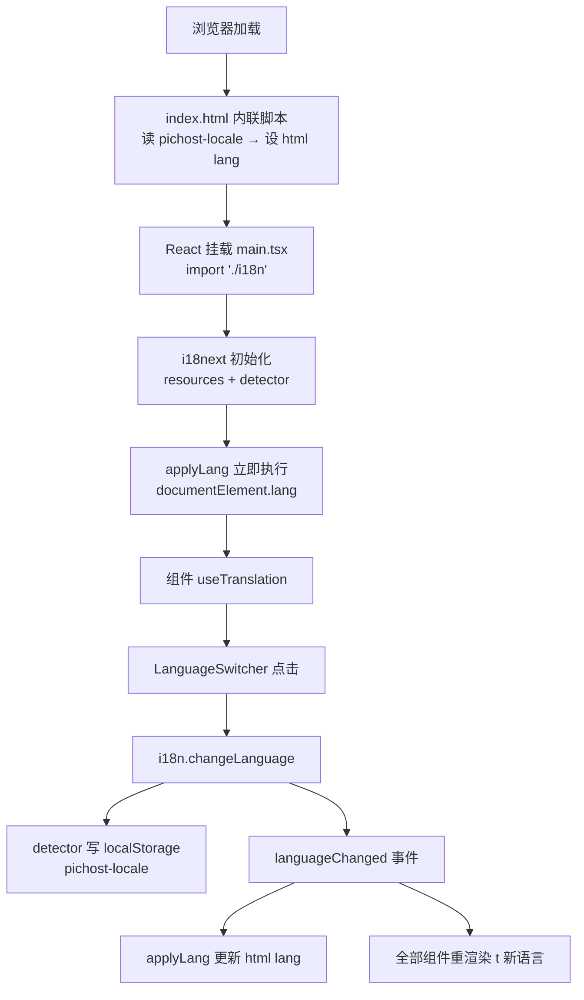
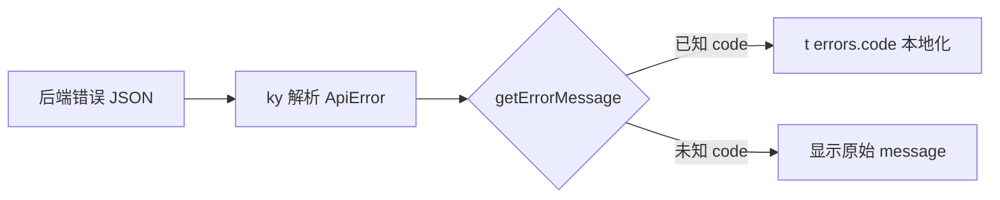

# PicHost 国际化 (i18n) 设计

- **日期**: 2026-08-05
- **状态**: 已批准(待实现)
- **目标版本**: 0.18.0

## 1. 背景与目标

PicHost 目前所有 UI 文案为硬编码英文,后端错误消息为英文与中文混杂(部分路由整文件中文),无法满足中英文用户的自托管部署需求。

**目标**:
1. 前端全部 UI 文本支持 en / zh-CN 双语切换,浏览器自动检测 + 手动切换
2. 后端错误响应引入机器可读 `code` 字段,前端将已知 code 映射为本地化文案,未知 code 回退显示原文
3. 日期/数字/文件大小格式化统一为 locale 感知的共享模块
4. 语言偏好持久化遵循现有主题偏好模式(localStorage)

## 2. 现状调研结论

### 2.1 前端字符串盘点

| 事实 | 详情 |
|------|------|
| 字符串规模 | ~300–350 条硬编码英文,分散在 ~25 个含用户可见文本的文件 |
| 最密集文件 | StorageConfigSection (~35)、SystemConfig (~32)、ImageDetail (~30)、Settings (~28) |
| 复数手写 | 8 处手写单复数拼接:`"Delete {n} image(s)?"`、`"{n} user(s)"`、`"{n} code(s)"` 等 |
| 格式化工具 | **无共享模块** — 5 处重复 `formatBytes` + 3 处内联 KB + 2 处日期格式化(AdminInvites 硬编码 `'en-US'`,ImageDetail 用浏览器默认 locale) |
| 持久化模板 | `stores/ui.ts` 主题 store:`localStorage['pichost-theme']` + 模块级预读 + index.html 内联 FOUC 脚本 |
| i18n 库 | 无(package.json 无任何 i18n 依赖) |
| html lang | `index.html` 硬编码 `<html lang="en">`,无运行时更新 |
| 语言相关代码 | 零 i18n 基础设施 |
| 前端测试 | vitest + jsdom 已配置(`stores/__tests__/preprocessing.test.ts` 是持久化 store 测试模板) |

### 2.2 后端错误盘点

| 事实 | 详情 |
|------|------|
| 错误信封 | 统一 `{"error": "<string>"}` — 单字段、无 code、无 status;HTTP 状态承载语义 |
| 消息规模 | ~136 处 `"error":` 序列化点,~100–110 条不同消息模板 |
| 集中出口 | 6 个: `AppError::IntoResponse`(pichost-core/error.rs)、`error_response`(auth.rs)、`error_json`(categories.rs)、`err`(upload_url.rs)、`too_many_response`(rate_limit.rs)、`internal_error`(admin.rs) |
| 已中英混杂 | `storage_configs.rs` 整文件中文(12 条),`git.rs` 中文 413 消息(`"文件超过GitCode 20MB限制..."`)直通客户端 |
| 消息不稳定 | 多处插值内部细节:`e.to_string()` sqlx 错误、GitHub/GitCode 响应体、reqwest 错误文本;大小写不一致(`"image not found"` vs `"Image not found"`) |
| 422 缺口 | 无自定义 rejection handler — 畸形 JSON 返回 Axum 明文 422/415,不在 `{"error": ...}` 约定内 |
| 状态码集 | 400/401/403/404/409/413/429/500,一致 |
| 增强 body | 配额超限 413 携带 `quota_bytes`/`used_bytes`/`file_bytes`(唯一带附加字段的错误) |

## 3. 设计决策总览

| # | 决策点 | 结论 |
|---|--------|------|
| 1 | 国际化范围 | 前后端全覆盖:前端 UI 文本 + 后端错误码机制 |
| 2 | 语言集与默认 | en(源)+ zh-CN;浏览器 `navigator.language` 检测,用户可手动切换 |
| 3 | 偏好持久化 | localStorage(`pichost-locale`),仿主题 store 模式 |
| 4 | 格式化工具 | 新建共享 locale 感知模块,替换全部重复实现 |
| 5 | 前端机制 | i18next v26 + react-i18next + i18next-browser-languagedetector,构建时打包资源 |
| 6 | 后端消息 | 保留原文(不重写,避免破坏测试),`code` 字段成为权威标识 |

## 4. 前端 i18n 基础设施

### 4.1 依赖

| 包 | 用途 |
|----|------|
| `i18next` (v26) | 核心引擎:资源管理、复数、插值 |
| `react-i18next` | React 19 绑定:`useTranslation`、类型安全 `t()` |
| `i18next-browser-languagedetector` | navigator + localStorage 检测与缓存 |

三个包均构建时打包,2 个语言 JSON 文件体积小,不做 HTTP backend 按需加载。

### 4.2 目录结构

```
web-ui/src/i18n/
├── index.ts              # i18next 初始化 + lang 副作用注册
├── locales/
│   ├── en.json           # 源语言(现有 ~350 条字符串抽取)
│   └── zh-CN.json        # 中文翻译
└── types/
    └── i18next.d.ts      # CustomTypeOptions 声明合并 → 类型安全 t()
```

### 4.3 初始化配置

```typescript
// i18n/index.ts(示意)
import i18n from 'i18next';
import { initReactI18next } from 'react-i18next';
import LanguageDetector from 'i18next-browser-languagedetector';
import en from './locales/en.json';
import zhCN from './locales/zh-CN.json';

i18n.use(LanguageDetector)
    .use(initReactI18next)
    .init({
        resources: { en: { translation: en }, 'zh-CN': { translation: zhCN } },
        supportedLngs: ['en', 'zh-CN'],
        fallbackLng: 'en',
        nonExplicitSupportedLngs: true,   // 浏览器 'zh' → 'zh-CN'
        detection: {
            order: ['localStorage', 'navigator'],
            caches: ['localStorage'],
            localStorageKey: 'pichost-locale',
        },
        interpolation: { escapeValue: false },  // React 自带 XSS 转义
        ns: ['translation'],
    });

// lang 副作用:首次 + 每次切换同步 <html lang>
const applyLang = (lng: string) => {
    document.documentElement.lang = lng;
};
applyLang(i18n.language);
i18n.on('languageChanged', applyLang);
```

**类型安全**(`i18next.d.ts`):

```typescript
import resources from '../locales/en.json';
declare module 'i18next' {
    interface CustomTypeOptions {
        resources: { translation: typeof resources };
    }
}
```

`t('xxx')` 键自动补全,错误键编译期报错。

### 4.4 FOUC 防闪变

`index.html` 内联脚本(与 `pichost-theme` 脚本并列),React 挂载前生效:

```html
<script>
    // 主题脚本之后
    (function () {
        var stored = localStorage.getItem('pichost-locale');
        var lang;
        if (stored) {
            lang = stored;
        } else {
            lang = (navigator.language || 'en').startsWith('zh') ? 'zh-CN' : 'en';
        }
        document.documentElement.lang = lang;
    })();
</script>
```

### 4.5 接线

`main.tsx` 顶部 `import './i18n'` — react-i18next 使用全局实例,无需显式 Provider;语言切换由全局 `languageChanged` 事件驱动全部组件重渲染。



## 5. 语言切换 UI 与格式化模块

### 5.1 LanguageSwitcher 组件

- 新文件 `web-ui/src/components/LanguageSwitcher.tsx`
- **NavBar**: ThemeToggle 旁 globe 图标下拉(复用 `ui/DropdownMenu` 模式),选项 English / 简体中文,当前语言打勾
- **Login/Register 页**: 页面右上角同款紧凑切换器(未登录用户需要)
- Settings 不重复放置 — 导航栏全局可达,入口唯一
- 切换: `i18n.changeLanguage(lng)`,持久化由 detector 自动完成

### 5.2 共享格式化模块

新文件 `web-ui/src/lib/format.ts`(该目录当前不存在,新建):

```typescript
formatBytes(bytes: number, locale: string): string  // B/KB/MB/GB/TB,Intl.NumberFormat 数字部分
formatDate(ts: number, locale: string): string       // Intl.DateTimeFormat short date + time
formatNumber(n: number, locale: string): string      // Intl.NumberFormat 千位分隔
```

配套 `useFormat()` hook:绑定当前 `i18n.language`,返回三个已绑定函数,随语言切换自动更新。

**替换清单**:

| 现状 | 替换为 |
|------|--------|
| 5 处重复 `formatBytes`(Dashboard/Settings/AdminStats/AdminUsers/EditUserDialog) | `formatBytes(bytes, locale)` |
| 3 处内联 `(bytes/1024).toFixed(1)} KB`(Dashboard/ImageDetail/UploadCard) | `formatBytes` |
| AdminInvites 硬编码 `'en-US'` 日期 | `formatDate`(locale 感知) |
| ImageDetail `toLocaleString()`、AdminStats 两处 `toLocaleString()` | `formatDate` / `formatNumber` |

**顺带修复**: AdminStats `formatBytes` 缺 index clamp 的 TB+ bug;单位保持 B/KB/MB/GB 技术惯例,数字部分 locale 化。

## 6. 后端错误码机制

### 6.1 信封改造

```json
// 改造前
{"error": "invalid username or password"}
// 改造后
{"error": "invalid username or password", "code": "auth_invalid_credentials"}
```

- `error` 消息字段**原样保留**(不重写消息,不破坏现有集成测试)
- 配额 413 增强 body(quota_bytes 等附加字段)保持不变
- code 命名:`{domain}_{reason}` snake_case

### 6.2 code 集(行为级粗粒度,~35 个)

```
# auth
auth_invalid_credentials / auth_invalid_token / auth_revoked_token
auth_insufficient_permissions
# invite
invite_invalid / invite_expired / invite_used
# user
user_not_found / username_taken / email_taken / password_too_weak
current_password_incorrect
# image
image_not_found / thumbnail_not_ready / webp_not_ready
# upload
upload_too_large / upload_invalid_image / upload_quota_exceeded
# url upload
url_invalid / url_ssrf_blocked / url_download_failed
# category
category_not_found / category_name_exists / category_depth_exceeded
category_invalid_name
# storage config
storage_config_not_found / storage_config_limit / storage_config_in_use
storage_repo_unreachable / storage_payload_too_large
# 通用
rate_limited / validation_error / not_found / internal_error / conflict
```

原则:前端需要区分的行为才有独立 code;细分到行为级,不追求每条消息一个 code。

### 6.3 改造点

```mermaid
flowchart TB
    A[路由 handler 出错] --> B{错误出口}
    B -->|AppError 路径| C[AppError::IntoResponse<br/>variant → 兜底 code]
    B -->|helper 路径| D[error_response / error_json / err<br/>too_many_response / internal_error<br/>签名扩展 + code 参数]
    C --> E[{"error": msg, "code": code}]
    D --> E
    E --> F[客户端]
```

1. **`pichost-core/src/error.rs` `AppError::IntoResponse`**:按 variant 推导兜底 code — `NotFound` → `not_found`、`Validation` → `validation_error`、`RateLimited` → `rate_limited`、`Internal` → `internal_error`、`Storage(PayloadTooLarge)` → `storage_payload_too_large`(覆盖 git.rs 中文 413)
2. **5 个 helper 签名扩展**:`error_response(status, msg, code)`、`error_json(msg, code)`、`err(msg, code)`、`too_many_response(retry_after, code)`、`internal_error(msg, code)`
3. **~136 处调用点补 code 参数**(机械改动)
4. **`app.rs` 自定义 `JsonRejection` handler**:畸形 JSON / 缺 Content-Type 统一为 `{"error": "...", "code": "validation_error"}`(422/415),修复现状明文响应

storage_configs.rs 现有中文消息不改原文 — 前端对全部 storage_config code 有映射,中文原文不再展示给用户,中英混杂问题随之解决。

### 6.4 前端映射

新文件 `web-ui/src/api/errors.ts`:

```typescript
// 示意
export interface ApiError { status: number; code: string; message: string; }
export function getErrorMessage(err: ApiError, t: TFunction): string {
    const key = `errors.${err.code}`;
    return i18n.exists(key) ? t(key) : err.message;  // 未知 code 回退原文
}
```

- `api/client.ts` 错误解析升级:提取 `{ status, code, message }`
- 全部 `toast.error(err.message)` 调用点(~10 个组件)替换为 `toast.error(getErrorMessage(err))`
- 翻译文件新增 `errors.*` 命名空间键(en/zh 各 ~35 条)



## 7. 字符串抽取策略

### 7.1 Key 组织(单 `translation` 命名空间)

```
login.* / register.* / dashboard.* / gallery.* / imageDetail.* / settings.*
admin.* / nav.* / categoryTree.* / storageConfig.* / systemConfig.* / watermark.*
preprocessing.* / upload.* / common.* / errors.*
```

### 7.2 动态字符串规则

| 类型 | 规则 | 示例 |
|------|------|------|
| 插值 | `{{var}}` | `"{{count}} images"` |
| 复数 | `_one` / `_other` 后缀 | `deleteConfirm_one` / `deleteConfirm_other` |
| toasts | 组件内 `toast(t('...'))` | 维持 sonner 分散调用现状 |
| aria/title/placeholder | 一并翻译 | SearchBar、SortDropdown、LinkCard、ThemeToggle |
| 时间剩余 | `t()` + 插值 | `"{{days}}d {{hours}}h remaining"` |

覆盖 8 处手写复数;zh-CN 无复数形式,`_one`/`_other` 值相同,零成本。

### 7.3 不翻译内容

- 品牌名 PicHost、URL 路径、文件名/分类名/水印内容(用户数据)

### 7.4 实施顺序

1. 基础设施:i18n init + 类型增强 + FOUC 脚本 + LanguageSwitcher + format.ts
2. 公共组件:NavBar / Login / Register(最快见效)
3. 主页面:Dashboard / Gallery / ImageDetail / Settings
4. 重组件:CategoryTree / StorageConfigSection / SystemConfig
5. Admin 页:AdminStats / AdminUsers / AdminInvites
6. 后端 code 改造(6 出口 + 136 调用点 + JsonRejection)+ 前端 errors 映射

## 8. 测试与验证

### 前端 vitest

| 测试文件 | 覆盖 |
|----------|------|
| `format.test.ts` | formatBytes/formatDate/formatNumber 双 locale 断言(en 与 zh-CN 输出) |
| `errors.test.ts` | code → 文案映射;未知 code 回退原文 |
| `i18n.test.ts` | en.json 与 zh-CN.json key 集一致性;localStorage 读写 |

### 后端 cargo

- 现有集成测试关键路径追加 code 断言:登录失败 401 → `auth_invalid_credentials`、配额 413 → `upload_quota_exceeded`、404 → `not_found`/`image_not_found`、429 → `rate_limited`
- `AppError::IntoResponse` code 推导单元测试
- JsonRejection handler 测试:畸形 JSON → 422 + `validation_error`

### 质量门

```
cargo clippy --workspace -D warnings
cargo test --workspace
npx vitest run
npm run build
```

版本:0.17.5 → **0.18.0**;完成后按项目规则同步 AGENTS.md / README.md / `.omo/summary/summary_and_next.md`。

## 9. 范围边界(明确不做)

- 不做 URL 路径语言前缀(`/en/...`)— localStorage 检测足够,与 Gallery 现有 URL searchParams 过滤不冲突
- 后端不感知语言:只发 code,消息保留原文作回退
- 不做 SSR / Cookie 检测 / 多命名空间 / 按需加载翻译
- 不引入 eslint-plugin-i18next(列为后续可选防护)
- 不翻译历史数据(已有用户上传的文件名等)

## 10. 风险与注意事项

| 风险 | 应对 |
|------|------|
| 现有后端测试断言 `{"error": ...}` — 加 code 字段可能破坏精确 JSON 匹配 | 实现时先跑测试基线;测试若用 `json["error"]` 取值则不受影响;必要时微调测试 |
| ~136 处调用点补 code 参数工作量大 | 机械改动,按文件分批;6 出口先行,调用点随动 |
| i18next 依赖体积 ~40KB gzip | 对已有 react-query/zustand 的项目可接受;2 语言资源构建时打包 |
| en/zh key 集漂移 | `i18n.test.ts` key 一致性测试兜底 |
| 未知后端 code 出现 | 前端回退显示原文,不阻塞;新 code 后续补翻译 |
