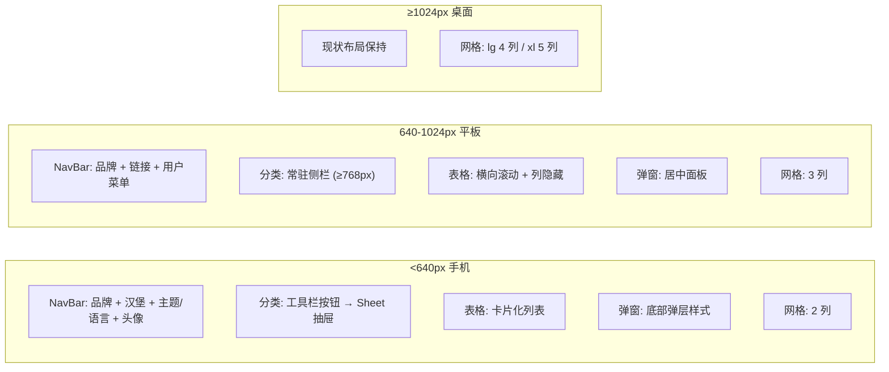
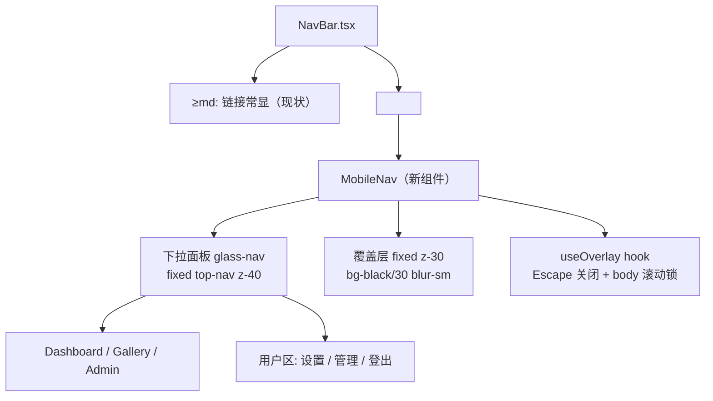
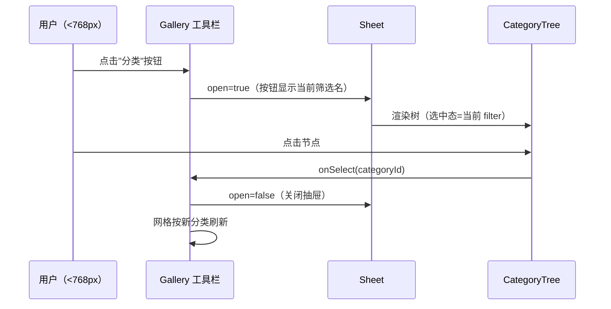
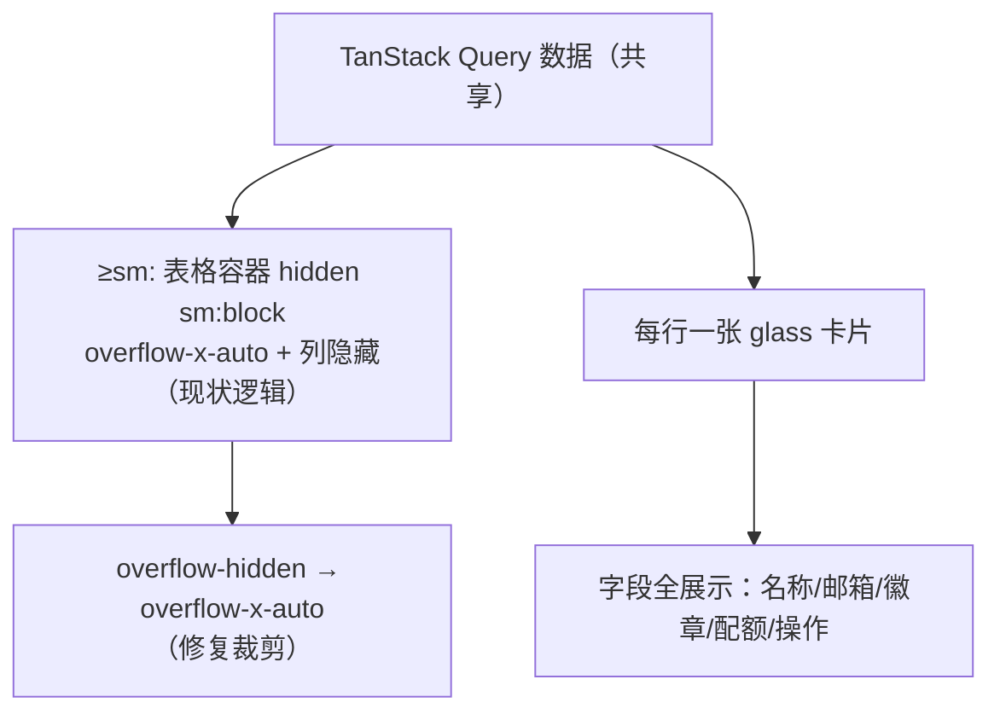

# PicHost Web 自适应布局 — 设计文档

> **日期**: 2026-08-08
> **目标**: 全面移动端适配——手机/平板/桌面多种设备下正常浏览与操作
> **范围**: 纯前端（web-ui/），无后端变更、无 DB 迁移

---

## 1. 背景与目标

PicHost 前端（React 19 + Vite 8 + Tailwind CSS 4 + TypeScript 7）当前主要面向桌面端设计。经代码调研确认以下问题：

### 1.1 现状问题清单

| # | 问题 | 位置 | 严重度 |
|---|------|------|--------|
| P0 | NavBar 单行 flex 无断点处理，品牌+3链接+主题/语言+用户 pill 在小屏溢出 | `NavBar.tsx:21-108` | 高 |
| P0 | Gallery 分类侧栏 `hidden md:block`，<768px 完全无分类筛选入口 | `Gallery.tsx:171` | 高 |
| P0 | CategoryTree 右键菜单仅 `onContextMenu` 触发，触屏无法重命名/删除分类 | `CategoryTree.tsx:64,194-202` | 高 |
| P1 | CategoryTree 两个弹窗固定 `w-80`（320px），<330px 视口溢出 | `CategoryTree.tsx:328-329,391-392` | 高 |
| P1 | Admin 表格外层 `overflow-hidden` 无横向滚动，溢出内容被裁剪 | `AdminUsers.tsx:55`, `AdminInvites.tsx:130` | 中 |
| P1 | 3 处原生 `confirm()/alert()`，移动端阻塞式体验差 | `AdminUsers.tsx:27`, `SystemConfig.tsx:237`, `Gallery.tsx:165` | 中 |
| P2 | 触屏不可达/弱化的操作：重命名铅笔 hover-only、DropZone 无触屏提示 | `ImageDetail.tsx:204`, `DropZone.tsx` | 中 |
| P2 | `WatermarkSettings.tsx:211` 无断点双列网格；`GlassSelect`/`DropdownMenu` 无视口钳制 | 多处 | 低 |
| P2 | 全部 22 处断点仅 sm/md/lg，无 lg/xl 密度适配；Gallery md 段 4 列与侧栏争宽 | `Gallery.tsx:298` | 低 |

### 1.2 已达标（不动）

- viewport meta（`index.html:6` `width=device-width, initial-scale=1.0`）
- Login/Register（`w-full max-w-sm` 流式居中，且为唯二公开页）
- `max-w-*` 容器体系（均有 `mx-auto` + 流式宽度）
- 设置页分区导航已有 `overflow-x-auto` 水平滚动模式（`Settings.tsx:165`）

### 1.3 成功标准

1. 375px（iPhone SE 宽度）视口下所有页面无横向溢出
2. 所有现有功能在触屏上可达（导航、分类 CRUD、弹窗、表格操作）
3. 桌面端（≥1024px）布局与现有视觉回归为零（或仅密度提升）
4. 不引入新的 UI 框架依赖（Radix 等），沿用现有手写组件 + 设计 token 惯例

---

## 2. 方案选型

| 方案 | 描述 | 结论 |
|------|------|------|
| A. 纯 Tailwind 断点 | 仅加 `sm:/md:/lg:` 类，无新组件 | ❌ 无法实现汉堡菜单/抽屉/触屏菜单——均需 JS 状态 |
| **B. 断点 + 少量共享组件** | 工具类层全量断点化 + 新增 3 个轻量组件（MobileNav/Sheet/Modal）+ 2 处改造（CategoryTree ⋯ 菜单、Admin 卡片化） | ✅ **采用** |
| C. 引入 Radix/shadcn | `@radix-ui/react-dialog` 等重建全部弹窗 | ❌ 新依赖层与现有手写玻璃样式冲突，迁移面反而更大 |

**选型理由**：方案 B 与代码库"自包含组件 + CSS token、无 UI 框架"惯例一致；新增组件职责单一、可独立测试；Escape 关闭/滚动锁等无障碍基础能力内建于共享组件（不依赖第三方也能实现基础版）。

---

## 3. 断点策略与全局布局

### 3.1 断点体系

沿用 Tailwind 默认断点（sm=640, md=768, lg=1024, xl=1280），**mobile-first**：基础类 = 手机样式，断点类逐级增强。不新增自定义断点、不覆盖 `@theme`。

### 3.2 响应式层级模型

### 3.3 全局改造清单

| 位置 | 现状 | 改造 |
|------|------|------|
| `Layout.tsx:13` | `px-4 py-6` | `px-4 sm:px-6` |
| `NavBar.tsx:22` | `px-5` | `px-4 sm:px-5` |
| `index.css` base | body 无横向溢出保护 | `html, body { overflow-x: clip }`（clip 不创建滚动容器，不影响 `position: sticky`） |
| `Gallery.tsx:298` | `grid-cols-2 sm:3 md:4` | `grid-cols-2 sm:grid-cols-3 md:grid-cols-3 lg:grid-cols-4 xl:grid-cols-5`（md 段侧栏占 224px 后 4 列过挤→3 列） |
| `WatermarkSettings.tsx:211` | `grid-cols-2` 无断点 | `grid-cols-1 sm:grid-cols-2` |
| `Admin.tsx` 标签栏 | `flex-1` 无换行 | 加 `overflow-x-auto` + `whitespace-nowrap` 兜底 |
| `PreprocessingSettings.tsx` | `w-20/w-32/w-40` 固定 | 数字输入保留 `w-20`，行布局加 `flex-wrap` |
| `GlassSelect.tsx:168-172` / `DropdownMenu.tsx:52` | 无视口钳制 | 面板加 `max-w-[calc(100vw-2rem)]`；GlassSelect 右缘超视口时回退右对齐钳制 |

---

## 4. 移动端导航（MobileNav 汉堡菜单）

### 4.1 组件结构

### 4.2 组件设计

**`web-ui/src/components/MobileNav.tsx`（新增）**

- `useState<open>` 控制展开；汉堡按钮带 `aria-label`（i18n key `nav.menu`）
- 面板：NavBar 正下方展开（`fixed inset-x-0 z-40`，`top` 取 NavBar 实测高度——以 NavBar 内联渲染而非 fixed 定位实现可免硬编码，实现时二选一：a) MobileNav 渲染在 NavBar 内部绝对定位；b) 硬编码 NavBar 高度常量），`transform` transition 下滑动画；不遮挡内容滚动（覆盖层拦截点击）
- 覆盖层点击关闭；Escape 关闭；展开时 body 滚动锁（`useOverlay`）
- 链接复用现有 `NavLink` 激活样式，点击即关闭抽屉
- 用户区：Settings/Admin（按 `isAdmin` 显示）/Logout，复用 `useAuthStore` 登出逻辑；含主题切换与语言切换（与 NavBar 相同组件，小屏内嵌）

**`NavBar.tsx` 改造**

- 现有链接组包 `
`
- 汉堡按钮 `<button className="md:hidden">`（SVG 图标，风格同 ThemeToggle）
- <md 时用户 pill 仅显示头像/首字母（隐藏用户名文字），缓解拥挤
- 现有 DropdownMenu（Settings/Admin/Logout）在 <md 时隐藏，功能由 MobileNav 承接（避免双入口）

**i18n**：新增 key（`nav.menu` 等），中英双语同步，键集相等性测试同步更新。

---

## 5. 分类侧滑抽屉 + CategoryTree 触屏化

### 5.1 Sheet 组件（新增）

**`web-ui/src/components/ui/Sheet.tsx`**

- 通用左侧滑出抽屉：`fixed inset-y-0 left-0 z-50 w-[85vw] max-w-xs` + 全屏覆盖层
- `translate-x` 过渡动画；覆盖层点击 / Escape / 关闭按钮均可关闭
- body 滚动锁（复用 `useOverlay`）；`role="dialog"` + `aria-modal`
- props：`open` / `onClose` / `title` / `children`

### 5.2 Gallery 集成

- Gallery 工具栏（<md 显示）新增"分类"按钮：`md:hidden`，显示当前分类名或"全部分类"
- Sheet 内渲染现有 `<CategoryTree>`（复用，无逻辑改动）；选择后关闭抽屉
- ≥md：常驻侧栏不变（现状）

### 5.3 CategoryTree ⋯ 按钮（触屏菜单）

- 每行节点新增常显 ⋯ 按钮：`opacity-60 md:opacity-0 md:group-hover:opacity-100`（<md 常显保证触屏可见，桌面 hover 显示保持清爽）
- 点击 ⋯ 弹出与右键相同的菜单（重命名/删除）——重构现有 ContextMenu 为**锚点 + 双触发**：
  - 右键 `onContextMenu` → 以鼠标坐标定位（现状）
  - ⋯ 按钮 `onClick` → 以按钮 rect 定位
  - 统一菜单渲染，`fixed` 定位 + viewport 钳制（`max-w-[calc(100vw-2rem)]`，右缘超界回退）
- 内联重命名（点击菜单项后节点变 input）在触屏上沿用现状交互（Enter 保存 / Escape 取消）
- 两个 `w-80` 弹窗改为共享 Modal（见 §6），溢出问题一并解决

---

## 6. 共享 Modal + 弹窗统一

### 6.1 组件设计

**`web-ui/src/hooks/useOverlay.ts`（新增）**：Escape 关闭 + body 滚动锁 + 覆盖层点击关闭的通用 hook，Modal/Sheet/MobileNav 共用。

**`web-ui/src/components/ui/Modal.tsx`（新增）**

- props：`open` / `onClose` / `title?` / `children` / `footer?` / `size?: 'sm'|'md'`（映射 `max-w-sm`/`max-w-md`）
- 移动端（<sm）：底部弹层——`items-end` 对齐、全宽、`rounded-t-2xl rounded-b-none`、面板贴底
- ≥sm：居中面板（现状 `items-center justify-center p-4`）
- 行为：覆盖层点击关闭、Escape 关闭、body 滚动锁、`role="dialog"` + `aria-modal`

**`web-ui/src/components/ui/ConfirmDialog.tsx`（新增）**：基于 Modal 的轻量确认框（`title` / `message` / `confirmLabel` / `cancelLabel` / `onConfirm` / `onCancel` / `danger?`），替换 3 处原生 confirm/alert。

### 6.2 弹窗替换清单

| 弹窗 | 现状 | 改造 |
|------|------|------|
| CategoryTree 创建分类 | `glass-modal w-80`（溢出） | → Modal size=sm |
| CategoryTree 删除确认 | `glass-modal w-80`（溢出） | → Modal size=sm |
| EditUserDialog | `w-full max-w-md` 手写 | → Modal（内部表单结构保留） |
| CreateInviteDialog（两阶段） | `w-full max-w-md` 手写 | → Modal |
| StorageConfigSection ConfigModal | `w-full max-w-md` 手写 portal | → Modal |
| StorageConfigSection DeleteConfirm | `w-full max-w-sm` 手写 portal | → Modal size=sm |
| Gallery batch-delete 确认 | `mx-4 w-full max-w-sm` 手写 | → Modal size=sm |
| AdminUsers 删除用户 | 原生 `confirm()` | → ConfirmDialog |
| SystemConfig 恢复备份 | 原生 `confirm()` | → ConfirmDialog |
| Gallery batch-move 占位 | `alert()` | → sonner toast 提示"未实现"（顺带清理，非本次核心） |

> 注：ImageDetail 删除确认为内联两步按钮（非弹窗），移动端可用，不改。

---

## 7. Admin 表格卡片化

### 7.1 双渲染策略

`AdminUsers.tsx` 与 `AdminInvites.tsx` 采用**同一数据源、双容器渲染**：

- **表格容器**（≥sm）：`overflow-hidden` 改为 `overflow-x-auto`（修复裁剪）；列隐藏规则保留；用户名单元格加 `truncate` + `max-w` 防长名撑宽
- **卡片容器**（<sm）：`flex flex-col gap-2`，每行一张 `glass rounded-xl p-4` 卡片，字段全部展示（不再依赖列隐藏），操作按钮换行放置（`flex-wrap`）

### 7.2 组件化

- 两个页面各自的卡片/表格结构仍为页内 JSX（不抽跨页 Table 组件——两表列结构差异大，抽取收益低）
- 卡片化仅新增 `sm:hidden` 渲染块，数据获取与 mutation 逻辑零改动

---

## 8. 触屏可用性

| 位置 | 现状 | 改造 |
|------|------|------|
| `ImageDetail.tsx:204` 重命名铅笔 | `opacity-0 group-hover:opacity-100`（触屏不可见） | `md:opacity-0 md:group-hover:opacity-100`（<md 常显） |
| `Gallery.tsx:315` 选择按钮 | `opacity-60 group-hover:opacity-100` | <md 常显 `opacity-100`；≥md 保持 hover 逻辑 |
| `DropZone.tsx` | 无触屏提示，`p-12` 大区域但仅鼠标 hover 反馈 | 文案统一为"点击选择文件，或将图片拖拽到此处"（i18n 文案调整，双端语义均成立）；点击区 `min-h-[140px]` 保证 ≥44px 触控目标；`isDragActive` 视觉态在触屏上不可达但无害 |
| 按钮触控目标 | Button sm 高约 28-36px | 不全局改——`md:hidden` 路径的操作（MobileNav 菜单项、卡片操作按钮）使用 ≥44px 高度类；桌面保持现状 |
| `DropdownMenu.tsx` hover 样式 | `onMouseEnter/Leave` | 触屏点击可触发菜单（onClick 已工作），不改 |

---

## 9. 测试计划

后端零改动，`cargo test --workspace` 不受影响（CI 照常）。

### 9.1 前端单测（vitest，现有 42 测试保持通过）

| 新增测试 | 覆盖 |
|----------|------|
| `useOverlay` hook 单测 | Escape 关闭、滚动锁加/解、覆盖层点击回调 |
| i18n 键集相等性测试更新 | 新增 `nav.menu` 等 key 后 en/zh-CN 键集仍相等 |

### 9.2 Playwright E2E（`web-ui/e2e/specs/`，现有 73 specs 保持通过）

| 新增 spec | 覆盖（移动端 viewport 375px） |
|-----------|-------------------------------|
| `mobile-nav.spec.ts` | 汉堡开合、链接跳转、Escape/覆盖层关闭、登出入口可达 |
| `mobile-gallery.spec.ts` | 分类按钮 → Sheet 打开 → 选择筛选 → 网格刷新；CategoryTree ⋯ 菜单重命名/删除 |
| `mobile-admin.spec.ts` | 用户卡片列表展示、卡片操作（编辑/删除走 ConfirmDialog） |
| `categories.spec.ts` 扩展 | 触屏路径创建/重命名/删除分类（现有 spec 补移动端用例） |

### 9.3 质量门

- `npm run build`（tsc -b && vite build）
- `npx vitest run`
- `npx playwright test`（本地 + CI e2e.yml 自动）
- `cargo clippy --workspace -- -D warnings`（确认无 Rust 侧回归）

---

## 10. 文件变更清单

### 新增（5）

| 文件 | 职责 |
|------|------|
| `web-ui/src/components/MobileNav.tsx` | 汉堡菜单 + 下滑抽屉 |
| `web-ui/src/components/ui/Sheet.tsx` | 左侧滑出抽屉（分类筛选） |
| `web-ui/src/components/ui/Modal.tsx` | 共享弹窗（移动端底部弹层） |
| `web-ui/src/components/ui/ConfirmDialog.tsx` | 确认框（替换原生 confirm） |
| `web-ui/src/hooks/useOverlay.ts` | Escape/滚动锁/覆盖层通用 hook |

### 改造（15）

| 文件 | 改动 |
|------|------|
| `NavBar.tsx` | 链接 `hidden md:flex` + 汉堡按钮 + <md 用户 pill 精简 |
| `Layout.tsx` | 容器 padding 断点化 |
| `index.css` | `overflow-x: clip` 全局保护 |
| `Gallery.tsx` | 网格密度、分类按钮 + Sheet、选择按钮触屏常显 |
| `CategoryTree.tsx` | ⋯ 按钮 + 菜单双触发重构、弹窗换 Modal |
| `AdminUsers.tsx` | 卡片化 + `overflow-x-auto` + truncate |
| `AdminInvites.tsx` | 卡片化 + `overflow-x-auto` |
| `EditUserDialog.tsx` | 换 Modal |
| `CreateInviteDialog.tsx` | 换 Modal |
| `StorageConfigSection.tsx` | 两个弹窗换 Modal |
| `SystemConfig.tsx` | 原生 confirm → ConfirmDialog |
| `ImageDetail.tsx` | 重命名铅笔触屏常显 |
| `DropZone.tsx` | 触屏文案 + 点击区高度 |
| `WatermarkSettings.tsx` / `PreprocessingSettings.tsx` | 网格/行断点化 |
| `GlassSelect.tsx` / `DropdownMenu.tsx` | 视口钳制 |
| `Admin.tsx` | 标签栏横向滚动兜底 |
| i18n 目录（`en.json`/`zh-CN.json` + 键集测试） | 新增导航 key |

### 新增 E2E（3 + 1 扩展）

`e2e/specs/mobile-nav.spec.ts`、`mobile-gallery.spec.ts`、`mobile-admin.spec.ts`、`categories.spec.ts` 移动端用例扩展。

---

## 11. 版本与作用域边界

- **版本**：`0.18.0` → `0.19.0`（功能特性，patch → minor）
- **不做**（明确排除）：
  - 底部 TabBar 方案（用户已选汉堡菜单）
  - Radix/UI 库引入、焦点陷阱完整实现（Modal 提供基础 `role="dialog"`，焦点陷阱列为后续增强）
  - 服务端/移动端原生 App（本特性纯 web SPA）
  - 公开 `/u/{public_key}` 页（服务端直出，不在 SPA 路由内）
  - Gallery batch-move 功能实现（仅占位 alert 换 toast）
- **风险**：桌面端视觉回归 —— 通过 E2E 现有 specs + 人工检查清单（§9.3）兜底；`overflow-x: clip` 兼容性（现代浏览器均支持，含 Safari 16+）
