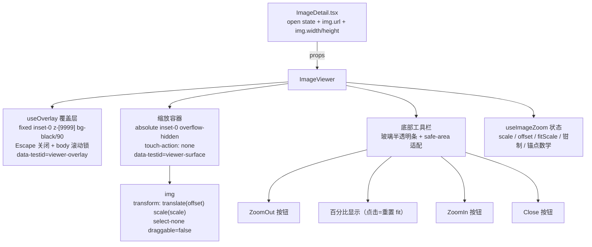
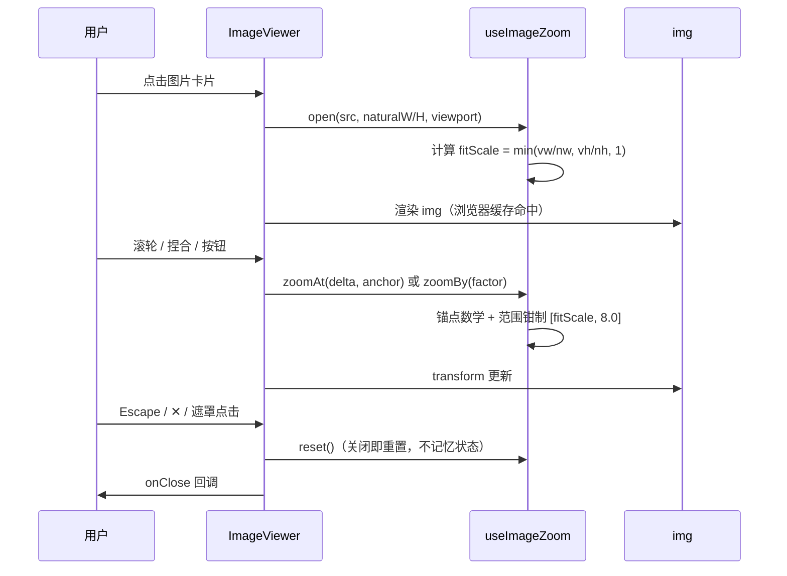
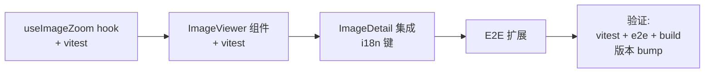

# PicHost 图片详情页缩放查看器 — 设计文档

> **日期**: 2026-08-09
> **目标**: 图片详情页支持放大/缩小查看图片（全屏 Lightbox，完整手势交互）
> **范围**: 纯前端（web-ui/），无后端变更、无 DB 迁移

---

## 1. 背景与目标

### 1.1 现状

图片详情页 `web-ui/src/pages/ImageDetail.tsx`（347 行）通过只读 `` 展示图片：

```tsx
// ImageDetail.tsx:163-170 — 图片预览卡片
<div className="glass-elevated mb-4 overflow-hidden rounded-xl">
  
</div>
```

已调研确认（探索代理验证）：

| 事实 | 位置 |
|------|------|
| `` 无任何事件处理器（onClick/onWheel/pointer/touch 均为零） | `ImageDetail.tsx:163-170` |
| 全代码库无 zoom/lightbox/fullscreen/pinch 相关代码，手势处理为绿地 | `web-ui/src/` 全量 grep |
| `ImageInfo` 已暴露 `width`/`height`（自然尺寸，可作缩放锚点）、`public_key`、`url`、`webp_url` | `src/api/client.ts:52-71` |
| 可复用覆盖层原语 `useOverlay`（Escape 关闭 + body 滚动锁 + 遮罩点击关闭） | `src/hooks/useOverlay.ts` |
| 可复用 `ui/Button`（variant="icon"）与 `.glass-*` 设计 token 体系 | `src/components/ui/Button.tsx` |
| i18n 键集相等测试：新增键必须 en/zh-CN 双写，否则 `i18n.test.ts:31-37` 失败 | `src/i18n/` |
| 现有 E2E 选择器不触碰 `` 元素，包裹/替换图片渲染方式安全 | `e2e/specs/image-detail.spec.ts` |

### 1.2 图片 URL 来源注意

- `img.url` 为**原图**：本地后端 = `{public_url}/u/{public_key}`；rustfs/git 后端 = 外部 CDN/S3/git 原始 URL（`storage.public_url()`）。
- `thumbnail_url` / `webp_url` 恒为 API 托管（`/u/thumb/{id}`、`/u/webp/{id}`）。
- **决策**: 查看器复用页面已加载的 `img.url` —— 浏览器缓存命中（详情页已加载同一 URL）、CDN 直连、与页面显示一致，零额外成本。

### 1.3 成功标准

1. 点击详情页图片打开全屏查看器，Escape/关闭按钮/遮罩点击均可关闭
2. 桌面端：滚轮缩放（锚定光标）、拖拽平移、双击 fit↔100% 切换
3. 移动端：双指捏合缩放、单指拖拽平移（`touch-action: none`），375×667 视口工具栏可操作
4. 缩放范围 `[fitScale, 8.0]`，关闭后重置（不记忆状态）
5. 现有 E2E 与 vitest 全部保持通过；不破坏任何现有选择器

---

## 2. 方案选型

| 方案 | 描述 | 结论 |
|------|------|------|
| **A. 全屏 Lightbox** | 点击图片 → 全屏覆盖层查看，缩放/平移/手势全部发生在覆盖层内 | ✅ **采用** |
| B. 页内原地交互 | 现有卡片内直接滚轮缩放 + 拖拽平移 | ❌ 缩放空间被卡片裁剪（`overflow-hidden`）、滚轮与页面滚动冲突、移动端捏合与页面手势冲突 |
| C. 两者都要 | 页内可缩放 + 全屏按钮 | ❌ 超出需求，YAGNI |

**选型理由**：全屏 Lightbox 是主流图床/相册模式（GitHub、Google Photos、sm.ms）；覆盖层内手势不与页面滚动/卡片边界冲突；`useOverlay` 的滚动锁 + Escape 天然适配；交互状态收敛在单一组件内，可独立测试。

---

## 3. 组件架构

### 3.1 新增文件

| 文件 | 职责 | 依赖 |
|------|------|------|
| `web-ui/src/hooks/useImageZoom.ts` | 纯缩放/平移状态逻辑（scale + offset + 钳制 + 锚点数学），无 DOM 依赖 | 无（可独立单测） |
| `web-ui/src/components/ImageViewer.tsx` | 全屏 Lightbox 组件：覆盖层 + 图片 + 工具栏 + 事件绑定 | `useImageZoom`、`useOverlay`、`ui/Button`、lucide-react、i18n |

### 3.2 组件结构



### 3.3 挂载方式（对现有代码零破坏）

- `ImageDetail.tsx:164` 图片卡片 `<div>`：加 `onClick → setViewerOpen(true)` + `cursor-zoom-in`，图片 `` 标记不变（保持 `max-h-[60vh] w-full object-contain` 与现有 E2E 文本断言兼容）
- 页面根节点挂载：`<ImageViewer open={viewerOpen} src={img.url} naturalWidth={img.width} naturalHeight={img.height} onClose={() => setViewerOpen(false)} />`
- 卡片 `<div>` 增加 `data-testid="image-preview"`（新增 testid，仅用于 E2E 打开查看器，纯增量）

### 3.4 数据流



---

## 4. 缩放状态模型（useImageZoom）

### 4.1 状态与常量

| 项 | 定义 |
|----|------|
| `scale` | 相对原图自然像素的缩放倍数（`1.0 = 100%`，与工具栏百分比一致） |
| `fitScale` | 打开时计算：`min(viewportW/naturalW, viewportH/naturalH, 1)` —— contain 适配且**小图不放大** |
| `offset {x, y}` | 相对容器中心的平移量（CSS `translate`） |
| 范围 | `scale ∈ [fitScale, 8.0]` |
| 滚轮步进 | 每格 ×1.1（指数级） |
| 按钮步进 | 每步 ×1.25 |
| 自然尺寸来源 | 优先 `ImageInfo.width/height`（同步可得）；缺失时回退 `` 的 `naturalWidth/Height` |

### 4.2 锚点缩放数学（滚轮/捏合通用）

缩放后保持锚点（光标 / 捏合中点）下的图像点不动：

```
offset' = anchor - (anchor - offset) × (newScale / oldScale)
```

### 4.3 平移钳制

- 当 `naturalW × scale > viewportW`：`offset.x ∈ [-(naturalW×scale − viewportW)/2, +(naturalW×scale − viewportW)/2]`
- 垂直方向同理；图片小于视口（或恰好 fit 小于视口尺寸）时钳制为 0（禁用平移）

### 4.4 公开 API

```
open(naturalW, naturalH, viewportW, viewportH)  → 初始化 fitScale、reset
zoomAt(delta, anchorX, anchorY)                 → 锚点缩放（滚轮/捏合共用）
zoomBy(factor)                                  → 按钮/键盘缩放（以视口中心为锚点）
panBy(dx, dy)                                   → 平移 + 钳制
toggleFit()                                     → fit ↔ 100% 切换
reset()                                         → 回 fit
isFit / displayPercent（四舍五入整数）              → 派生值
```

---

## 5. 交互规格

| 输入 | 行为 |
|------|------|
| 滚轮（桌面） | ×1.1/格，锚定光标，`preventDefault`（阻断页面滚动传播） |
| 鼠标拖拽 / 单指拖拽 | 平移，`cursor: grab → grabbing` |
| 双击 | fit ↔ 100% 切换 |
| 双指捏合（移动） | 距离比值缩放，锚定双指中点；`touch-action: none` 禁用浏览器默认 |
| 工具栏 `−` / `+` | ×1.25 步进，以视口中心为锚点 |
| 百分比按钮 | 显示 `Math.round(scale×100)%`；点击 = 重置 fit |
| 键盘 `+` / `-` / `0` | 放大 / 缩小 / 重置 fit |
| `Escape` / ✕ / 遮罩点击 | 关闭（useOverlay 兜底 Escape 与遮罩；✕ 走按钮） |
| 关闭语义 | 重置为 fit，不记忆缩放状态 |

### 事件绑定要点

- `onWheel`: React 合成事件 + 原生 `preventDefault`（注意 DropZone 注释的 React 19 原生事件陷阱：必要时从 nativeEvent 读取）
- Pointer Events 多指跟踪：维护 `Map<pointerId, {x,y}>`；2 指针 = 捏合，1 指针 = 平移
- 全部手势在 `data-testid="viewer-surface"` 容器上绑定

---

## 6. UI 样式

### 6.1 覆盖层

- `fixed inset-0 z-[9999]`（与 GlassSelect portal 同级之上），`bg-black/90`
- 图片：`select-none` + `draggable={false}` + `will-change: transform`，`transform: translate(offset) scale(scale)`，`transform-origin: center`

### 6.2 工具栏（底部居中玻璃条）

```
[ − ]  [ 42% (点击=重置fit) ]  [ + ]                [ ✕ ]
```

- 图标：lucide-react `ZoomIn` / `ZoomOut` / `X`
- 按钮复用 `ui/Button` variant="icon"，`aria-label` 全部走 `t()`
- 百分比按钮含 `aria-label="Zoom {{percent}}%"` 与 title「适应屏幕」
- 样式遵循玻璃体系：`var(--glass-bg)` / `var(--color-border)` 半透明，不新增设计 token
- 移动端 `pb-[env(safe-area-inset-bottom)]` 适配刘海屏

---

## 7. i18n 新增键

前缀 `imageDetail.*`（en/zh-CN 同步新增，键集相等测试 `i18n.test.ts:31-37` 兜底；关闭按钮复用现有 `modal.close`）：

| 键 | en | zh-CN |
|----|----|-------|
| `imageDetail.zoomIn` | Zoom in | 放大 |
| `imageDetail.zoomOut` | Zoom out | 缩小 |
| `imageDetail.zoomReset` | Reset zoom | 重置缩放 |
| `imageDetail.zoomFit` | Fit to screen | 适应屏幕 |
| `imageDetail.zoomLevel` | Zoom {{percent}}% | 缩放 {{percent}}% |
| `imageDetail.openViewer` | View image | 查看图片 |

`types/i18next.d.ts` 自动基于 en.json 提供编译期键检查。

---

## 8. 测试策略

### 8.1 Vitest（遵循 `Modal.test.tsx` / `useOverlay.test.tsx` 模式：`createRoot` + `act` + `dispatchEvent`，无 testing-library）

**`src/hooks/useImageZoom.test.ts`**（纯函数，无 DOM）：
- fitScale 计算（contain 适配、小图不放大、超宽/超高图）
- 范围钳制（`[fitScale, 8.0]`）
- 锚点数学：缩放前后锚点下的图像点坐标不变
- 平移钳制（大于视口可平移、小于视口钳制为 0）
- `toggleFit` / `reset` / `displayPercent`

**`src/components/ImageViewer.test.tsx`**：
- `open=false` 不渲染；`open=true` 渲染覆盖层（`[data-testid="viewer-overlay"]`）
- Escape 触发 `onClose` 回调
- 合成 wheel 事件触发 scale 变化（百分比文本更新）
- pointer down/move/up 触发平移
- 工具栏 − / + / 百分比 / ✕ 按钮行为
- 按钮 `aria-label` 存在（`imageDetail.zoomIn` 等）

### 8.2 Playwright E2E（扩展 `image-detail.spec.ts` + `image-detail.po.ts`）

- 新 getters：`viewerOverlay`（`[data-testid="viewer-overlay"]`）、`zoomInButton` / `zoomOutButton` / `zoomLevel`（按 aria-label / 文本）
- 桌面：点击 `[data-testid="image-preview"]` → viewer 可见 → `page.mouse.wheel(0, -100)` 缩放 → 百分比文本变化 → `+`/`-` 按钮 → `0`/百分比点击重置 → Escape 关闭
- 移动：现有 375×667 `hasTouch` describe 内追加 — 打开 viewer、工具栏按钮可点、关闭
- 捏合手势不做 E2E（Playwright 多指模拟成本高；逻辑已由 vitest 的锚点数学覆盖）

### 8.3 回归保障

- 现有 `image-detail.spec.ts` 全部断言保持通过（不触碰 `` 选择器、`button:has(.lucide-pencil)`、combobox 名称、`code` 元素序不变）
- `npm run build`（tsc -b + vite build）零错误
- `npx vitest run` 全绿

---

## 9. 范围边界（明确不做）

- ❌ Gallery 缩略图点击直接打开 lightbox（仅详情页）
- ❌ 图片旋转（rotate）
- ❌ 缩放状态记忆（每次打开重置 fit）
- ❌ 幻灯片 / 相邻图片导航
- ❌ 任何后端改动（0 Rust 变更）
- ✅ 版本：`0.19.0 → 0.20.0`（feature 级 bump，Cargo.toml + web-ui/package.json + CHANGELOG 同步）

---

## 10. 实施步骤建议



1. **useImageZoom**: hook + 纯函数测试（先测试后实现，TDD）
2. **ImageViewer**: 组件 + 交互测试（覆盖层/工具栏/手势绑定）
3. **ImageDetail 集成**: 挂载 + 卡片点击 + i18n 双写键
4. **E2E**: 桌面 + 移动 spec 扩展
5. **验证**: `npx vitest run`、`npm run e2e`、`npm run build`、版本 bump 0.20.0
