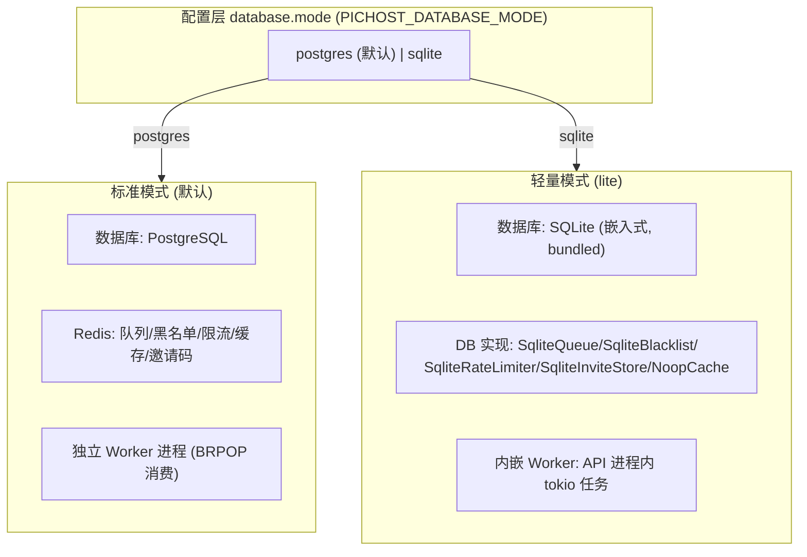
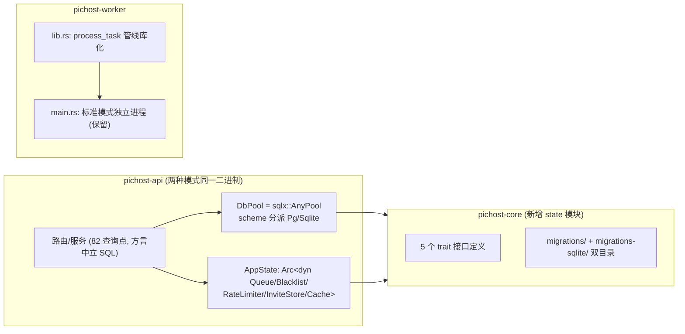
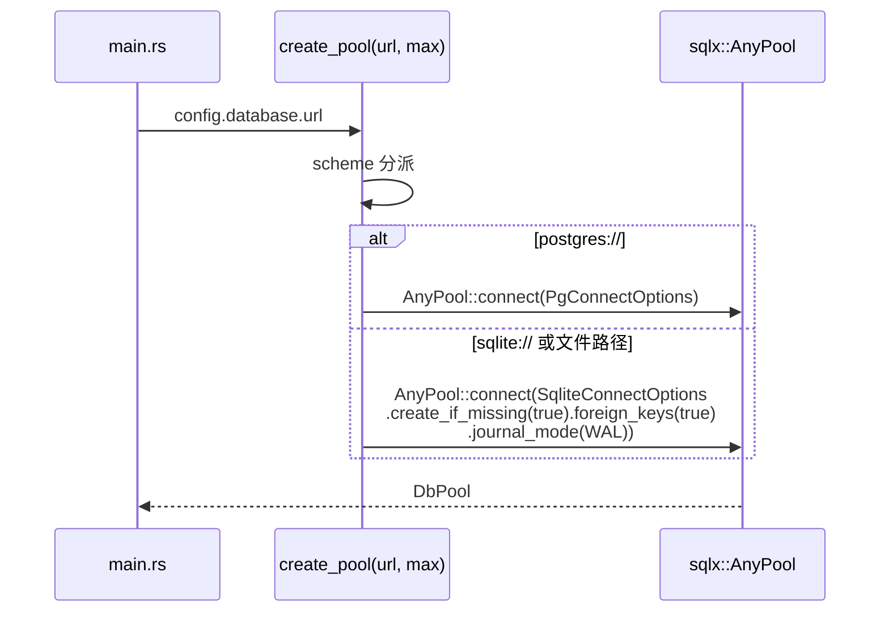
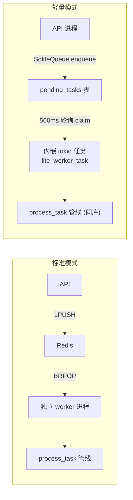

# PicHost 轻量模式（SQLite + 无 Redis）— 设计文档

> **日期**: 2026-08-09
> **目标**: 为 PicHost 增加"轻量模式"——SQLite 替代 PostgreSQL + 无 Redis 的零外部依赖单机部署，同时保持现有标准模式（PG + Redis）行为零变化
> **范围**: 跨 crate（pichost-core / pichost-api / pichost-worker）+ 安装脚本 + 配置系统。含 DB 方言抽象、Redis 角色 trait 化、单进程内嵌 worker、安装流程交互化
> **版本**: 0.20.0 → 0.21.0（feature）

---

## 1. 背景与目标

### 1.1 现状

PicHost 当前强依赖两个外部服务：

| 依赖 | 角色 | 故障行为 |
|------|------|----------|
| PostgreSQL | 全部业务数据（82 个生产查询点，10 个迁移） | 服务不可用 = 全站不可用 |
| Redis | 5 个角色：worker 队列（BRPOPLPUSH）、token 黑名单（唯一 **fail-closed**）、限流（4 策略，fail-open）、3 层缓存、邀请码（Redis 独占，无 DB 表） | 黑名单检查失败 = 全体 401 |

裸机安装（`scripts/install.sh`）对依赖**只有一行 echo 提示**（`install.sh:33-34`），无真实检测、无安装引导、无交互。目标是让 PicHost 能在没有 PG/Redis 的小机器上直接跑起来。

### 1.2 已确认的决策（brainstorming 澄清）

| # | 决策点 | 结论 |
|---|--------|------|
| D1 | Redis 角色定位 | **SQLite + 无 Redis 模式** — 轻量模式零外部依赖 |
| D2 | 部署形态 | **单进程** — 轻量模式下 API 内嵌 worker 处理逻辑 |
| D3 | 功能范围 | **全功能对齐** — 全部现有功能（水印/多后端 Git/分类/配额/OAuth/搜索）在两种模式下均可用 |
| D4 | 安装交互 | **提问 + apt 自动安装 + SQLite 引导**（`--yes` 支持无人值守） |
| D5 | 数据迁移 | **不做自动迁移** — SQLite 定位为全新轻量部署选项 |
| D6 | Redis 替代实现层 | **trait 抽象 + 双实现** — 标准模式 Redis 实现保留（零回归），轻量模式 DB 实现 |
| D7 | DB 方言抽象 | **方案 A：sqlx::Any 统一池 + 方言中立 SQL 改造** |

### 1.3 成功标准

1. 轻量模式：仅二进制 + SQLite 文件即可完整运行（注册/登录/上传/缩略图/WebP/水印/分类/配额/搜索全部可用）
2. 标准模式（PG + Redis）：现有 575 测试全部通过，行为零变化
3. `install.sh` 交互化：检测缺失依赖 → 提问（自动安装 apt / 手动 / 改 SQLite）→ 按模式生成 .env 与 systemd 单元
4. 轻量模式下 systemd 单元不依赖 `postgresql.service`/`redis.service`
5. 全部 ~20 处方言敏感 SQL 改造为双方言兼容，其余 ~60 处不动

### 1.4 研究事实（explore 代理验证）

**DB 方言审计**（82 个生产查询点）：

| 事实 | 数据 |
|------|------|
| 生产查询点分布 | pichost-api 77 处 + pichost-worker 5 处（pichost-core 0 处，仅 FromRow derive） |
| 方言敏感语法 | `::type` 转换 ×12（upload.rs:288; users.rs:97-296; admin.rs:455-494）、`ANY($N)` ×4（upload.rs:493; images.rs:745/773/895）、`ILIKE` ×2（upload.rs:1066; images.rs:91）、`now()` ×4（users.rs:297/404; storage_configs.rs:413/483）、`NOW() - INTERVAL` ×1（admin.rs:481） |
| 天然兼容语法 | `$N` 参数、`EXISTS`、`COALESCE`、`CASE WHEN`、`RETURNING`（SQLite ≥3.35）、`ON CONFLICT DO NOTHING`、`IS NOT DISTINCT FROM`（≥3.39）、`LIMIT/OFFSET`、部分唯一索引 |
| 类型映射 | `Uuid`→TEXT、`DateTime<Utc>`→TEXT/INTEGER、`serde_json::Value`→TEXT（需 sqlx `json` feature）、bool→INTEGER 0/1 |
| 迁移 | 10 个迁移全部 PG 方言（pgcrypto、gen_random_uuid、TIMESTAMPTZ、JSONB、COMMENT ON、ADD COLUMN IF NOT EXISTS） |
| 基础设施 | `DbPool = PgPool` 别名贯穿 ~40 个签名；api/worker 各有一份相同的 db 模块；workspace sqlx features 缺 `sqlite`/`any`/`json`；`QueryBuilder<'_, Postgres>` ×7 处 |

**Redis 使用点审计**（5 角色，替代难度）：

| 角色 | 位置 | 替代难度 |
|------|------|----------|
| 队列 | API 生产 upload.rs:171-230；Worker 消费 queue.rs（BRPOPLPUSH + retry + dead-letter + stale recovery） | **高** — SQLite 表 + 原子 claim + 轮询 |
| 黑名单 | middleware/auth.rs:79、routes/auth.rs:419（fail-closed）；写入 auth.rs:175-191/478 | **中** — `token_blacklist` 表 |
| 限流 | middleware/rate_limit.rs:48-150（4 策略，fail-open + Nginx 兜底） | **低-中** — 窗口 upsert 表 |
| 缓存 | cache/mod.rs（meta/thumb/stats 三层，全 fail-open 回源） | **低** — 轻量模式直接删除（NoopCache），Nginx proxy_cache 已兜底 /u/ /t/ |
| 邀请码 | cache/mod.rs:229-416（Redis 独占，无 DB 表） | **低** — `invite_codes` 表 |

关键结论：**无 pub/sub、无 stream/consumer group，Redis 可完全移除**；轻量模式天然单实例语义。

**配置与安装审计**：

| 事实 | 位置 |
|------|------|
| `DatabaseConfig { url, max_connections }` 无 mode 字段 | pichost-core/src/config.rs:81-85 |
| figment 链：defaults → config.toml → `PICHOST_` env（`__` 显式嵌套 + `_` 扁平 2 段兼容） | config.rs:260-274 |
| install.sh 依赖检测仅一行 echo，无用户创建/无 chown/无 JWT secret 校验/无服务启动 | scripts/install.sh:33-34 |
| systemd 单元硬引用 `postgresql.service`/`redis.service`（Wants/After） | scripts/pichost-api.service、pichost-worker.service |
| 双二进制启动均跑迁移（api db/mod.rs:16、worker db.rs:16） | main.rs 启动链 |
| admin config 服务 `test_database_connection` 硬编码 PgPool | services/config.rs:163-180 |
| `.env.example` 缺 `PICHOST_I18N_LANGUAGE`/`PICHOST_I18N_LOCALES_DIR`（顺带补齐） | .env.example |

---

## 2. 运行模式架构



**核心原则**：标准模式（PG + Redis）作为唯一回归基线，全部现有行为零变化；轻量模式作为全新部署选项，共用同一套路由/服务/模型代码。



---

## 3. DB 方言抽象层（方案 A 落地）

### 3.1 DbPool 统一化



**变更点**：

| # | 位置 | 变更 |
|---|------|------|
| 1 | workspace Cargo.toml | sqlx 增加 `sqlite`（**bundled** — 编译期内置 SQLite，目标机无需 libsqlite3）+ `any` + `json` features |
| 2 | api/db/mod.rs + worker/db.rs | 合并为一份共享 `create_pool`/`run_migrations`（消除重复源），`DbPool = AnyPool` |
| 3 | SQLite 连接选项 | `PRAGMA foreign_keys=ON`（否则 ON DELETE CASCADE/SET NULL 静默失效）、WAL 模式 |
| 4 | health.rs | 组件名 `"postgres"` → 按模式返回 `"postgres"`/`"sqlite"` |
| 5 | services/config.rs | `test_database_connection` 按 mode 分支（Any 或 Sqlite 探测） |

### 3.2 方言敏感点改造清单（~20 处，全量枚举）

| 方言语法 | 位置 | 改造方式 |
|----------|------|----------|
| `::BIGINT`/`::boolean`/`::jsonb` ×12 | upload.rs:288; users.rs:97,98,294,296; admin.rs:455,467,494 | 全部删除 — Rust 侧 `query_as` 类型已定型（i64/bool/serde_json::Value），SQLite 端 sqlx 自动映射 |
| `ANY($N)` ×4 | upload.rs:493; images.rs:745,773,895 | 展开为 `IN (?,?,...)` 动态占位符 + 逐项绑定 |
| `ILIKE` ×2 | upload.rs:1066; images.rs:91（QueryBuilder） | → `LIKE`（SQLite ASCII 大小写不敏感；中文无大小写语义，行为一致） |
| `now()` ×4 | users.rs:297,404; storage_configs.rs:413,483 | → `CURRENT_TIMESTAMP` |
| `NOW() - INTERVAL '24 hours'` ×1 | admin.rs:481 | Rust 侧计算 `now - 24h` 时间戳作为绑定参数传入（彻底消除方言） |
| PG 错误码 23505 / constraint 名 ×3 | users.rs:312; auth.rs:231; categories.rs:168 | 统一 `db_error_kind()` 映射层（SQLite 2067 → unique_violation），上层逻辑不变 |

**明确不动**（双方言天然兼容）：`$N` 编号参数、`EXISTS`、`COALESCE`、`CASE WHEN`、`RETURNING`、`ON CONFLICT DO NOTHING`、`IS NOT DISTINCT FROM`、`LIMIT/OFFSET`、部分唯一索引、`LEFT JOIN`、`status IN (...)`。

**QueryBuilder 泛型化**：`QueryBuilder<'_, sqlx::Postgres>` ×7 处（upload.rs:1060,1086,1115; images.rs:82,116,142）→ `QueryBuilder<'_, sqlx::Any>`（`push_optional_filters` 等辅助函数签名同步泛型化）。

### 3.3 迁移双目录

```
migrations/            ← PG 版 (10 个, 不动)
migrations-sqlite/     ← SQLite 版 (10 个, 方言改写)
```

| 迁移特征 | PG 版 | SQLite 版改写 |
|----------|-------|---------------|
| `CREATE EXTENSION pgcrypto` (0001) | 保留 | 删除 |
| `UUID ... DEFAULT gen_random_uuid()` (0001/2/4/7/8/9) | 保留 | `TEXT PRIMARY KEY DEFAULT (lower(hex(randomblob(16))))` |
| `TIMESTAMPTZ ... DEFAULT now()` | 保留 | `TEXT DEFAULT (strftime('%Y-%m-%dT%H:%M:%fZ','now'))` |
| `JSONB` (0004/0008/0010) | 保留 | `TEXT` |
| `COMMENT ON COLUMN` (0006/0010) | 保留 | 删除 |
| `ADD COLUMN IF NOT EXISTS` (0006/0010) | 保留 | 直接 `ADD COLUMN`（SQLite 不支持 IF NOT EXISTS） |
| 部分唯一索引 `WHERE is_default=true` (0008) | 保留 | 保留（SQLite 支持） |
| `ON DELETE CASCADE/SET NULL` | 保留 | 保留（依赖 foreign_keys PRAGMA） |

`run_migrations` 编译期内嵌两个 `Migrator` 常量（`Migrator::new("../migrations")` + `Migrator::new("../migrations-sqlite")`），运行时按 mode 选择其一执行。`_sqlx_migrations` checksum 表双方言独立。

### 3.4 风险与 spike（实现期第一周）

1. `serde_json::Value` 在 AnyPool 下的 decode（JSONB→TEXT 往返）
2. `Uuid` / `DateTime<Utc>` 的 TEXT 编解码
3. `QueryBuilder<'_, Any>` 的动态 SQL 支持度（upload.rs/images.rs 画廊查询）

spike 结果固化为例行参数化测试（双库跑同一查询）。

---

## 4. Redis 角色 trait 化（5 接口 + 双实现）

### 4.1 接口定义（pichost-core/src/state/，无框架依赖）

```rust
pub trait Queue: Send + Sync {
    async fn enqueue(&self, payload: TaskPayload) -> Result<(), QueueError>;
    async fn dequeue(&self, timeout: Duration) -> Option<TaskPayload>;
    async fn ack(&self, task_id: &str) -> Result<(), QueueError>;
    async fn nack(&self, task_id: &str, retry_count: u32) -> Result<(), QueueError>;
}

pub trait Blacklist: Send + Sync {
    async fn check(&self, jti: &str) -> bool;               // 现有 fail-closed 语义保留
    async fn revoke(&self, jti: &str, ttl: Duration);
}

pub trait RateLimiter: Send + Sync {
    async fn check(&self, policy: &str, key: &str, limit: u32, window: Duration)
        -> RateLimitResult;                                  // 含 retry-after 语义
}

pub trait InviteStore: Send + Sync {
    // 现有 cache/mod.rs:229-416 的 create/verify/consume/list 签名照搬
}

pub trait Cache: Send + Sync {
    // 现有 cache/mod.rs:42-84 的 get/set_ex/incr/delete 签名
}
```

### 4.2 双实现矩阵

| 接口 | 标准模式（现有代码封装） | 轻量模式（新实现） |
|------|--------------------------|--------------------|
| `Queue` | `RedisQueue` — 封装现有 queue.rs BRPOPLPUSH 逻辑 | `SqliteQueue` — `pending_tasks` 表 `(task_id PK, payload_json, status, retry_count, claimed_at, updated_at, created_at)`；dequeue = 原子 claim（`UPDATE ... WHERE status='pending' AND claimed_at IS NULL RETURNING`）+ 500ms 轮询；nack 重试/死信（status='dead'）；启动时归还超时 claim（复刻 recover_stale_tasks） |
| `Blacklist` | `RedisBlacklist` — 封装 bl:{jti} | `SqliteBlacklist` — `token_blacklist(jti PK, expires_at)` + 定期清理 |
| `RateLimiter` | `RedisRateLimiter` — 封装 INCR+EXPIRE | `SqliteRateLimiter` — `rate_limits(policy, key, window_start, count)` 窗口 upsert |
| `InviteStore` | `RedisInviteStore` | `SqliteInviteStore` — `invite_codes(code PK, created_by, created_at, expires_at, used_by)` |
| `Cache` | `RedisCache` | `NoopCache` — 直接回源（SQLite 本地查询快 + Nginx proxy_cache 兜底 /u/ /t/） |

### 4.3 AppState 装配

```rust
pub struct AppState {
    pool: DbPool,                          // AnyPool
    queue: Arc<dyn Queue>,
    blacklist: Arc<dyn Blacklist>,
    rate_limiter: Arc<dyn RateLimiter>,
    invites: Arc<dyn InviteStore>,
    cache: Arc<dyn Cache>,
    // ... 其余字段不变
}
```

`app.rs` 按 mode 构建实现并注入。**标准模式 = 现有实现原样封装，575 测试零回归**。

### 4.4 轻量模式行为差异（有意为之）

| 项 | 标准模式 | 轻量模式 |
|----|----------|----------|
| 黑名单 | fail-closed（Redis 挂 = 全体 401） | SQLite 本地事务（无外部故障面） |
| 限流 | Redis 共享（多副本精确） | 单实例精确（多副本语义不适用） |
| 队列延迟 | BRPOP 即时 | 500ms 轮询（缩略图延迟可接受） |
| 缓存 | Redis 3 层 | 无缓存（直查本地） |
| 伸缩性 | API×N + Worker×N | 单实例（SQLite 单写者 + 进程内队列） |

---

## 5. 单进程内嵌 worker（轻量模式）



### 5.1 pichost-worker 库化

- 新增 `pichost-worker/src/lib.rs`：暴露 `process_task(pool, router, payload)`（现有 main.rs 处理逻辑迁移，含 watermark/thumbnail/WebP 管线）
- 保留 `pichost-worker/src/main.rs`：标准模式独立进程入口（worker_loop + Redis 消费）
- worker 的 `db.rs` 与 api 合并为共享 AnyPool 代码

### 5.2 轻量模式任务分发

- API 启动 spawn `lite_worker_task`：循环 `SqliteQueue.dequeue()` → `process_task()` → ack/nack
- `TaskPayload` 复用（queue.rs:8-19），`process_upload()` 上传后 enqueue → 500ms 内处理
- 进程退出时任务保留在表内（claimed_at 超时归还 → 重启续跑）
- **标准模式 API 不 spawn 内嵌任务**（行为零变化）

---

## 6. 安装流程交互化

### 6.1 install.sh 交互流程

```
install.sh [--yes] [--mode postgres|sqlite]
  ├─ 1. 检测依赖:  pg_isready / redis-cli PING (或 systemctl is-active)
  ├─ 2. 模式引导:
  │     PG 缺失 → 提问: [1] 自动安装 PostgreSQL (apt, 仅 Debian/Ubuntu)
  │                    [2] 改用 SQLite 模式 (零依赖, 推荐轻量)  ★新
  │                    [3] 手动安装后重跑
  │     Redis 缺失 (仅 postgres 模式) → 提问: [1] apt 自动安装 [2] 手动安装后重跑
  ├─ 3. 按模式生成 /etc/pichost/.env:
  │     postgres: PICHOST_DATABASE_URL=postgres://... + PICHOST_REDIS_URL=...
  │     sqlite:   PICHOST_DATABASE_MODE=sqlite
  │               PICHOST_DATABASE_URL=sqlite:///var/lib/pichost/pichost.db
  ├─ 4. 创建 pichost 系统用户 + 目录权限 (补齐现有缺口)
  ├─ 5. systemd 单元条件化: SQLite 模式去掉 postgresql.service/redis.service 的 Wants;
  │     postgres 模式可加 createdb pichost 引导
  └─ 6. 校验 PICHOST_AUTH_JWT_SECRET ≥32 字符 (现有缺口)
```

### 6.2 systemd 单元

| 模式 | pichost-api.service 依赖 |
|------|--------------------------|
| postgres | `After/Wants=postgresql.service redis.service`（现状） |
| sqlite | 仅 `After=network.target`（无 postgresql/redis 单元） |

### 6.3 配置与文档变更

| # | 位置 | 变更 |
|---|------|------|
| 1 | pichost-core/src/config.rs | `DatabaseConfig` 增加 `mode: DatabaseMode`（serde default = postgres）；`url` 语义扩展（sqlite 文件路径） |
| 2 | .env.example | 增加 `PICHOST_DATABASE_MODE`；顺带补齐缺失的 `PICHOST_I18N_LANGUAGE`/`PICHOST_I18N_LOCALES_DIR` |
| 3 | services/config.rs | `[database] mode` 读写 + `test_database_connection` 按 mode 分支 |
| 4 | verify-release.sh | 冒烟测试按 mode 参数化（sqlite = 临时文件 URL）；install dry-run 覆盖 SQLite 分支 |
| 5 | docker-compose | 保持 PG 模式不动（轻量模式定位裸机，不做容器化） |

---

## 7. 测试计划（TDD 冒烟设计）

| 测试层 | 内容 | 门控 |
|--------|------|------|
| 标准模式回归 | 现有 575 测试全量通过（CI 不变） | 必须 |
| Any 类型边界 spike | Uuid/Json/DateTime 双库 decode 参数化测试 | 必须 |
| 方言中立 SQL | ~20 处改造点逐条双库跑通（参数化） | 必须 |
| SqliteQueue | 原子 claim / 超时归还 / 重试上限 / 死信 / 并发 claim 单测 | 必须 |
| SqliteBlacklist / RateLimiter / InviteStore | 接口语义 + 过期清理 | 必须 |
| 轻量模式端到端 | 临时 SQLite 文件跑通 注册→登录→上传→缩略图→公开访问 全链路 | `#[ignore]` 门控 |
| 安装脚本 | verify-release.sh dry-run 覆盖 sqlite 分支（交互用 `--yes` 跳过） | 发布前 |

---

## 8. 实施顺序（建议）

| 阶段 | 内容 | 依赖 |
|------|------|------|
| S1 | **spike**: Any 类型边界验证（Uuid/Json/DateTime/QueryBuilder） | 无 |
| S2 | workspace sqlx features + DbPool=AnyPool + db 模块合并 + 迁移双目录 | S1 |
| S3 | ~20 处方言点改造 + QueryBuilder 泛型化 + 错误映射层 | S2 |
| S4 | 5 个 trait 定义 + Redis 实现封装（标准模式零回归） | S3 |
| S5 | SQLite 双实现（Queue/Blacklist/RateLimiter/InviteStore/NoopCache）+ AppState 装配 | S4 |
| S6 | worker 库化 + 轻量模式内嵌任务 | S5 |
| S7 | install.sh 交互化 + systemd 条件化 + .env 生成 + verify-release 适配 | S6 |
| S8 | 文档同步（AGENTS.md/README.md/summary）+ CHANGELOG + 版本 0.21.0 | S7 |

**范围边界（本期不做）**：PG→SQLite 数据迁移工具；轻量模式多实例；SQLite 容器化。

---

## 9. 待办（TODO 跟踪）

- [ ] S1 spike：Any 类型边界验证
- [ ] S2 sqlx features + AnyPool + 迁移双目录
- [ ] S3 方言点改造（~20 处）
- [ ] S4 trait 定义 + Redis 实现封装
- [ ] S5 SQLite 双实现 + AppState 装配
- [ ] S6 worker 库化 + 内嵌任务
- [ ] S7 安装交互化 + 文档
- [ ] S8 文档同步 + 版本发布
