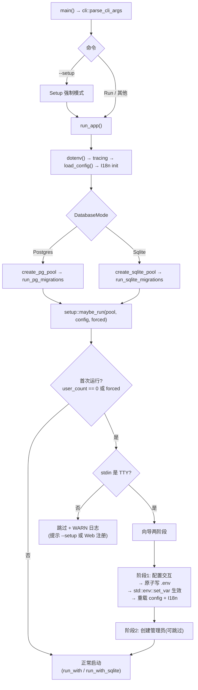
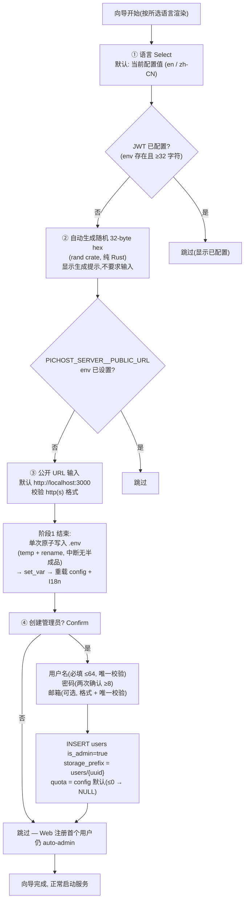

# PicHost 首次安装服务启动终端初始化向导 — 设计文档

> **日期**: 2026-08-15
> **目标**: 服务首次启动(数据库无任何用户)且进程具有交互终端时,自动运行终端初始化向导:① 配置(JWT secret / 公开 URL / 界面语言)② 创建首个管理员账号。无 TTY 环境(systemd/Docker/CI)自动跳过并 WARN,现有部署零影响
> **范围**: Rust 代码(pichost-api 启动流程 + 新 setup 模块 + cli.rs)+ i18n 后端消息目录 + 文档。**不涉及** pichost-core 依赖变更、前端 web-ui、安装脚本、数据库迁移
> **版本**: 0.23.0 → 0.24.0(feature)
> **前置**: 0.23.0 原生安装包(install.sh / deb / rpm / Windows 服务均已在安装期生成随机 JWT secret 与 .env)

---

## 1. 背景与目标

### 1.1 现状

| 现状 | 问题 |
|------|------|
| 安装后首次启动直接运行,无任何初始化引导 | 用户需自行编辑 `.env` 设置 `PICHOST_SERVER__PUBLIC_URL`(deb/rpm 的 .env 根本不写 PUBLIC_URL,回落到默认 `http://localhost:3000`) |
| 首个管理员只能通过 Web 注册界面创建 | 无头部署(远程服务器)必须先打开浏览器注册,才能获得管理员权限;注册页依赖前端可用 |
| 配置分散在 `.env` 与 config.toml,无统一引导 | 用户不知道该配置什么、配置在哪生效 |
| Windows 服务已有非交互式 bootstrap(`ensure_service_env` 自动生成 JWT) | Linux/macOS 无等价物;且它只补 JWT,不引导 URL/语言/管理员 |

### 1.2 已确认决策(brainstorming 澄清)

| # | 决策点 | 结论 |
|---|--------|------|
| D1 | 向导范围 | **配置 + 管理员**:① JWT secret ② 公开 URL ③ 界面语言 ④ 创建首个管理员账号 |
| D2 | 触发条件 | **自动检测**:数据库中用户数 == 0 即为首次运行(与 JWT 是否已配置无关——安装器均已生成随机 JWT);另加 `--setup` CLI 标志可**强制**运行向导 |
| D3 | 非 TTY 行为 | **跳过 + WARN 日志**(提示 `pichost-api --setup` 或 Web 注册首个用户),正常启动服务;Web"首个用户自动 admin"逻辑作为兜底 |
| D4 | 配置写入目标 | **`.env`**(与 install.sh / deb / rpm / Windows 服务同一持久化通道,systemd `EnvironmentFile` 直接生效);定位顺序: `PICHOST_ENV_FILE` 显式指定 → `/etc/pichost/.env` → CWD `.env` → 交互询问新建位置。**不写 config.toml**(env 优先于 config.toml 且其为 CWD 相对路径) |
| D5 | 执行时机 | **单进程两阶段**:迁移完成后运行(DB pool 在手)。阶段 1 配置 → 写 .env → 进程内生效;阶段 2 创建管理员 → 正常启动。无需重启 |
| D6 | 管理员字段 | 用户名(必填,≤64)+ 密码(两次确认,≥8,与改密规则一致)+ 邮箱(可选);提供"跳过管理员创建"选项 |
| D7 | 交互细节 | JWT **自动生成**随机值(与安装器一致,不要求输入);公开 URL 输入框带默认值;向导第一步 Select 语言(默认当前配置),**后续提示均用所选语言**(复用现有 i18n,新增向导专用 key);已配置项(.env 已有值)跳过不重复问 |
| D8 | 实现路线 | **启动钩子向导**:setup 模块嵌入启动流程,`Prompt` trait 抽象可 mock 测试;dialoguer 0.12 交互;std `IsTerminal` 检测 TTY(零依赖) |
| D9 | 版本 | 0.24.0(feature,minor 递增) |

### 1.3 成功标准

1. 全新裸机安装(sqlite 模式)首次 `pichost-api` 前台启动 → 终端出现向导 → 完成语言/URL/JWT 配置 + 创建管理员 → 服务正常启动
2. systemd / Docker(无 TTY)启动 → 跳过向导,打印一条 WARN,服务正常;Web 注册首个用户仍自动成为 admin
3. `pichost-api --setup` 可随时强制重跑向导(已初始化实例可改配置;用户数 > 0 时管理员步骤自动跳过)
4. 向导写入 `.env` 后进程内立即生效(公开 URL/语言无需重启即被服务使用)
5. 配置一致性:向导创建的 admin 与 Web 注册用户完全同构(`is_admin=true`、`storage_prefix=users/{uuid}`、默认配额)
6. 回归:`cargo test --workspace` + clippy 零警告 + `npm run build` 全绿;现有 auth 注册集成测试(198 路由测试)全量通过

---

## 2. 目标形态

### 2.1 启动流程总览



### 2.2 向导交互流程



---

## 3. 变更清单

### 3.1 新模块 `pichost-api/src/setup/`

```
pichost-api/src/setup/
├── mod.rs        # setup::maybe_run(pool, &AppConfig, forced) — 阶段编排入口
├── prompts.rs    # Prompt trait(Select/Input/Password/Confirm 抽象)+ DialoguerPrompts 实现
├── env_writer.rs # EnvWriter — .env 位置探测 + 幂等写入 + 校验(纯逻辑, 无 IO 依赖可单测)
└── admin.rs      # 管理员创建(复用 user_ops 助手)
```

**依赖**:pichost-api 新增 `dialoguer = "0.12"`(default features 含 password/zeroize);TTY 检测用 `std::io::IsTerminal`(Rust 1.70+,零依赖)。**pichost-core 无变更**(dialoguer 属 API 层运行时关注点)。

**`prompts.rs` — Prompt trait**(可测试性核心):

```rust
pub trait Prompt {
    fn select(&mut self, prompt: &str, items: &[&str], default: usize) -> Result<usize>;
    fn input(&mut self, prompt: &str, default: Option<&str>, validator: ...) -> Result<String>;
    fn password(&mut self, prompt: &str, confirm: bool) -> Result<String>;  // zeroize
    fn confirm(&mut self, prompt: &str, default: bool) -> Result<bool>;
}
```

- `DialoguerPrompts` 实现委托 dialoguer 0.12(`Select` / `Input` / `Password` / `Confirm`,自定义 `Theme` 使用中文/英文提示由调用方传入已完成翻译的文案)。
- 单元测试用 `MockPrompts`(预置答案队列)驱动向导逻辑,无需真实 TTY。
- 密码输入失败/EOF(如 stdin 提前关闭)→ 返回错误 → 向导中止并打印指引,不 panic。

**`env_writer.rs` — .env 写入器**(复用 install.sh `ensure_jwt_secret` / packaging `install-lib.sh` 语义):

1. **位置探测**:
   - `PICHOST_ENV_FILE` env(新增配置,文档化)→ 显式路径
   - `/etc/pichost/.env`(系统安装惯例,存在即用)
   - CWD `.env`(dotenvy 惯例,存在即用)
   - 均不存在 → 交互询问创建位置(候选: `/etc/pichost/.env`、CWD `.env`;权限失败给出明确错误)
2. **幂等写入**:
   - 逐行扫描,删除目标键的**所有变体行**(`PICHOST_AUTH_JWT_SECRET` 与 `PICHOST_AUTH__JWT_SECRET` 双下划线变体)
   - 追加规范形式:`PICHOST_AUTH__JWT_SECRET=<hex>`(双下划线,与安装器一致)
   - 保留注释与其他行;新建文件 `chmod 600`
3. **原子性**:阶段 1 完整收集所有输入后**单次写入**(temp 文件 + `rename`),中断不留半成品
4. **校验**:JWT ≥32 字符;URL 可 parse 为 http(s);语言 ∈ {en, zh-CN}
5. 写入后 `std::env::set_var` 同步进程环境(与 Windows `service.rs` 的 .env → set_var 模式一致),保证后续 `load_config()` 拿到新值

**`setup/mod.rs` — 阶段编排**(函数 ≤50 行,拆分为 `phase1_config` / `phase2_admin` 子函数):

```
maybe_run(pool, config, forced):
  if !forced && count_users(pool) > 0 → return (非首次,跳过)
  if !std::io::stdin().is_terminal() → WARN 日志("首次启动检测到未初始化,但无交互终端;跳过初始化向导。"
      "请运行 `pichost-api --setup` 或在浏览器中注册首个用户。") → return
  打印欢迎横幅 + 语言 Select(用当前配置语言渲染初始界面)
  phase1_config: JWT(缺失→生成)/ URL(缺失→输入)/ 语言 → EnvWriter 原子写 → set_var → 返回新 AppConfig
  phase2_admin: user_count==0 时 Confirm 创建管理员 → 字段收集(唯一冲突重新提示)→ insert_user
  返回(调用方用新 config 启动服务)
```

### 3.2 启动接线

**`pichost-api/src/main.rs` `run_app()`**:

- PG 分支:迁移后(现状 L58 之后)插入 `let cfg = setup::maybe_run(&pool, &config, forced).await?;` → 用返回的(可能重载的)config 调 `app::run_with::<sqlx::Postgres>(cfg, pool, ...)`。
- Sqlite 分支:现状委托 `run_lite_from_env()`,在 **`pichost-api/src/lib.rs`** 的 `run_lite_from_env` 内迁移后插入同一调用(其内部 `load_config()` 在向导之后执行,天然拿到 set_var 后的新值,无需改签名)。
- 向导返回的 config 更新方式:写 .env + set_var 后调用 `load_config()` 重载(PG 分支显式重载;sqlite 分支由 `run_lite_from_env` 内部加载);I18n 在配置变更后调用 `I18n::reload_global()` 或重新 `init_global`(语言热加载机制已存在,复用)。

**`pichost-api/src/cli.rs`**:

- 新增 `CliCommand::Setup` 变体 + `--setup` 标志(`parse_cli_args` 扩展一行匹配)
- `main.rs` 匹配:`--setup` → `forced = true` 进入 `run_app()`(向导完成后**继续启动服务**,与自动触发路径一致,便于 systemd 用户重配后直接接管前台服务)
- `--help` 文本同步更新

**Windows 服务**(`service.rs`):`--install-service` / `--uninstall-service` / `--service` 不进入 `run_app()`,天然绕过向导;服务经 `run_lite_from_env` 无 TTY → 自动跳过。**零行为变化**。

### 3.3 用户创建助手提取(有意的针对性重构)

`pichost-api/src/routes/auth.rs` 中私有且耦合 HTTP 错误信封的助手提取到新文件 **`pichost-api/src/services/user_ops.rs`**(pub(crate)):

| 助手 | 新签名 | 消费方 |
|---|---|---|
| `count_users` | `async fn count_users<DB: DbType>(pool: &Pool<DB>) -> Result<i64>` | 注册流程、向导触发检测 |
| `insert_user` | `async fn insert_user<DB: DbType>(pool, username, email, hash, is_admin, storage_quota) -> Result<Uuid>` | 注册流程、向导管理员创建 |
| `hash_password` | `fn hash_password(password: &str) -> Result<String>` | 注册流程、改密流程、向导 |

- 错误映射(UniqueViolation → 409 等)保留在 auth.rs 层;user_ops 返回领域错误(或直接复用 `AppError`)
- `setup/admin.rs` 通过同一助手创建管理员:`is_admin=true`、`storage_prefix=users/{uuid}`(镜像 `create_user_and_tokens` L386-391)、quota 取 `config.upload.storage_quota_default`(≤0 → NULL)——与 Web 注册完全一致的用户不变量
- 冲突(用户名/邮箱重复)→ 向导内重新提示,不中断
- 现有 auth 注册集成测试全量回归保障提取无行为变化

### 3.4 i18n 后端消息目录

`pichost-core/src/i18n/locales/{en,zh-CN}/messages.toml` 新增 ~20 个 `setup.*` key(两语言键集保持相等,现有键集相等性测试覆盖):

```
setup.welcome        # 欢迎横幅
setup.language       # 语言选择提示
setup.jwt_generated  # JWT 已自动生成
setup.jwt_configured # JWT 已配置,跳过
setup.public_url     # 公开 URL 提示
setup.public_url_skip# 公开 URL 已配置,跳过
setup.admin_confirm  # 是否创建管理员
setup.admin_skip     # 跳过管理员创建
setup.username       # 用户名
setup.password       # 密码
setup.password_confirm
setup.email          # 邮箱(可选)
setup.invalid_username / setup.invalid_url / setup.invalid_email
setup.complete       # 向导完成
setup.warn_notty     # 无终端跳过警告
```

### 3.5 文档同步

| 文件 | 变更 |
|------|------|
| README.md | Quick Start 补充首次启动向导说明;配置表新增 `PICHOST_ENV_FILE`;Features 勾选 |
| AGENTS.md | 版本 0.24.0、setup 模块、`--setup` 标志、`PICHOST_ENV_FILE` 配置 |
| CHANGELOG.md | 0.24.0 条目(Keep a Changelog) |
| `.omo/summary/summary_and_next.md` | 新阶段小节 |
| 本设计文档 | 提交入库 |

---

## 4. 边界与已知限制

**本期不做**:
- **Web 初始化页面**(Gitea/Nextcloud 风格)— 与终端向导需求定位不同,列为后续候选
- **PG 不可达时的向导降级** — 首次启动 PG 连不上时服务照旧启动失败(现状行为不变);文档注明:先修复数据库,再 `pichost-api --setup` 完成初始化
- **多进程锁** — 自动触发场景均为单实例或非 TTY(Docker 双副本双双跳过);`--setup` 为人工操作,不引入文件锁
- **`PICHOST_SETUP_SKIP` 逃生阀** — 非 TTY 已自动跳过、`--setup` 可强制,无第三开关需求
- config.toml 写入路径(env 优先 + CWD 相对路径,已确认不采用)
- 前端 web-ui / 安装脚本 / 数据库迁移

**已知注意事项**:
- 向导写 `.env` 需要目标位置写权限(系统安装下 `/etc/pichost/.env` 属 pichost 用户,install.sh 已 chown;权限不足时给出明确错误而非静默失败)
- `dotenvy::dotenv()` 只在进程启动时加载一次;向导的 `set_var` 同步保证当前进程与后续 `load_config()` 一致,已覆盖
- 已初始化实例(用户数 > 0)运行 `--setup`:配置步骤仍可用,管理员步骤自动跳过(不重复创建)

---

## 5. 测试计划

| 层 | 测试 | 内容 | 门控 |
|---|---|---|---|
| 单元 | `env_writer_test.rs` | 位置探测顺序、幂等去重(单/双下划线变体)、JWT ≥32 校验、URL/语言校验、原子写(temp+rename) | 必须 |
| 单元 | `prompts_test.rs` | MockPrompts 驱动:跳过逻辑(已配置项)、字段校验、密码两次一致、EOF/取消处理 | 必须 |
| 单元 | `cli_test.rs` | `--setup` 解析、未知参数报错 | 必须 |
| 集成 | `setup_test.rs`(PG + SQLite) | MockPrompt 注入:`user_count==0` 自动触发、创建管理员后 `count==1` 且 `is_admin=true`、`--setup` 强制重跑、用户数>0 时管理员步骤跳过、非 TTY 跳过(WARN) | 必须 |
| 集成 | auth 注册回归 | 提取 user_ops 后现有 198 个路由级测试全量通过 | 必须 |
| 回归 | `cargo test --workspace -- --include-ignored` + clippy 零警告 | 全量 | 必须 |
| 前端 | `npm run build` | 不涉及 web-ui,仅确认 | 不涉及 |

---

## 6. 实施顺序

| 阶段 | 内容 | 依赖 |
|------|------|------|
| S1 | user_ops 提取(count_users/insert_user/hash_password)+ auth.rs 重构 + 回归 | 无 |
| S2 | setup 模块骨架:prompts.rs(Prompt trait + dialoguer 实现 + mock)+ 单元测试 | 无 |
| S3 | env_writer.rs(探测/幂等/原子写/校验)+ 单元测试 | 无 |
| S4 | setup/mod.rs 阶段编排 + admin.rs(管理员创建) | S1–S3 |
| S5 | 启动接线:main.rs PG 分支 + lib.rs sqlite 分支 + cli.rs `--setup` | S4 |
| S6 | 集成测试 setup_test.rs(PG + SQLite) | S5 |
| S7 | i18n `setup.*` key(en/zh-CN)+ 文档同步 + 版本 0.24.0 | S1–S6 |
| S8 | 全量验证(cargo test / clippy / npm build) | S1–S7 |

---

## 7. TODO 跟踪

- [ ] S1 user_ops 提取
- [ ] S2 prompts.rs + 单元测试
- [ ] S3 env_writer.rs + 单元测试
- [ ] S4 阶段编排 + admin.rs
- [ ] S5 启动接线 + cli
- [ ] S6 集成测试
- [ ] S7 i18n + 文档 + 版本
- [ ] S8 全量验证
