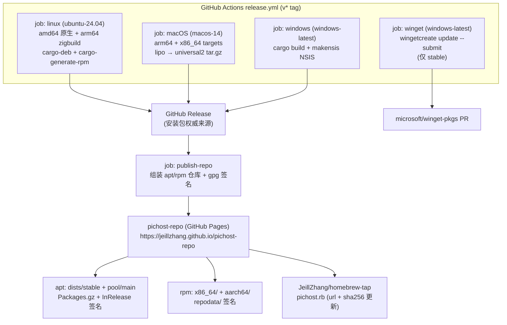
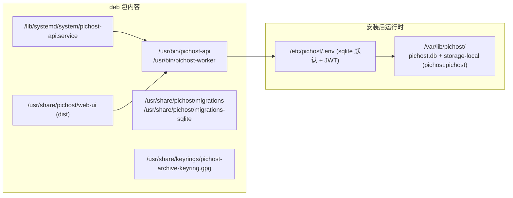
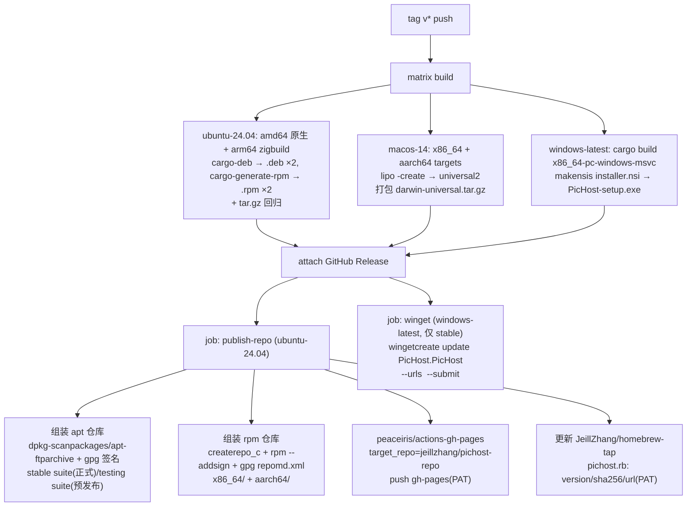

# PicHost 原生安装包与软件仓库分发 — 设计文档

> **日期**: 2026-08-15
> **目标**: 在现有 `.tar.gz` + install.sh 分发基础上,新增 **deb / rpm / exe(NSIS)原生安装包**,并发布到 **apt 仓库(Ubuntu/Debian)、RPM 仓库(Fedora/RHEL)、Homebrew(macOS)、winget(Windows)** 等软件仓库,实现"一行命令下载 → 安装 → 部署 → 启动即用"
> **范围**: Rust 代码(pichost-api 静态服务 + Windows 服务支持)+ 打包工程(packaging/ 目录)+ CI 矩阵扩展 + 仓库发布流水线 + 文档。**不涉及** Docker compose 改动
> **版本**: 0.22.0 → 0.23.0(feature)
> **前置**: 0.22.0 SQLite 单目录安装契约(已落地);release.yml 现有 `v*` tag → `.tar.gz` 流水线(可扩展)

---

## 1. 背景与目标

### 1.1 现状

| 现状 | 问题 |
|------|------|
| 仅发布 `.tar.gz`(x86_64 Linux 单架构) | 用户需 `tar xzf` + `sudo bash scripts/install.sh` 两步,无系统包管理器管理 |
| API 不提供前端静态服务(Docker 靠 Nginx;裸机 install.sh 拷 dist 但不配 web 服务器) | 装完无法"启动即用",需自行搭建反向代理 |
| 无任何 deb/rpm/exe/brew/winget 引用 | 打包工程为 greenfield |
| 版本单一来源:workspace Cargo.toml `0.22.0` + git tag | 包版本需在 CI 注入并做格式标准化 |

### 1.2 已确认决策(brainstorming 澄清)

| # | 决策点 | 结论 |
|---|--------|------|
| D1 | 架构矩阵 | **全架构**:deb `amd64`+`arm64`;rpm `x86_64`+`aarch64`;macOS **universal2**(arm64+x86_64 lipo 合并);Windows `x86_64`(不做 Windows arm64) |
| D2 | 前端(SPA)服务方 | **API 内嵌静态服务**:`tower-http` 增加 `fs` 特性,新配置 `PICHOST_STATIC_DIR`(默认 `./dist`,目录不存在则跳过挂载并 warn),带 SPA fallback(index.html);Docker 无 dist → 行为不变 |
| D3 | 仓库渠道 | **混合**:自托管 `pichost-repo` Pages 仓库统一托管 **apt + rpm 仓库**;macOS 走 **Homebrew 个人 tap**(`JeillZhang/homebrew-tap`,零审核);Windows 走 **winget 提交**(`microsoft/winget-pkgs`,首次 manifest 人工,后续 wingetcreate 自动 PR);GitHub Releases 继续作为全部安装包文件的权威来源 |
| D4 | Windows 形态 | **NSIS `.exe` 安装器** + **`windows-service` crate 原生服务**(`pichost-api.exe --install-service` 注册服务;数据落 `%ProgramData%\PicHost`) |
| D5 | macOS 形态 | **brew formula**(预编译 tarball `url`+`sha256`,非源码构建)+ `service` block(launchd);`brew install` + `brew services start` 即用;数据落 `$(brew --prefix)/var/pichost` |
| D6 | deb/rpm 数据目录 | **FHS 正统布局**:二进制 `/usr/bin`、静态资源 `/usr/share/pichost/web-ui`、迁移 `/usr/share/pichost/`、systemd 单元 `/lib/systemd/system/`、配置 `/etc/pichost/`、数据 `/var/lib/pichost/`。与 install.sh 的 `/opt/pichost` 单目录契约**有意分叉**,README 分别说明 |
| D7 | 版本 | 0.23.0;包版本在 CI 由 git tag 注入并标准化(deb 预发布 `1.2.3~beta.4` 用 `~`,apt 排序正确;rpm/macOS/Windows 用 semver) |
| D8 | 服务安装行为 | deb/rpm `postinst` 自动:创建 `pichost` 系统用户 → 生成 `/etc/pichost/.env`(默认 sqlite + 随机 JWT secret)→ `systemctl enable --now pichost-api`;卸载自动停止并清理(保留数据可选项) |

### 1.3 成功标准

1. `apt install pichost`(Debian/Ubuntu)与 `dnf install pichost`(Fedora/RHEL)从自托管仓库完成安装,`systemctl start pichost-api` 后浏览器打开即见界面(SQLite 默认、零外部依赖)
2. `brew install pichost/tap/pichost && brew services start pichost` 完成 macOS 安装启动
3. `winget install PicHost.PicHost`(或下载 NSIS exe 双击)完成 Windows 安装,服务自动注册并启动
4. 全部包内置 API 静态服务:安装后无 Nginx 亦可完整使用(与 SQLite 轻量哲学一致)
5. CI:`v*` tag 自动构建 5+ 安装包 → 附加 GitHub Release → 更新 apt/rpm 仓库索引与签名 → 更新 homebrew tap formula → winget 提 PR;预发布 tag 进 `testing`/不发布
6. 回归:`cargo test --workspace` + clippy 零警告 + `npm run build` + verify-release.sh(扩展 deb 冒烟)全绿

---

## 2. 目标分发形态

### 2.1 分发架构总览



### 2.2 用户侧安装体验(目标)

| 平台 | 命令 | 结果 |
|------|------|------|
| Debian/Ubuntu | `bash <(curl -sL https://jeillzhang.github.io/pichost-repo/setup-repo.sh)` → `apt install pichost` | systemd 服务 + SQLite 零依赖,打开 `http://localhost:3000` |
| Fedora/RHEL | `bash <(curl -sL .../setup-repo.sh)` → `dnf install pichost` | 同上 |
| macOS | `brew tap jeillzhang/tap && brew install pichost && brew services start pichost` | launchd 服务(`brew tap jeillzhang/tap` → `github.com/jeillzhang/homebrew-tap`) |
| Windows | `winget install PicHost.PicHost`(或下载 exe 双击) | Windows 服务自动启动 |

### 2.3 deb 安装后布局(FHS,与 install.sh 分叉)



---

## 3. 变更清单

### 3.1 Rust 代码 — API 内嵌静态服务(D2)

**`pichost-core/src/config.rs`**:新增字段

```rust
pub static_dir: Option<PathBuf>,   // env PICHOST_STATIC_DIR;None → 默认 ./dist
```

**`pichost-api/Cargo.toml`** / workspace `Cargo.toml`:`tower-http` features 增加 `"fs"`。

**`pichost-api/src/app.rs`**:路由装配末尾追加(函数 ≤50 行):

```
static_dir 解析:config.static_dir 或默认 PathBuf::from("./dist")
若目录存在 → router.fallback_service(ServeDir::new(dir).fallback(ServeFile::new(dir.join("index.html"))))
不存在 → tracing::warn!("PICHOST_STATIC_DIR {} 不存在,静态服务未挂载") 并跳过
```

- 显式路由(`/api/v1/*`、`/u`、`/t`、`/metrics`、`/health`)优先级高于 fallback,行为不变
- Docker:API 容器无 dist → 跳过挂载,nginx 场景零影响
- install.sh / 各安装包:dist 路径显式注入(`PICHOST_STATIC_DIR`),即开即用

**测试**(`pichost-api/tests/` 新增 `static_serve_test.rs`):临时 dist 目录 → 断言 `GET /` 返回 index.html、`GET /app.js` 返回文件、`GET /nonexistent` SPA fallback 回 index.html、`/api/v1/health` 仍由 API 处理、dist 不存在时 fallback 未挂载(404)。

### 3.2 Rust 代码 — Windows 原生服务(D4)

**依赖**:pichost-api 新增 `windows-service` crate(`cfg(windows)` 条件编译,不影响 Linux)。

**`pichost-api/src/service.rs`**(`#[cfg(windows)]`):

| 命令 | 行为 |
|------|------|
| `pichost-api --install-service` | 以 `PicHost` 服务名注册(SCM),启动类型 Automatic |
| `pichost-api --uninstall-service` | 停止并删除服务 |
| `pichost-api --service` | 由 SCM 启动:进入服务循环(`ServiceDispatcher`),回调内跑现有 `run_with_sqlite` 逻辑;服务模式先加载 `%ProgramData%\PicHost\.env`(小 dotenv loader,~30 行,带单测) |
| 无参数 | 保持现状:前台运行(Linux/macOS 行为不变) |

**服务模式 .env 引导**:若 `.env` 缺失或 JWT secret 缺失 → 自动生成随机 secret 并写入 `%ProgramData%\PicHost\.env`(复用 install.sh `ensure_jwt_secret` 的语义;Windows 上等效于 `tr -dc` 用 PowerShell/`rand` 替代)。数据目录 `%ProgramData%\PicHost\data`(`pichost.db` + `storage-local`),`PICHOST_STATIC_DIR` 指向安装目录 `dist`。

**CLI 参数解析**:不引入 clap,`std::env::args` 手写最小匹配(约 15 行)。

### 3.3 `packaging/` 目录(新)

```
packaging/
├── deb/                      # cargo-deb 的 maintainer-scripts
│   ├── postinst              # 建用户/建目录/生成 .env/JWT/systemd enable --now
│   ├── prerm                 # systemctl stop
│   └── postrm                # purge 时删 /var/lib/pichost(保留配置)
├── rpm/                      # cargo-generate-rpm 的脚本(%post/%preun/%postun)
├── windows/
│   └── installer.nsi         # NSIS:装 Program Files、注册服务、卸载保留数据勾选;
│                             # .env 不预写 — 由服务首次启动自动生成(含 JWT)
├── homebrew/
│   └── pichost.rb.tpl        # formula 模板(url/sha256/version 由 CI 注入)
└── winget/
    └── manifest.yaml         # 首次人工提交 winget-pkgs 的清单参考
```

**deb 元数据**:定稿为 **pichost-api Cargo.toml 的 `[package.metadata.deb]`**(cargo-deb 标准,版本自动取自 crate version):

```
name: pichost
assets:
  target/release/pichost-api      → /usr/bin/pichost-api (755)
  target/release/pichost-worker   → /usr/bin/pichost-worker (755)
  web-ui/dist/                    → /usr/share/pichost/web-ui/ (递归)
  migrations/                     → /usr/share/pichost/migrations/
  migrations-sqlite/              → /usr/share/pichost/migrations-sqlite/
  packaging/keyrings/pichost-archive-keyring.gpg → /usr/share/keyrings/ (dearmor 公钥)
  scripts/pichost-api.service     → /lib/systemd/system/pichost-api.service
  scripts/pichost-worker.service  → /lib/systemd/system/pichost-worker.service
maintainer-scripts: packaging/deb/
depends: (构建时验证动态依赖,rustls+bundled sqlite 已静态 → 预期仅 libc6/glibc)
section: web
```

**postinst 要点**(≤50 行,与 install.sh 语义对齐):`id pichost || useradd --system` → `mkdir -p /etc/pichost /var/lib/pichost` → 首次生成 `.env`(sqlite 默认:`PICHOST_DATABASE_MODE=sqlite`、`sqlite:///var/lib/pichost/pichost.db`、`PICHOST_STORAGE__LOCAL_BASE_PATH=/var/lib/pichost/storage-local`、`PICHOST_STATIC_DIR=/usr/share/pichost/web-ui`、随机 JWT)→ `chown -R pichost:pichost /var/lib/pichost /etc/pichost` → `systemctl daemon-reload && systemctl enable --now pichost-api`。`.env` 已存在则不覆盖(幂等)。

**rpm 元数据**(`[package.metadata.generate-rpm]`):assets 同 deb;`%post/%preun/%postun` 复用同一套逻辑(脚本语言 shell 双格式各一份)。

### 3.4 CI — release.yml 矩阵扩展



- **arm64 Linux 交叉编译**:`cargo-zigbuild --target aarch64-unknown-linux-gnu`(rustls/sqlite bundled 无系统依赖负担);若动态 glibc 依赖复杂,退路为容器内 cross 工具链(实施阶段验证)
- **gpg 密钥**:一次性生成(2 年有效期),私钥 + 口令存仓库 secrets(`APT_GPG_PRIVATE_KEY` / `APT_GPG_PASSPHRASE`),公钥 dearmor 后随 deb 包分发 + 置于仓库根
- **PAT**:一次性创建 fine-grained token(`contents:write` 于 `pichost-repo` + `homebrew-tap`),存 `PICHOST_REPO_PAT` secret
- **winget**:`WINGET_CREATE_GITHUB_TOKEN` secret;`wingetcreate update` 要求清单已存在 → 首次发布人工提交一次(packaging/winget/manifest.yaml 参考),后续自动 PR;仅稳定版
- **预发布路由**:tag 含 `-rc/-beta/-alpha/-pre` → apt 进 `testing` suite、rpm 不进正式仓库、不触发 winget

### 3.5 `pichost-repo` 仓库(新建,一次性初始化)

```
pichost-repo/ (gh-pages 分支, GitHub Pages 启用)
├── apt/
│   ├── dists/stable/main/binary-{amd64,arm64}/Packages{,.gz}
│   ├── dists/testing/...
│   ├── pool/main/p/pichost/*.deb
│   └── dists/*/Release{,.gpg,InRelease}
├── rpm/
│   ├── x86_64/{pichost-*.rpm, repodata/}
│   └── aarch64/{...}
├── public.key            # gpg 公钥(asc)
├── setup-repo.sh         # 一键:装 key + 写 sources/repo 文件(apt/dnf 双分支)
└── README.md             # 各平台安装指引
```

`setup-repo.sh`(apt 分支):

```bash
curl -fsSL https://jeillzhang.github.io/pichost-repo/public.key | sudo gpg --dearmor -o /usr/share/keyrings/pichost-archive-keyring.gpg
echo "deb [signed-by=/usr/share/keyrings/pichost-archive-keyring.gpg] https://jeillzhang.github.io/pichost-repo/apt stable main" | sudo tee /etc/apt/sources.list.d/pichost.list
sudo apt update
```

dnf 分支:`[pichost] baseurl=.../rpm/x86_64 gpgcheck=1 gpgkey=.../public.key`。

### 3.6 文档同步

| 文件 | 变更 |
|------|------|
| README.md | Quick Start 增加"原生安装包"小节(四平台命令);Deployment 补 FHS 布局说明;Features 勾选 |
| AGENTS.md | 版本 0.23.0、release.yml 矩阵、packaging/ 目录、PICHOST_STATIC_DIR 配置、新命令 |
| CHANGELOG.md | 0.23.0 条目 |
| `.omo/summary/summary_and_next.md` | 新阶段小节 |
| 本设计文档 | 提交入库 |

---

## 4. 边界与已知限制

**本期不做**:
- **自动更新**:apt/dnf/brew 天然提供升级通道;Windows exe 无自动更新(winget upgrade 覆盖)
- macOS **dmg / 公证(notarization)**:需 Apple 开发者账号(99$/年),列入后续
- Windows **代码签名**:需证书;未签名 exe 触发 SmartScreen 提示(已知限制,README 注明)
- **PPA / COPR / homebrew-core** 官方渠道(账号与审核负担,自托管足够)
- Windows arm64、Linux armhf
- 应用层 `DatabaseMode::default()` 翻转(保持 postgres,Docker/CI 零变化)
- install.sh 单目录契约改造(与 FHS 分叉有意保留,README 分别说明)

**升级注意事项**:deb/rpm 覆盖安装时 postinst 幂等(.env 已存在不覆盖);旧 install.sh 用户不受影响。

---

## 5. 测试计划

| 测试 | 内容 | 门控 |
|------|------|------|
| 静态服务集成测试 | `static_serve_test.rs`(SPA fallback/路由优先级/目录缺失) | 必须 |
| Windows 服务单测 | cfg(windows):CLI 解析、dotenv loader、env 生成(CI windows runner) | CI |
| cargo test / clippy | `cargo test --workspace` 406+ pass、clippy 零警告、`npm run build` | 必须 |
| deb 冒烟 | verify-release.sh 扩展:ubuntu 容器内 `dpkg -i` → 跑二进制 → curl `/health` + `/` 200 | 发布前 |
| rpm 冒烟 | CI:fedora 容器 `rpm -i` → 同断言(或降级为 verify 说明) | CI |
| exe 冒烟 | CI windows runner:NSIS `/S` 安装 → `sc query PicHost` + curl 本地 | CI |
| brew 冒烟 | CI macos runner:`brew install --formula ./pichost.rb` → `brew services start` → curl | CI |
| 仓库冒烟 | publish 后 fetch Pages URL 断言 `Packages.gz`/`InRelease`/`repodata` 存在;ubuntu runner 模拟用户 `apt update` + 安装 | 发布后 |
| 回归 | `bash scripts/verify-release.sh`(tar.gz 链路零回归) | 必须 |

---

## 6. 实施顺序

| 阶段 | 内容 | 依赖 |
|------|------|------|
| S1 | Rust 静态服务:config + ServeDir/fallback + 测试 | 无 |
| S2 | Windows 服务:windows-service crate + CLI + dotenv loader + 测试 | 无 |
| S3 | deb 打包:cargo-deb 元数据 + postinst/prerm/postrm + CI linux matrix(amd64) | S1 |
| S4 | rpm 打包:cargo-generate-rpm + %post 脚本 + CI linux matrix(aarch64 zigbuild) | S1 |
| S5 | macOS:universal2 构建 + formula 模板 + tap 更新 job | S1 |
| S6 | Windows:NSIS 安装器 + 服务注册集成 | S2 |
| S7 | `pichost-repo` 初始化 + publish-repo job(apt/rpm 组装/签名/Push)+ setup-repo.sh | S3/S4 |
| S8 | winget workflow(wingetcreate) | S6 |
| S9 | 文档同步 + verify-release.sh 扩展 + 版本 0.23.0 | S3–S8 |
| S10 | 全量验证(cargo/clippy/npm/verify/仓库冒烟) | S1–S9 |

---

## 7. TODO 跟踪

- [ ] S1 API 静态服务
- [ ] S2 Windows 服务支持
- [ ] S3 deb 打包
- [ ] S4 rpm 打包
- [ ] S5 macOS formula
- [ ] S6 Windows NSIS
- [ ] S7 pichost-repo 仓库 + 发布 job
- [ ] S8 winget workflow
- [ ] S9 文档 + 版本 0.23.0
- [ ] S10 全量验证
